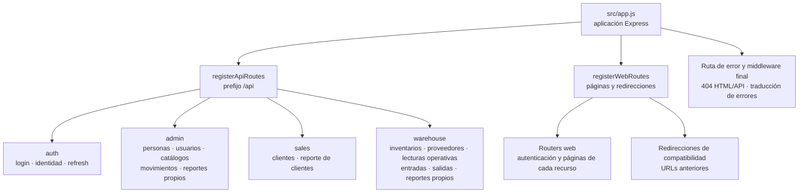

# 2. Entradas HTTP y registro de routers

La frontera HTTP se organiza mediante dos registros de routers. La agrupación identifica
módulos de transporte y capacidades expuestas; no convierte una ruta en caso de uso ni
cada carpeta en un servicio independiente. Los conteos y el detalle método–URL permanecen
en el [mapa generado](../code-map.md), evitando mantener cifras manuales divergentes.

**Identificador:** `DIA-COD-HTTP-001`. **Pregunta:** ¿qué módulos montan la API y las
páginas de Nexus? **Fuente:** `src/routes/api/index.js`, `src/routes/web/index.js` y
`src/app.js`. Las flechas representan registro y agrupación, no orden de peticiones.

Compras y salidas tienen variantes de materiales y consumibles. Los catálogos auxiliares
administrables se montan bajo `admin/catalogs`, mientras las lecturas para selectores
permanecen en sus áreas. Los reportes se registran en el contexto del recurso; no forman
un dominio funcional separado. La URL de una página puede diferir de la carpeta de su
router: el índice de registro determina su montaje efectivo.
