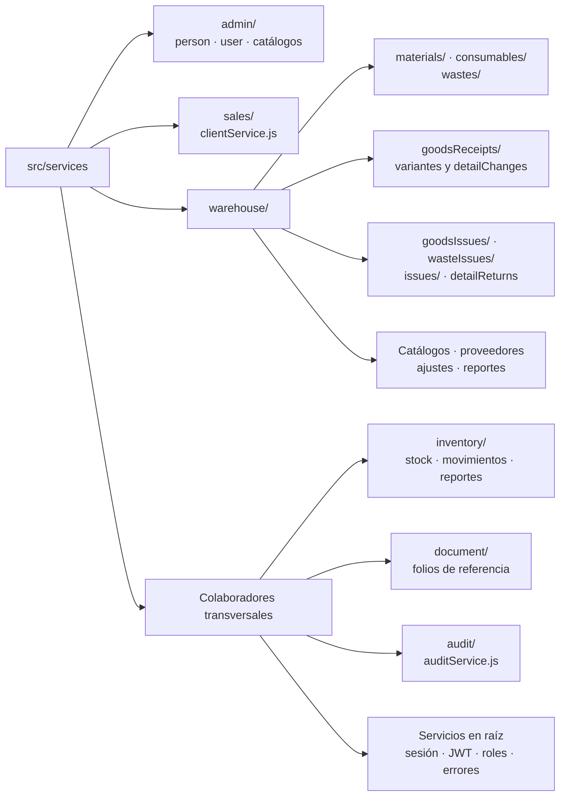
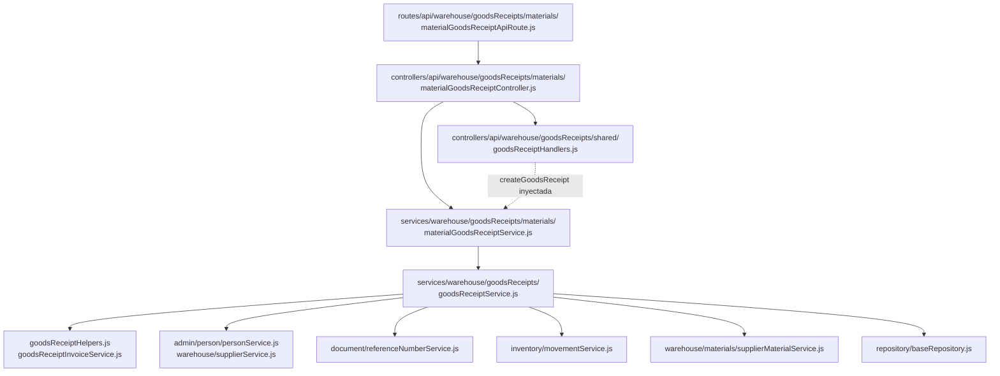

# 3. Backend: dominios y dependencias

El backend distribuye el transporte en `routes/api`, `routes/web`, `controllers/api`
y `controllers/web`. Los registros HTTP están en el [capítulo 2](02-http-entry-points.md).
El mapa siguiente amplía `src/services`, donde se encuentran reglas, consultas y
transacciones. Incluye las áreas funcionales y los colaboradores que atraviesan esas
áreas y permite localizar las variantes de materiales, consumibles y mermas.

## Distribución de módulos y subdominios

**Identificador:** `DIA-COD-MOD-001`. **Pregunta:** ¿qué carpetas y módulos de servicio
componen el backend? **Fuente:** estructura de `src/services`. **Leyenda:** las flechas
representan ubicación/agrupación, no llamadas ni imports. «Colaboradores transversales»
agrupa carpetas y archivos hermanos de las áreas; no es una carpeta adicional.

`warehouse/issues` aporta encabezados y cumplimiento compartidos; no es otro endpoint.
Los reportes están en `warehouse/reportService.js`, `inventory/reportService.js` y los
controllers de sus áreas: reutilizan consultas y formato Excel, sin constituir un
dominio independiente. `serviceErrorHandler.js`, `errors`, `messages`, `constants`
y `utils` son soporte transversal. La tabla contrasta los imports y completa el alcance de los nodos agrupados.
Los servicios que consultan modelos usan `getDb(tx)` o métodos del `tx` recibido;
la construcción del cliente se detalla en [Prisma](06-prisma-and-persistence.md).

| Área/carpeta | Implementación y colaboraciones verificables |
| --- | --- |
| `admin` | Usuarios usan personas; catálogos administrables seleccionan modelos desde `constants/catalogs.js`; movimientos/reportes de administración delegan en `services/inventory`. Los dos primeros están bajo `services/admin`; los últimos tienen allí su transporte, no un servicio duplicado. |
| `sales` | `clientService.js` mantiene clientes. `issueHeaderService.js` consulta clientes al construir encabezados de salidas. |
| `warehouse/materials`, `consumables` | `consumableService.js` fija `MATERIAL_TYPES.CONSUMABLE` y delega en material/supplierMaterial. La relación proveedor–material y su stock viven en `supplierMaterialService.js`. |
| `warehouse/wastes` | Mermas conservan servicio, inventario, movimientos, ajustes y entrada de stock propios. Usan helpers de conversión/identidad de `inventory`, sin reutilizar toda la persistencia de materiales. |
| `warehouse/goodsReceipts` | Adaptadores material/consumable configuran `type`; el núcleo coordina documento, detalles y movimiento. Corrección/cancelación tienen servicios separados. |
| `warehouse/goodsIssues`, `wasteIssues`, `issues` | Salidas comparten encabezado/cumplimiento; los movimientos de merma usan `wastes/wasteMovementService.js`. Devoluciones y reglas específicas conservan sus propios módulos. |
| `inventory`, `document` | Movimientos de material y consultas/reportes; folios anuales mediante el `tx` recibido directamente. `movementService.js` también importa `warehouse/materials/supplierMaterialService.js`: existe colaboración en ambos sentidos entre esos grupos, no una jerarquía estricta. |
| `authService`, `jwtService`, `roleService`, `audit` | Sesión/JWT, consulta de accesos y auditoría. `authMiddleware.js` y `auditMiddleware.js` invocan estos servicios desde la entrada HTTP. |

## Corte verificable: creación de una entrada

**Identificador:** `DIA-COD-MOD-002`. **Pregunta:** ¿qué dependencia concreta conecta
una variante HTTP con el núcleo de compras y sus colaboradores?
**Fuente:** imports de los archivos nombrados. **Leyenda:** flechas continuas = import;
la discontinua = función inyectada en el handler, que la invoca durante la petición.

El controller exporta handlers ya configurados. El adaptador fija `type=MATERIAL`;
`goodsReceiptService.js` abre la transacción, llama a folios y movimientos con `tx` y
actualiza el costo después del commit. Los permisos/validadores se aplican en el router;
los DTO y eventos están en el handler. Ese reparto se amplía en
[reutilización backend](../reuse-and-refactoring/01-backend-handlers-and-services.md) y
[Prisma](06-prisma-and-persistence.md). Para orden temporal y método/URL exactos se
consultan [procesos](../../processes/backend-code-sequences/index.md) y el
[mapa del código](../code-map.md).
