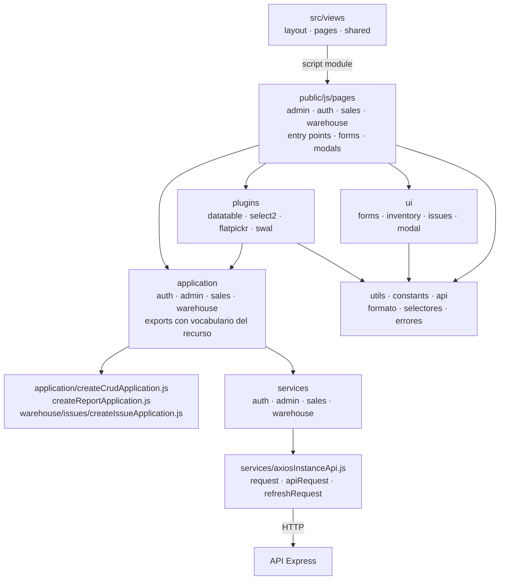
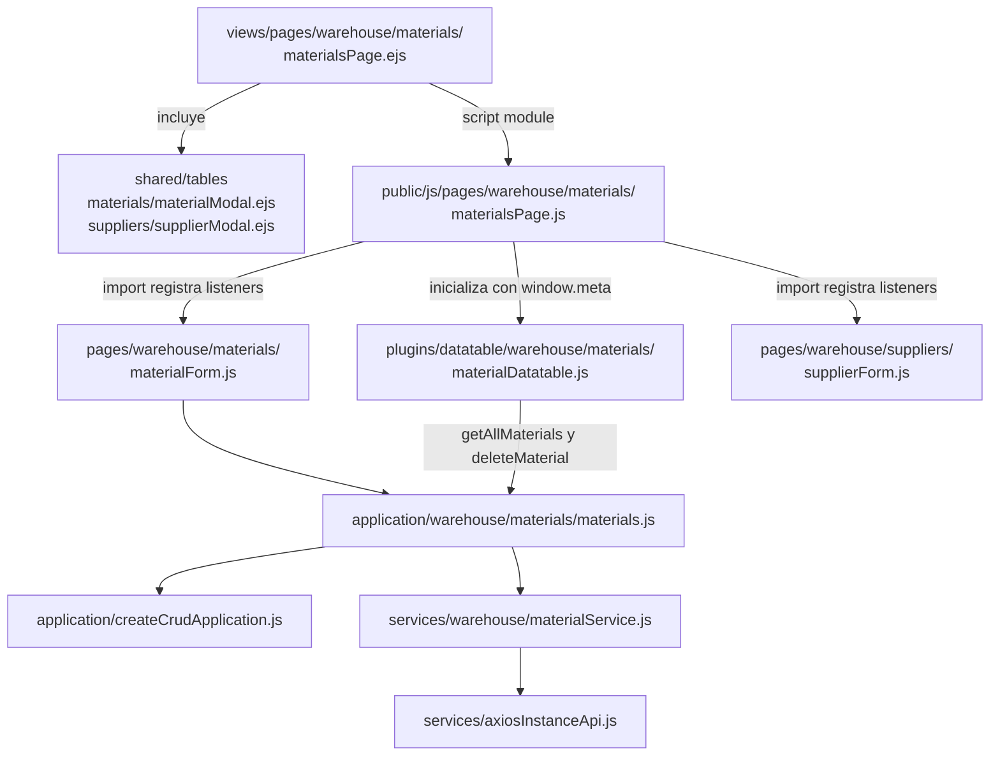

# 4. Frontend: plantillas, módulos y composición

La presentación se construye en dos momentos: Express renderiza EJS en el servidor;
después el navegador carga el `script type="module"` de la página. El entry point
inicializa plugins e importa formularios por sus efectos de registro. `application`
adapta operaciones y respuestas; `services` construye HTTP; `ui` y `plugins` poseen
controles visuales. Los listados conservan la respuesta Axios/DataTable, mientras las
mutaciones adaptan mensaje y datos del recurso.

## Familias de módulos del navegador

**Identificador:** `DIA-COD-FRONT-001`. **Pregunta:** ¿cómo se distribuye el frontend
por área y responsabilidad? **Fuente:** `src/views`, `src/public/js` e imports de páginas,
formularios y plugins. **Leyenda:** flechas = import/uso; EJS incluye o declara módulos.

`pages/warehouse` contiene materiales, consumibles, mermas, entradas, salidas y
proveedores; `pages/admin` contiene personas, usuarios, movimientos y catálogos;
`pages/sales` contiene clientes; autenticación tiene su entrada propia. Las factories
de requests de compras/salidas están en `services/warehouse`, mientras el núcleo CRUD
está en `application`: son mecanismos diferentes. La actualización de inventario usa
el puente de eventos del layout y `configureRealtimeReload` en el núcleo DataTable;
se describe en [publicación de eventos](../design-and-construction-patterns/10-publication-of-events-of-inventory.md).

## Corte verificable: página de materiales

**Identificador:** `DIA-COD-FRONT-002`. **Pregunta:** ¿qué módulos concretos inicializan
la tabla y el formulario de materiales? **Fuente:** imports de los módulos nombrados y
`src/views/pages/warehouse/materials/materialsPage.ejs`.

La tabla configura `ajax.get` con `getAllMaterials`; `createApplicationList` pasa
`params` al request y devuelve su respuesta sin extraer una clave de datos. El
formulario usa mutaciones de la misma application, que sí adaptan la respuesta.
`window.meta` aporta contexto de presentación; la autorización efectiva se comprueba
en el servidor. Formulario, modal, callbacks y plugins se amplían en
[reutilización de interfaz](../reuse-and-refactoring/03-interface-and-table-lifecycle.md)
y [referencia frontend](../frontend-technical-documentation/index.md).
