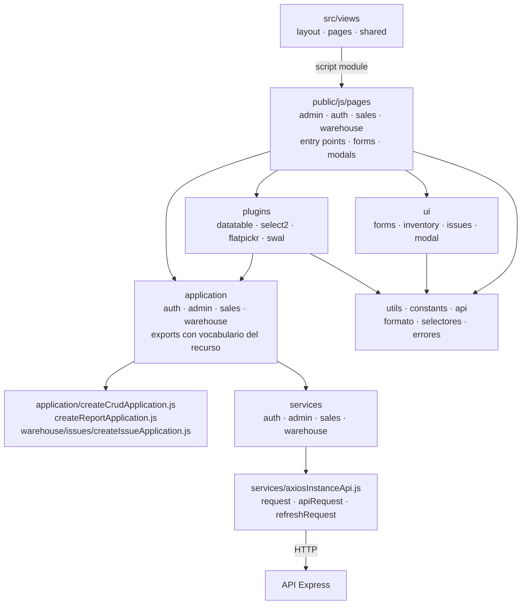

# 4. Frontend: plantillas, módulos y composición

La presentación se construye en dos momentos: Express renderiza EJS en el servidor;
después el navegador carga el `script type="module"` de la página. El entry point
inicializa plugins e importa formularios por sus efectos de registro. `application`
adapta operaciones y respuestas; `services` construye HTTP; `ui` y `plugins` poseen
controles visuales. Los listados conservan la respuesta Axios/DataTable, mientras las
mutaciones adaptan mensaje y datos del recurso.

## Familias de módulos del navegador

**Identificador:** `DIA-COD-FRONT-001`. **Pregunta:** ¿cómo se distribuye el frontend
por área y responsabilidad? **Fuente:** `src/views`, `src/public/js` e imports de páginas,
formularios y plugins. **Leyenda:** flechas = import/uso; EJS incluye o declara módulos.

`pages/warehouse` contiene materiales, consumibles, mermas, entradas, salidas y
proveedores; `pages/admin` contiene personas, usuarios, movimientos y catálogos;
`pages/sales` contiene clientes; autenticación tiene su entrada propia. Las factories
de requests de compras/salidas están en `services/warehouse`, mientras el núcleo CRUD
está en `application`: son mecanismos diferentes. La actualización de inventario usa
el puente de eventos del layout y `configureRealtimeReload` en el núcleo DataTable;
se describe en [publicación de eventos](../design-and-construction-patterns/10-publication-of-events-of-inventory.md).

## Mapas completos por módulo

La [referencia frontend](../frontend-technical-documentation/02-module-code-maps.md)
contiene un mapa para cada módulo con sus entry points, formulario/modal, application,
requests y dependencias de UI. Las variantes material/consumable aparecen juntas cuando
comparten pantalla y en módulos separados cuando tienen configuradores propios.
El capítulo compartido completa layout, selects operativos y reportes. Las llamadas,
reintentos y estados se consultan en procesos.
