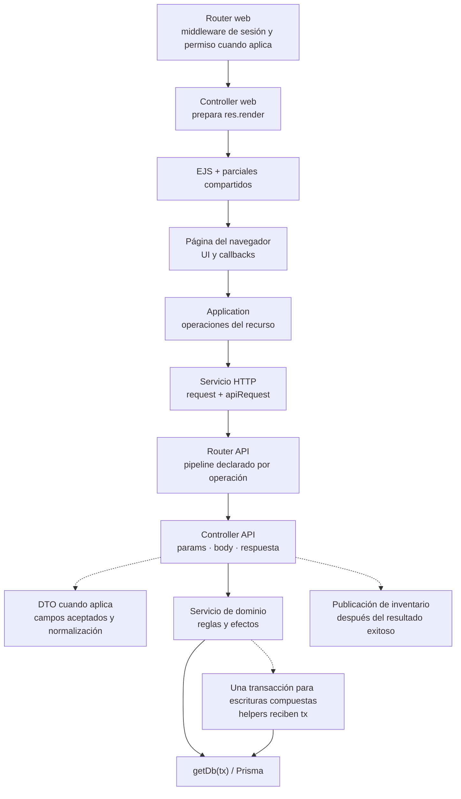

# 5. Contratos entre capas

### 5.1 Fronteras y contratos de implementación

**Identificador:** `DIA-COD-FRO-001`. **Pregunta:** ¿qué responsabilidad adapta cada
frontera de una petición? **Alcance:** composición general; las flechas continuas
muestran delegación y las discontinuas, colaboraciones condicionales. El orden exacto
del middleware y de cada operación se consulta en su router y secuencia `CU-*`.

Las páginas EJS y los endpoints de lectura no ejecutan necesariamente un DTO o una
transacción. `materialApiRoute.js` valida determinadas escrituras antes de autorizar;
`catalogApiRoute.js` instala autenticación y autorización a nivel de router antes de
validar. El login tiene su propio contrato de acceso. Ninguna cadena genérica sustituye
estos órdenes concretos.

`auditWrites` se monta en `src/app.js`: registra la observación de `finish` antes de
delegar y persiste posteriormente, fuera de la transacción funcional. Su colaboración
se mantiene en la [secuencia canónica de auditoría](../../processes/shared-runtime-behavior/01-write-audit.md#secuencia-transversal-de-auditoría-de-escrituras).
Las fuentes de esta figura son `src/routes`, `src/controllers`, `src/dtos`,
`src/services`, `src/public/js` y `src/repository/baseRepository.js`.

### 5.2 Dónde ampliar cada frontera

| Necesidad | Fuente propietaria |
| --- | --- |
| Imports y contrato de una operación del recurso | Referencias técnicas de [backend](../backend-technical-documentation/index.md) y [frontend](../frontend-technical-documentation/index.md). |
| Decisión de middleware, DTO, permisos o composición | [Patrones aplicados](../design-and-construction-patterns/index.md). |
| Configuración de factories, handlers, requests o tablas | [Mecanismos reutilizables](../reuse-and-refactoring/index.md). |
| Cliente generado, conexión y selección de `tx` | [Integración Prisma](06-prisma-and-persistence.md). |
| Orden de llamadas, rollback, eventos o renovación de sesión | [Vista de procesos](../../processes/index.md). |

### 5.3 Relación con las otras vistas

La realización de cada operación se consulta en los índices de
[secuencias backend](../../processes/backend-code-sequences/index.md) y
[frontend](../../processes/frontend-code-sequences/index.md). Los estados de negocio y
los datos que cambia una acción permanecen en
[modos, precondiciones y efectos](../../../../requirements/requirements-specification/06-operation-modes-and-effects.md).
La matriz requisito–caso–código–prueba pertenece a
[componentes y reutilización](../../logical/01-components-and-reuse.md).

Esta colección conserva el mapa de fronteras y las colaboraciones compartidas; no
mantiene otra matriz de casos ni duplica secuencias. Para un cambio de implementación
se revisa la frontera afectada aquí y el recorrido exacto en procesos. El código y las
pruebas sustentan el dibujo; la figura no amplía su cobertura por sí misma.
