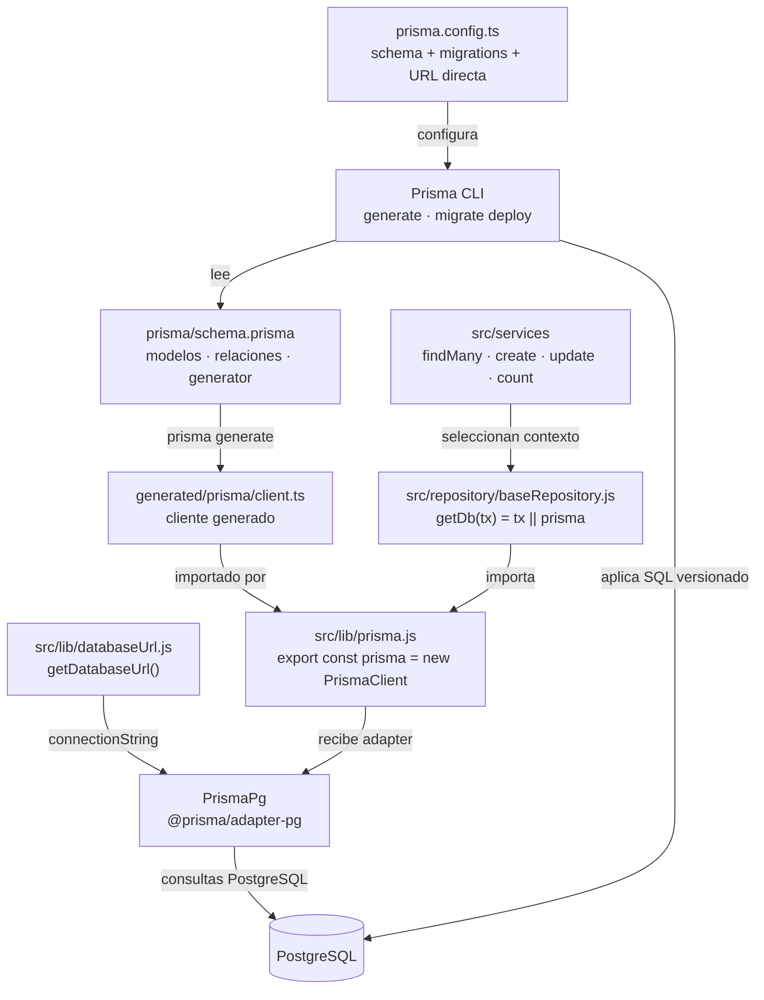

# 6. Prisma: cliente, consultas, transacciones y migraciones

Prisma es el ORM y generador de cliente usado por el backend para consultar PostgreSQL.
Nexus usa Prisma 7 (`package.json`), el generador `prisma-client` y el adaptador
`@prisma/adapter-pg`. Sus modelos describen datos y relaciones; las reglas de negocio,
los permisos y los DTO siguen en servicios, middleware y controllers.

## Construcción del cliente y conexión

**Identificador:** `DIA-COD-PRISMA-001`. **Pregunta:** ¿cómo llega el modelo Prisma a las
consultas de los servicios? **Fuente:** `prisma/schema.prisma`, `prisma.config.ts`,
`src/lib/{prisma,databaseUrl}.js` y `src/repository/baseRepository.js`.
**Leyenda:** flechas rotuladas por generación, import o uso; no son pasos de una petición.

`src/lib/prisma.js` construye una instancia compartida al cargar el módulo y la exporta.
Los servicios importan `getDb`; cuando no reciben `tx`, usan esa misma instancia. El
adaptador proporciona el acceso PostgreSQL; el cliente generado expone los modelos y
operaciones. No se crea un cliente por controller o por petición.

`baseRepository.js` contiene sólo el selector `getDb(tx)`. Las consultas se implementan
en servicios; no hay un repository por tabla ni un Unit of Work propio. Por ejemplo,
`findAllGoodsReceipts` usa `goodsReceipt.findMany` con `where`, `include`, orden y
paginación, y `count` para los totales. Prisma construye las consultas y devuelve datos;
la forma HTTP/DataTable la define el código que lo consume.

## Selección de URL y responsabilidades

| Ejecución | Configuración que utiliza el código |
| --- | --- |
| Aplicación Node | `getDatabaseUrl()` elige `DATABASE_URL`; con `NODE_ENV=test` elige `DATABASE_TEST_URL`. Si falta la URL seleccionada, falla la construcción del cliente. |
| Prisma CLI | `prisma.config.ts` llama a `resolveDatabaseUrl({ preferDirectUrl: true })`: prefiere `DIRECT_URL`, o `DIRECT_TEST_URL` en pruebas; si no existe, usa la URL del entorno correspondiente. |
| Integración con base | Los scripts verifican una base aislada y después ejecutan migraciones/generación antes de Vitest. La separación se comprueba en `scripts/verifyTestDatabaseEnv.js`. |

Las credenciales y privilegios de aplicación/migración se explican en
[roles PostgreSQL](../../physical/02-postgresql-runtime-and-migration-roles.md).
Aquí se describe cómo el código selecciona y utiliza esa conexión.

## Transacción y propagación del contexto

La dependencia entre el coordinador, `tx` y sus colaboradores se explica en
[contexto transaccional](../design-and-construction-patterns/09-context-transactional-and-consistency-atomic.md).
El orden de generación de folio, documento, movimiento, commit y costo pertenece a la
[secuencia backend de creación de entrada](../../processes/backend-code-sequences/purchases/cu-ent-02.md).
El código concreto está en `goodsReceiptService.js#createGoodsReceipt`.

Los colaboradores reciben explícitamente `tx` y usan `getDb(tx)` o sus métodos.
Prisma confirma o revierte las escrituras del callback; usar `getDb()` sin `tx` dentro
de esa colaboración escaparía del límite transaccional. Las lecturas previas y la
actualización de costo posterior no quedan cubiertas por ese rollback. Un error del
costo después del commit no deshace documento, movimiento y stock ya confirmados.
La publicación de eventos y la auditoría también tienen fronteras propias, descritas
en [contexto transaccional](../design-and-construction-patterns/09-context-transactional-and-consistency-atomic.md).

## Modelo, generación y evolución de la base

| Artefacto/comando | Qué cambia y qué no resuelve por sí solo |
| --- | --- |
| `prisma/schema.prisma` | Define modelos, campos, relaciones, índices y generador. Su edición no altera por sí sola una base existente. |
| `prisma/migrations/*/migration.sql` | SQL versionado que evoluciona la base. Una migración nueva conserva las ya aplicadas. |
| `npm run db:generate` | Ejecuta `prisma generate` para regenerar `generated/prisma`. No aplica las migraciones a PostgreSQL. |
| `npm run db:migrate` | Ejecuta `prisma migrate deploy` y luego `prisma generate`. Aplica migraciones pendientes; no crea una migración nueva a partir del esquema. |
| `npm run docs:architecture` | Genera evidencia documental desde código/esquema. No genera el cliente ni migra la base. |

El [modelo persistente](../../logical/data-and-persistence/index.md) conserva el ER y
el diccionario; esta sección conserva la integración de Prisma con la implementación.
Si cambian modelos, se revisan migración, cliente, servicios, DTO, contrato HTTP y
pruebas de persistencia. No basta con regenerar una de esas piezas.

## Errores y verificación

Prisma no traduce automáticamente sus errores a respuestas de Nexus. Los servicios
conservan sus errores de dominio y el middleware final de `src/app.js` aplica
`normalizeDatabaseError` (`src/errors/databaseError.js`): `P2021` y `P2022` identifican
tabla/columna faltante; ciertos errores de validación por miembros desconocidos
identifican un cliente desactualizado. Se convierten a errores de aplicación 503.
Otros errores siguen la traducción definida por su servicio o el manejador final.

Las pruebas unitarias con mocks verifican contratos y delegación; no demuestran que
una migración se aplique ni que PostgreSQL haga rollback. Eso se comprueba con
[integración en base aislada](../../../../testing/test-plan.md) y los scripts de prueba.
