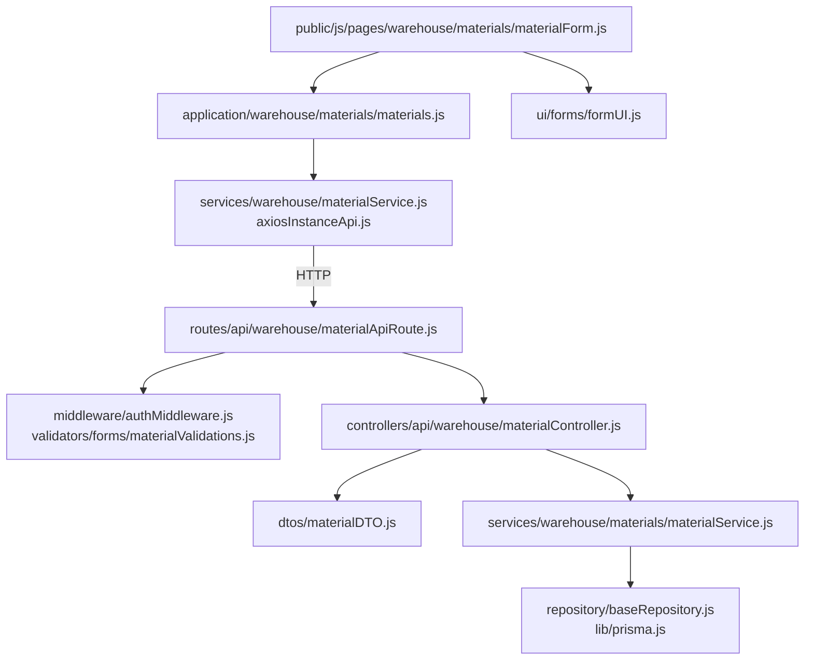
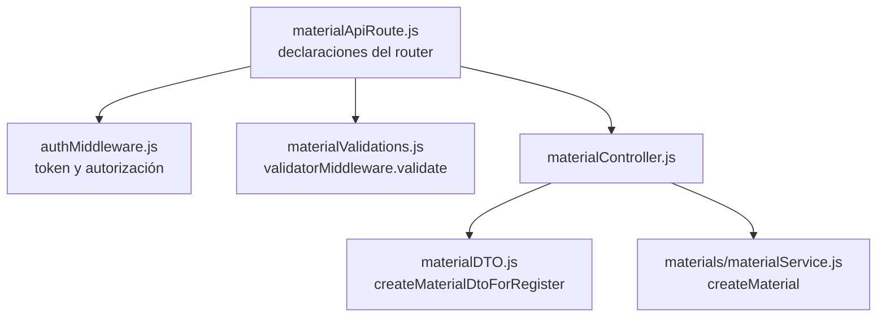
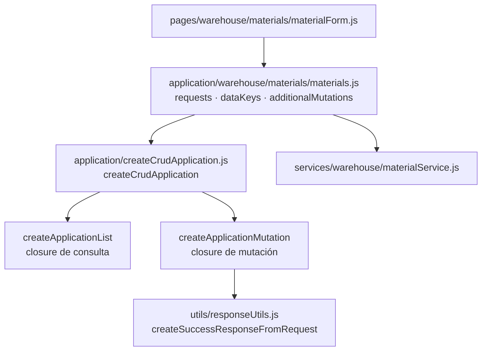
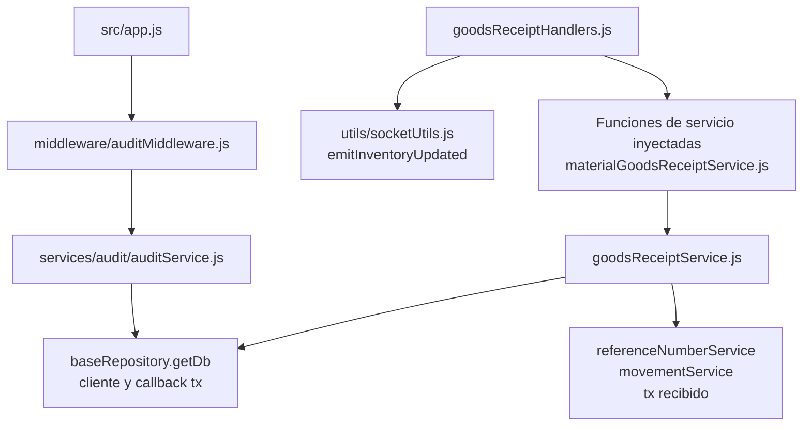
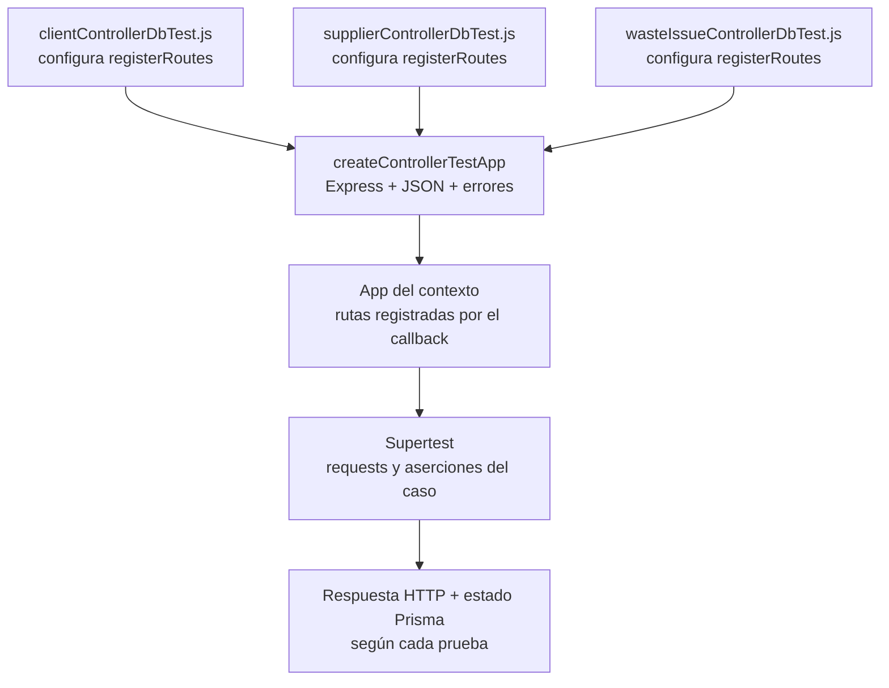

# 3. Catálogo visual de patrones aplicados

El catálogo conecta las responsabilidades compartidas con sus implementaciones y
consumidores. Las figuras localizan dependencias, configuración y contratos de implementación.
Los recorridos temporales se consultan en procesos. Cada mecanismo tiene
un contrato y variantes que permanecen en el recurso. Los símbolos y archivos permiten
contrastar el dibujo con código y pruebas, sin atribuirle cobertura adicional.

Los capítulos de detalle completan [políticas y adaptación de datos](06-dtos-adapters-and-policies.md),
[publicador y suscriptores](10-publication-of-events-of-inventory.md),
[ownership visual](12-composition-and-ownership-of-components-visual.md) y
[refactorización](../reuse-and-refactoring/04-refactoring-and-extension.md). Los códigos **Patrones** de los casos
son enlaces a estas colaboraciones; no sustituyen su evidencia de aplicación.

### Estructura por dominio, capas y fronteras

**Identificador:** `DIA-PAT-EST-001`. **Pregunta:** ¿dónde se materializa la separación
por capa en el recurso materiales? **Fuente:** imports de los módulos nombrados.
**Alcance:** ejemplo de capas en módulos ES; las flechas apuntan del consumidor a la dependencia.

Los módulos son archivos JavaScript con funciones exportadas. El [mapa completo del backend](../code-structure/03-backend-domains-and-dependencies.md)
permite seguir archivos concretos. La referencia backend explica el contrato de cada
capacidad y la frontend explica qué se configura y qué estado conserva la pantalla.

### Pipeline, DTO y políticas declarativas

**Identificador:** `DIA-PAT-FRO-001`. **Pregunta:** ¿cómo aplica una escritura de
materiales el pipeline y el DTO mediante módulos y funciones importadas? **Fuente:**
`materialApiRoute.js`, `materialController.js`, `materialDTO.js` y `authMiddleware.js`.
**Alcance:** alta de material; no impone su orden a todos los routers.

El DTO selecciona y normaliza campos; la autorización y las reglas conservan sus
propietarios. El contrato exacto del servicio se comprueba en el controller: el mapa muestra dependencias, no una secuencia ejecutada ni una firma común.

| Variante real | Orden declarado | Fuente |
| --- | --- | --- |
| Alta/edición de material | Token → validators → validate → autorización → controller. | `src/routes/api/warehouse/materialApiRoute.js`. |
| Consulta de materiales | Token → autorización → controller, sin validator de formulario. | El mismo router, `GET /`. |
| Catálogos administrables | `router.use` instala token y autorización; luego la operación valida y delega. | `src/routes/api/admin/catalogApiRoute.js`. |

La construcción de permisos se explica en
[políticas declarativas](06-dtos-adapters-and-policies.md#aplicación-de-políticas-declarativas).
El middleware global de auditoría se monta antes de los routers y observa la respuesta;
no constituye otra etapa local entre DTO y servicio.

### Factories y composición sobre herencia

**Identificador:** `DIA-PAT-CON-001`. **Pregunta:** ¿qué se configura para crear una
variante sin duplicar el flujo común?

El mapa distingue el configurador, las factories, los closures y la adaptación de
respuesta. La implementación tiene dos momentos: al evaluar el módulo se inyectan requests y se crean *closures* inmutables; al
interactuar la página se usa una referencia de dominio que conserva esa configuración.
El ejemplo se puede recorrer en
[`createCrudApplication.js`](../../../../../src/public/js/application/createCrudApplication.js),
[`materials.js`](../../../../../src/public/js/application/warehouse/materials/materials.js),
[`materialService.js`](../../../../../src/public/js/services/warehouse/materialService.js) y
[`materialForm.js`](../../../../../src/public/js/pages/warehouse/materials/materialForm.js). Los
demás consumidores reutilizan la misma construcción con su propia tabla `requests`.

### Transacción, eventos y auditoría

**Identificador:** `DIA-PAT-DIN-001`. **Pregunta:** ¿qué módulos implementan transacción, eventos y auditoría?
**Leyenda:** flechas = uso; el handler recibe el servicio por configuración.
**Fuente:** imports de los archivos nombrados.

La traza parte del controller propietario y permite distinguir código ejecutado dentro
del callback de Prisma de efectos posteriores. `getDb(tx)` está implementado en
[`baseRepository.js`](../../../../../src/repository/baseRepository.js), el publicador en
[`socketUtils.js`](../../../../../src/utils/socketUtils.js) y la auditoría transversal en
[`auditMiddleware.js`](../../../../../src/middleware/auditMiddleware.js). Los diagramas técnicos
de cada mutación sustituyen los comodines por los servicios y escrituras exactos.

### Test harness configurable

**Identificador:** `DIA-PAT-TST-001`. **Pregunta:** ¿cómo se reutiliza el montaje HTTP
sin ocultar las rutas y efectos del contexto? **Fuente:**
`tests/helpers/controllerTestHarness.js` y sus tests consumidores.

Los consumidores nombrados están en `tests/integration/controllers`. El helper sólo
construye el entorno y traduce errores; permisos, persistencia y rollback deben
comprobarse en las pruebas que corresponden, no se deducen del montaje Express.
Los códigos **Patrones** de las secuencias enlazan estas colaboraciones canónicas;
la presencia de un código no sustituye la evidencia del consumidor ni de sus pruebas.
