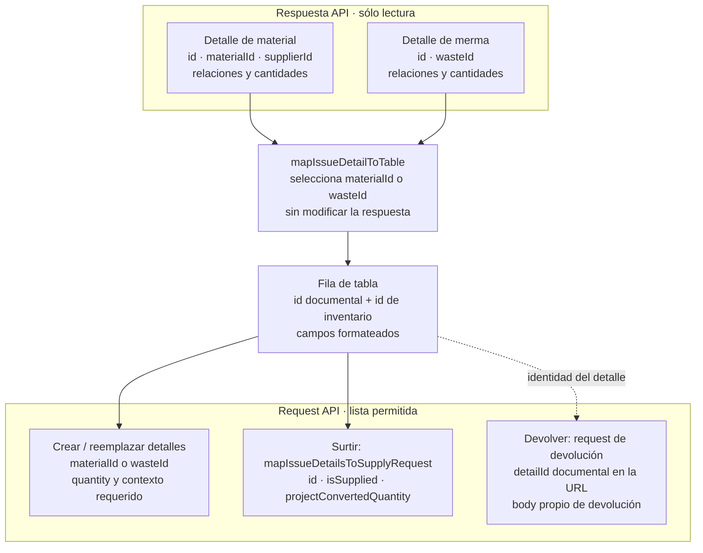
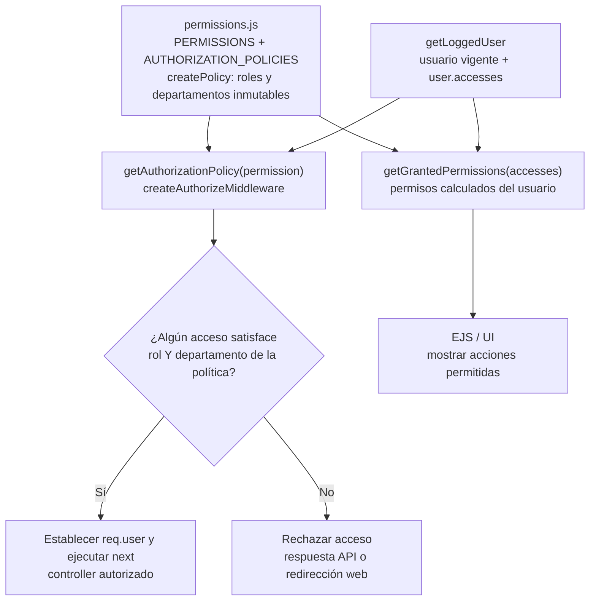

# 7. DTO funcional y políticas declarativas

Los módulos de `src/dtos` aplican el patrón **Data Transfer Object** sin requerir clases:
seleccionan campos aceptados y normalizan valores de transporte antes de invocar el
servicio. Un DTO no contiene autorización ni reemplaza validadores o reglas de negocio.
Se reutiliza uno existente cuando dos endpoints aceptan el mismo contrato; no se fuerza
si una mutación especializada necesita campos o semántica diferentes.

La autorización se construye como una tabla inmutable: una clave de `PERMISSIONS` apunta
a roles y departamentos en `AUTHORIZATION_POLICIES`. `createPolicy` congela la
configuración y `getGrantedPermissions` la evalúa para los accesos de la sesión. Es una
**política declarativa**, no el patrón GoF *Strategy*: no intercambia algoritmos, sino
datos de decisión consumidos por un evaluador común.

**Regla de construcción:** un endpoint nuevo reutiliza un permiso existente sólo si la
capacidad y alcance son los mismos. Una operación especializada con riesgo distinto
recibe su propia clave y casos negativos de autorización.

## Adaptadores de detalles de inventario

Las respuestas de salidas de material y de merma se consideran objetos de solo
lectura. Antes de mostrarlas, el adaptador compartido de
`warehouseInventoryUtils.js` identifica si cada detalle contiene `materialId` o
`wasteId`, crea una fila nueva y conserva por separado el identificador del detalle
documental y el del material o merma. El primer identificador se usa al surtir o
devolver; el segundo,
al crear o reemplazar detalles del CRUD. Los adaptadores de request aplican una
lista permitida de campos. Para crear o reemplazar detalles, el navegador conserva el
adaptador específico del inventario; al surtir, `mapIssueDetailsToSupplyRequest` recorre
las filas una sola vez y conserva únicamente `id`, `isSupplied` y
`projectConvertedQuantity` de las nuevas selecciones. Los DTO de salida vuelven a
aplicar esa lista permitida como frontera del servidor. La etiqueta compartida de
select y tabla obtiene el nombre del material y del proveedor mediante getters que
encapsulan las variantes del contrato (`material`, `supplierMaterial` o valores ya
aplanados), en lugar de repetir navegación opcional dentro del formateador.

### Diagrama del contrato de datos de los detalles

**Identificador:** `DIA-PAT-DAT-001`. Este diagrama focalizado responde, para desarrollo y revisión, **qué identidad conserva
cada etapa** entre la respuesta HTTP, la tabla y los requests de una salida. Su alcance
es sólo la adaptación en el navegador; complementa el contrato OpenAPI y el
diagrama ER. La fuente de verdad son los DTO de salidas y los adaptadores de
`warehouseInventoryUtils.js`; `issueFormUI.js` conserva únicamente coordinación visual.

Las flechas expresan transformación de datos, no llamadas entre capas. `id` siempre
identifica el detalle documental; `materialId` y `wasteId` identifican el elemento de
inventario según el contexto. El diagrama se revisa cuando cambien los DTO de salida,
los campos permitidos de un request o `mapIssueDetailToTable`; `npm run docs:check`
valida evidencia generada y reglas documentales automatizadas; la semántica y el
renderizado de esta figura curada también requieren revisión contra los contratos.

## Aplicación de políticas declarativas

**Identificador:** `DIA-PAT-POL-001`. **Pregunta:** ¿qué configuración comparte la
comprobación del servidor y la presentación de permisos? **Fuente:**
`src/constants/permissions.js`, `src/services/admin/userService.js` y
`src/middleware/authMiddleware.js`. Las flechas representan datos y evaluación, no
orden temporal de todas las peticiones.

La ruta fija el permiso de la operación. El middleware consulta la política y vuelve a
comprobar los accesos del usuario vigente; no autoriza por la visibilidad del botón ni
confía únicamente en una lista enviada al navegador. El mismo registro alimenta
`getGrantedPermissions`, evitando mantener una segunda definición de roles y áreas.
El resultado es política declarativa evaluada por funciones comunes, sin jerarquía GoF.
