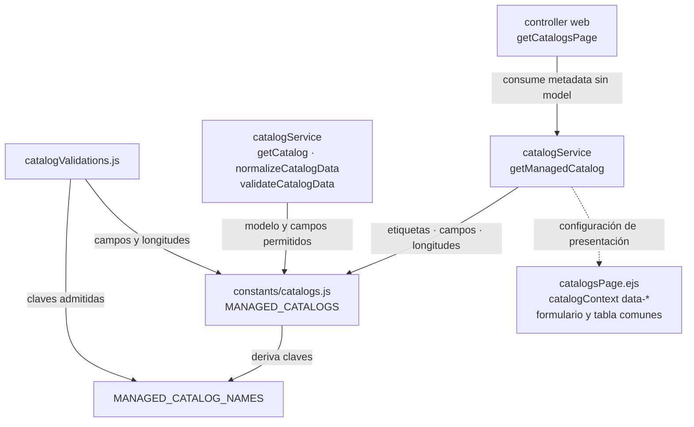

# 8. Registro de catálogos con lista blanca

## Problema y decisión aplicada

Seis catálogos auxiliares comparten consulta, creación y edición, pero difieren en modelo,
campos y etiquetas. `constants/catalogs.js` define `MANAGED_CATALOGS` para configurar
una implementación administrativa común. El servicio resuelve únicamente esas claves;
el cliente no selecciona modelos Prisma o campos arbitrarios. Es un registro de
configuración con lista blanca, no un CRUD universal para las entidades del sistema.

Las [referencias backend](../backend-technical-documentation/16-catalogs-code.md) y
[frontend](../frontend-technical-documentation/16-catalogs-code.md) poseen los mapas de
archivos, los seis registros, contratos y metadata de pantalla. Las consultas operativas
y los recursos con reglas propias mantienen sus módulos. Clientes y proveedores son
datos maestros comerciales, pero no pertenecen al registro auxiliar.

### Diagrama del patrón de catálogos administrables

**Identificador:** `DIA-ARQ-CAT-001`. **Pregunta:** ¿qué configura el registro y qué
parte recibe cada consumidor? **Fuente:** `constants/catalogs.js`, `catalogService.js`,
`catalogValidations.js` y controller web. **Leyenda:** flechas = uso de configuración;
los nodos de función/campo son partes de archivos existentes, no nuevos módulos.

El servicio conserva la resolución del modelo y la validación incluso si se invoca
fuera del router. `getManagedCatalog` devuelve metadata de presentación y omite `model`:
el servidor conserva la decisión de persistencia. EJS la proyecta en atributos que
configuran formulario, modal y columnas; esa metadata no concede permisos.

## Mecanismos reutilizados y fronteras

| Decisión | Aplicación comprobable y fuente de detalle |
| --- | --- |
| Lista blanca del servidor | El registro fija modelos, campos y longitudes; el validator rechaza claves desconocidas y el servicio vuelve a resolverlas. [Backend](../backend-technical-documentation/16-catalogs-code.md#contratos-y-límites-implementados). |
| Configuración de presentación | Un controller web y plantilla publican metadata para una pantalla común. [Frontend](../frontend-technical-documentation/16-catalogs-code.md#configuración-entre-ejs-y-el-navegador). |
| Composición de aplicación | `catalogs.js` configura `createCrudApplication` con `getAll`, `register` y `edit`, manteniendo el catálogo como argumento del transporte. [Contrato de reutilización](../reuse-and-refactoring/02-browser-applications-and-requests.md). |
| Contratos de formulario y tabla | Se componen `useForm`, `handleSubmit`, `createDataTable` y `buildMdbEditActionButton`; las columnas derivan de campos, sin seis implementaciones. [Frontend](../frontend-technical-documentation/16-catalogs-code.md). |
| Separación de lectura operativa | Las opciones activas se consultan con permisos y adaptadores propios; el listado administrativo permite reactivar filas. [Lecturas backend](../backend-technical-documentation/16-catalogs-code.md#lecturas-operativas-de-los-mismos-datos). |

## Límites y extensión

La vista y el API administrativo requieren `catalogs:manage`. El parámetro `catalog`
selecciona configuración permitida; ocultar navegación o validar en el navegador no
reemplaza el control del servidor. Desactivar es editar `isActive`, no eliminar.
El registro no administra permisos ni define las transiciones de cumplimiento: sus
nombres tienen consumidores en código que se deben revisar.

Agregar un catálogo exige revisar el modelo persistente, registro, campos, validators,
compatibilidad del formulario/columnas y navegación. Si requiere selectores operativos,
se conserva también su contrato de lectura y adaptador. Añadir una clave no demuestra
por sí solo que esos consumidores existen. Un recurso con reglas o campos que no
caben en el contrato común mantiene un módulo específico.

Los pasos y alternativas se consultan en las secuencias de
[backend](../../processes/backend-code-sequences/catalogs/index.md) y
[frontend](../../processes/frontend-code-sequences/catalogs/index.md). Aquí se conserva
la decisión de configuración; los mapas del módulo y de reutilización amplían sus
colaboradores sin repetirlos como un segundo diagrama del patrón.
