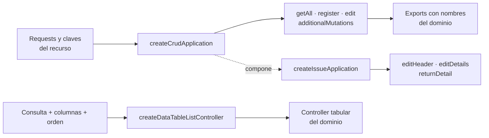

# 8. Factory functions y composición de aplicaciones

La construcción canónica se muestra en
[`DIA-PAT-CON-001`](04-catalog-visual-of-patterns-applied.md#factories-y-composición-sobre-herencia)
y sus consumidores en los
[diagramas de reutilización](../code-diagrams/06-view-of-reuse-crud-and-interface.md).
Este capítulo conserva únicamente las variantes y reglas de exposición.

### Contratos configurables

| Construcción | Configuración recibida | Resultado y consumidores |
| --- | --- | --- |
| `createCrudApplication` | requests, claves de respuesta y mutaciones adicionales | objeto privado con consulta y mutaciones; personas, usuarios, clientes, proveedores, inventario y documentos |
| `createIssueApplication` | requests y claves de material o merma | CRUD compuesto con encabezado, detalles y devolución |
| `createApplicationList` | request con contrato `{ params }` | lectura uniforme para CRUD y catálogos de sólo lectura |
| `createDataTableListController` | consulta, columnas y orden seguro | controller DataTable de roles, áreas y catálogos operativos |

`createApplicationMutation` adapta `formData`, identificadores, contexto adicional y la
respuesta exitosa. Una diferencia exclusiva permanece en el módulo propietario: por
ejemplo, materiales omite `maxUnitCost` cuando el alta ocurre desde una entrada, y las
compras conservan corrección y cancelación bajo `goodsReceipts/detailChanges` porque sus
reglas difieren de una devolución de salida.

Los listados reutilizan la respuesta del recurso. No se crea `get*Options` cuando el
mapper de Select2 ya puede producir `{ id, text }`; sólo se mantiene un adaptador cuando
resuelve otra decisión, como precargar `Pendiente` o seleccionar una persona por área.
De igual forma, `getIssueDataTableQuery` comparte el parsing de filtros, pero cada
controller conserva columnas, servicio y autorización propios.

### Exposición y extensión

1. La instancia producida permanece privada en el módulo de contexto.
2. El módulo exporta referencias nombradas en lenguaje de dominio, no las claves
   genéricas `register` o `edit`.
3. La firma pública conserva el contrato de la factory; una adaptación sólo se agrega
   cuando el dominio realmente difiere.
4. Primero se configura una factory existente. Se amplía únicamente si la nueva
   operación conserva el mismo contrato en al menos dos contextos.
5. Se exporta una función constructora compartida cuando existen varios consumidores;
   su resultado no comparte estado entre ellos.

Estas construcciones son **factory functions**, no *Factory Method*, *Abstract Factory*
ni *Template Method*: no existen jerarquías de creadores o productos y la
especialización se realiza por composición de objetos, no por herencia.
