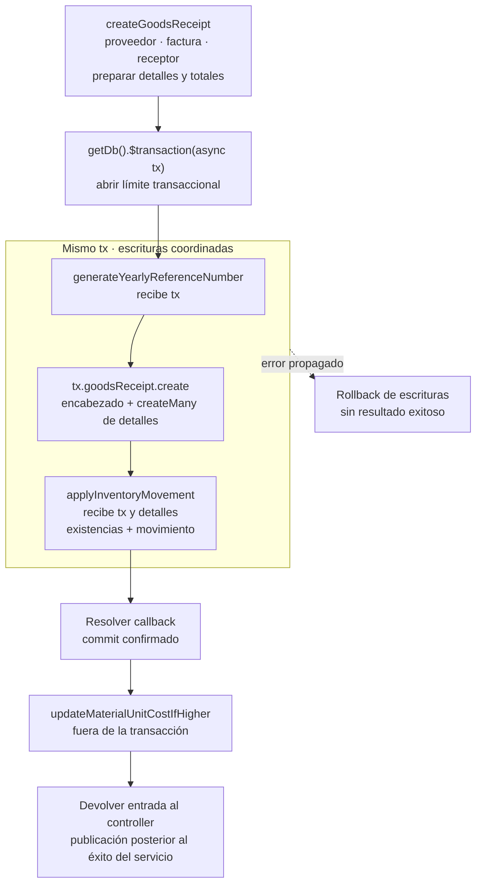

# 9. Contexto transaccional y consistencia atómica

`src/repository/baseRepository.js` expone únicamente `getDb(tx)`: propaga el cliente de
transacción cuando el caso de uso ya está dentro de `$transaction`, o usa Prisma cuando
no lo está. Esto permite que servicios auxiliares participen en la misma operación
atómica sin abrir transacciones anidadas ni depender de una variable global de
transacción.

El archivo **no implementa actualmente el patrón Repository completo**: no encapsula
colecciones ni ofrece repositorios por agregado. Tampoco se declara una implementación
propia de *Unit of Work*; Prisma administra el commit/rollback. La estrategia real es
**Transaction Script con propagación explícita de contexto**, coordinado por servicios
de caso de uso.

**Regla de construcción:** una operación que modifica documento, detalle, existencia y
movimiento abre un solo límite `$transaction` y pasa `tx` a las funciones participantes.
La prueba de integración debe demostrar tanto el efecto completo como el rollback.

## Aplicación del contexto en una entrada

**Identificador:** `DIA-PAT-TX-001`. **Pregunta:** ¿qué operaciones comparten `tx` y
qué efecto queda después del commit? **Fuente:** `goodsReceiptService.createGoodsReceipt`,
`referenceNumberService`, `inventory/movementService` y `supplierMaterialService`.
Las flechas dentro de la transacción expresan coordinación en orden; su contorno indica
el límite de atomicidad, no un proceso independiente.

Las comprobaciones y la preparación anteriores a `$transaction` no quedan protegidas
por su rollback. El recálculo posterior de costos tampoco revierte la entrada ya
confirmada si falla. El contrato documenta este límite real y no promete atomicidad de
todos los efectos. Dentro del callback se usa `tx` directamente o se propaga a helpers
que seleccionan ese cliente mediante `getDb(tx)`.

La [secuencia del caso de entrada](../../processes/backend-code-sequences/purchases/cu-ent-02.md)
completa el recorrido HTTP. [`DIA-PAT-DIN-001`](04-catalog-visual-of-patterns-applied.md#transacción-eventos-y-auditoría)
resume la posición de eventos y auditoría respecto del commit.
