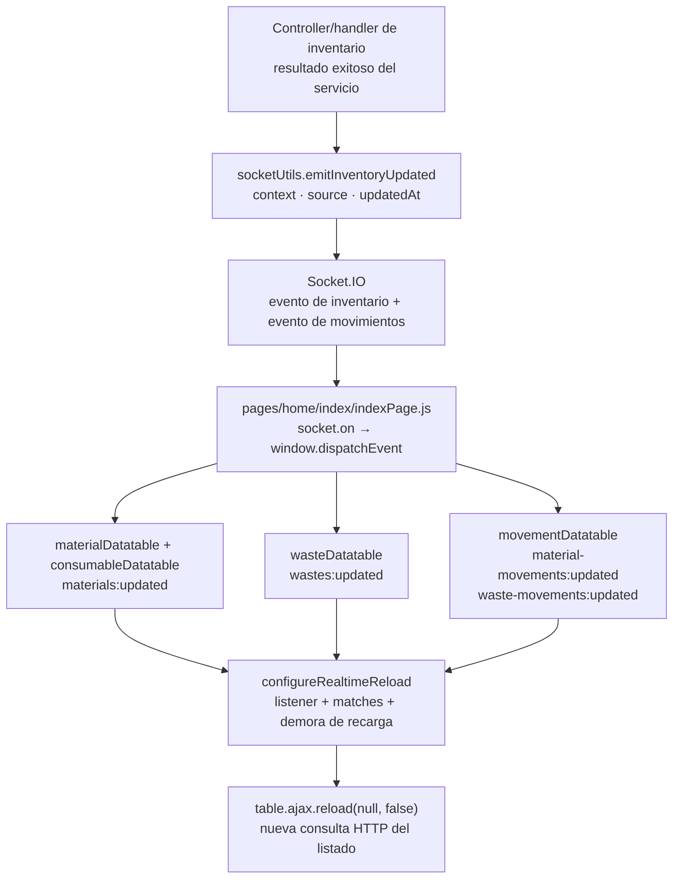

# 10. Publicación de eventos de inventario

`emitInventoryUpdated` funciona como publicador: recibe `material` o `waste`, resuelve
los nombres de eventos y notifica inventario y movimientos mediante Socket.IO. Los
controllers publican sólo después de una mutación exitosa.

Es una aplicación ligera de **Publish/Subscribe** en el borde de presentación, no un bus
de eventos de dominio durable: no persiste mensajes, no garantiza entrega y no sustituye
la transacción. Una nueva notificación de inventario debe reutilizar este publicador;
otro tipo de evento sólo se incorpora aquí si comparte el mismo contrato y ciclo de
vida.

Los modelos `InventoryMovement`, `WasteMovement`, ajustes, devoluciones y cambios de
detalle conservan historia operativa, pero **no implementan Event Sourcing**: el estado
actual de existencias y documentos se actualiza y consulta directamente, no se
reconstruye reproduciendo una secuencia inmutable de eventos; tampoco existe event
store, versión de agregado, proyección ni consumidor durable. Nombrar movimientos o
eventos Socket.IO como Event Sourcing sería incorrecto. No se recomienda introducirlo
sin un requisito de reconstrucción temporal, integración durable o múltiples
proyecciones que justifique la complejidad; la trazabilidad vigente usa historial de
dominio más Audit Trail.

## Aplicación entre publicador y consumidores

**Identificador:** `DIA-PAT-EVT-001`. **Pregunta:** ¿cómo llega una mutación confirmada
al refresco de los listados? **Alcance:** notificación y nueva consulta; las flechas
indican propagación del evento y delegación de recarga.

**Fuentes:** `src/utils/socketUtils.js`, el puente en `src/public/js/pages/home/index/indexPage.js`
y los módulos bajo `src/public/js/plugins/datatable/{warehouse,admin}`; el listener común
vive en `plugins/datatable/core/base/tableOperations.js`. Consumibles comparte los eventos
`material` por su contexto de inventario. El mensaje indica que hubo un cambio; las filas
actualizadas se obtienen mediante otra consulta, no se reconstruyen desde el evento.
Si Socket.IO no está inicializado o el contexto no existe, el publicador retorna sin
emitir. La notificación no acredita entrega, autorización de la nueva consulta ni
persistencia de eventos.
