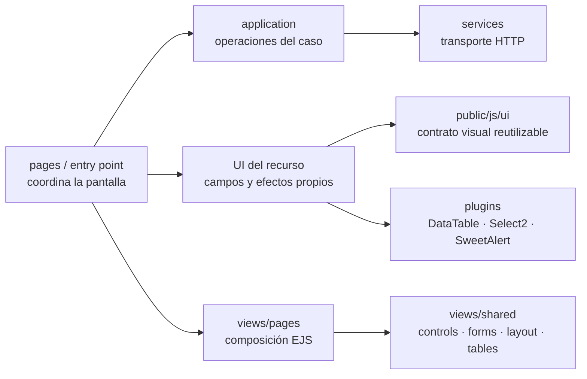
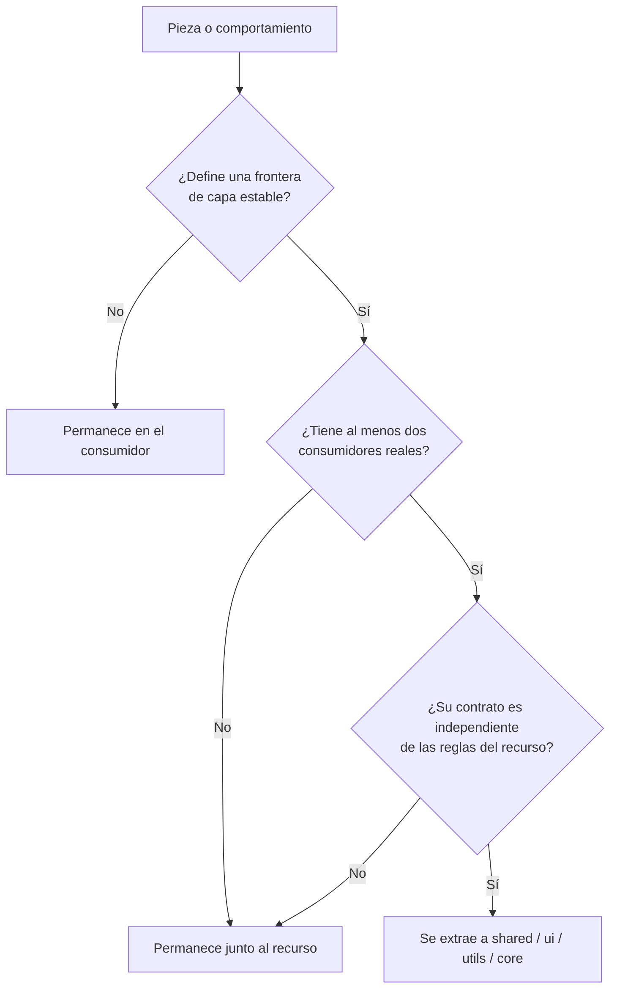
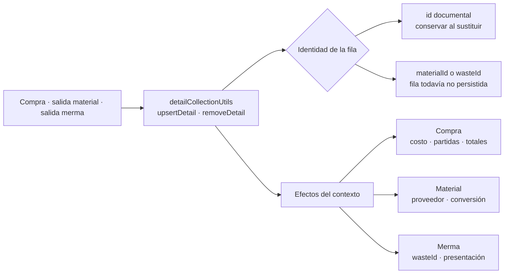
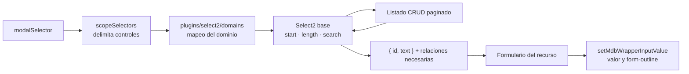

# 12. Composición y propiedad de componentes visuales

La interfaz aplica **composición por responsabilidad**: las páginas coordinan, los
componentes compartidos resuelven un contrato visual estable y cada recurso conserva sus
reglas, selectores y efectos propios. Compartir no significa mover todo a `shared`; exige
al menos dos consumidores y un contrato independiente del contexto.

### Composición de la interfaz

**Identificador:** `DIA-PAT-UI-001`. **Pregunta:** ¿cómo se compone una pantalla sin
mezclar transporte, caso de uso, plugins y reglas visuales?

| Pieza compartida | Contrato común | Variación que permanece en el recurso |
| --- | --- | --- |
| `inventoryCrudModal.ejs` e `inventoryCrudModalUI.js` | modo, identidad, errores y estado habilitado | campos, encabezados, detalles y selects |
| `materialSelect.ejs` | control de material con marcado y ancho estables | activación sólo en contextos de material |
| `baseSwal.js` y `swalComponent.js` | apariencia, variantes, botones y toast | contenido interactivo y validación del diálogo |
| `shared/layout/header.ejs` y `openModal` | título semántico, pila y backdrop | texto del título y operación del formulario |
| `bindDisabledSelectDependency` y `scopeSelectors` | dependencia y alcance de controles | selectores y mensajes del dominio |

Ningún consumidor llama directamente `Swal.fire`, administra backdrops o redefine el
marcado compartido. Al editar un EJS se conserva exactamente su cierre final de
`contentFor` y su estado de fin de archivo.

### Decisión de propiedad

**Identificador:** `DIA-PAT-OWN-001`. **Pregunta:** ¿cuándo una pieza permanece con el
recurso y cuándo se extrae como componente compartido?

La ubicación resultante conserva estas fronteras:

| Área | Responsabilidad propietaria |
| --- | --- |
| `routes`, `controllers`, `services` | transporte y reglas bajo el mismo dominio y recurso |
| `public/js/services`, `application`, `pages` | HTTP, operaciones del caso y composición visual; no se fusionan entre capas |
| `public/js/plugins` | adaptación de bibliotecas; DataTable y Select2 conservan dominio y recurso |
| `public/js/ui`, `views/shared` | componentes visuales con contrato reutilizable |
| `views/pages` | entrada EJS y parciales exclusivos de la pantalla |
| `constants`, `dtos`, `validators`, `utils` | contratos sin I/O o infraestructura transversal sólo cuando su alcance lo justifica |

Los entry points con sufijo `Page` coordinan pantalla y tablas; no vuelven a implementar
`useForm` ni `useIssueForm`. Los módulos `Fields` sólo existen cuando formulario y modal
del mismo recurso comparten grupos de campos por modo. El número de exports no decide la
ubicación: prevalecen cohesión, capa y ciclo de cambio.

### Colecciones de detalles

**Identificador:** `DIA-PAT-DET-001`. **Pregunta:** ¿qué se comparte al editar detalles
y qué reglas permanecen en compras o salidas?

`upsertDetail` y `removeDetail` administran únicamente la colección. Validación, totales,
limpieza del formulario y refresco visual permanecen en cada contexto. Las salidas sólo
permiten agregar, sustituir o eliminar detalles en modo `Pendiente`; la fila conserva su
`id` documental cuando ya existe y usa la identidad de inventario mientras es nueva. El
mapper de cada formulario envía únicamente los campos admitidos por su contrato.

El estado de surtimiento no se redefine aquí: sus transiciones y datos afectados están
en la [modos, precondiciones y efectos](../../../../requirements/requirements-specification/06-operation-modes-and-effects.md)
y su representación física en el
[diccionario generado](../../logical/data-and-persistence/generated/data-dictionary.md).

### Selects dentro de modales

**Identificador:** `DIA-PAT-SEL-001`. **Pregunta:** ¿cómo se conserva el alcance del
modal y el contrato paginado sin duplicar adaptadores por recurso?

El inicializador de dominio recibe un `baseSelector` ya delimitado; las funciones
`setup*Select` reciben el selector relativo y lo combinan una vez con `modalSelector`.
El adaptador base conserva `recordsFiltered` para la paginación y los mappers serializan
sólo las relaciones que el consumidor necesita. Los controles remotos reutilizan el
transporte HTTP y su renovación coordinada de autenticación; no implementan un refresh
por plugin. La limpieza posterior a agregar un detalle actualiza tanto el valor como el
estado visual del `form-outline`.
