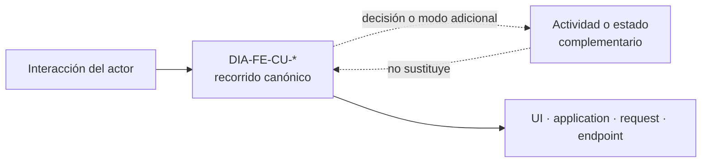
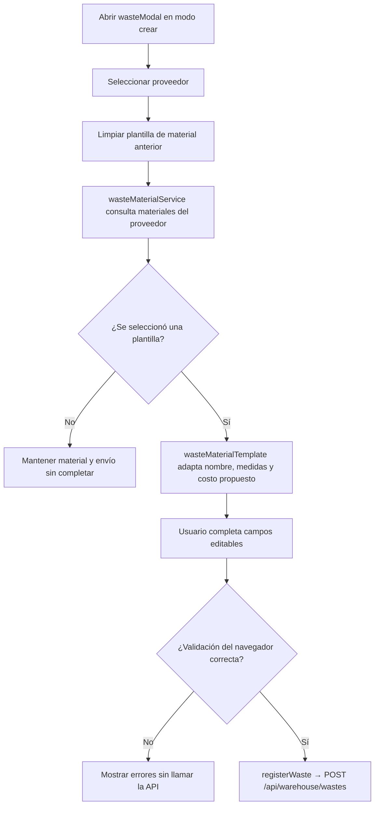
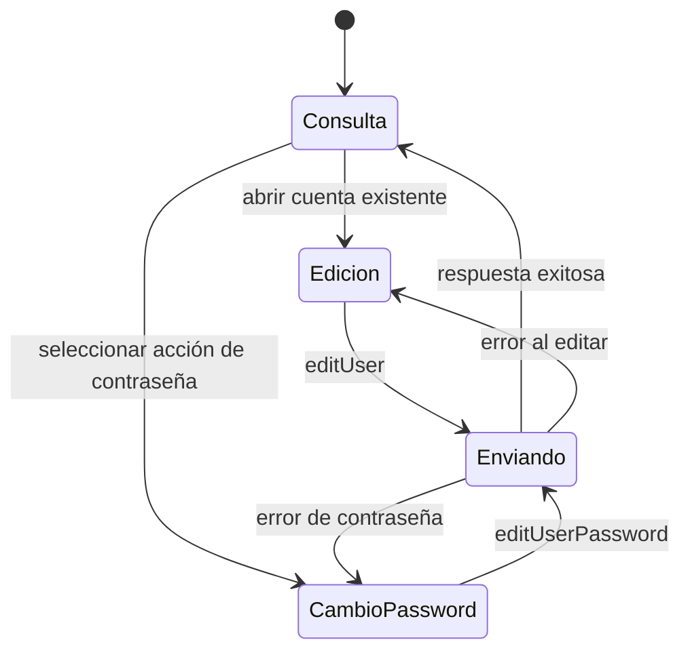
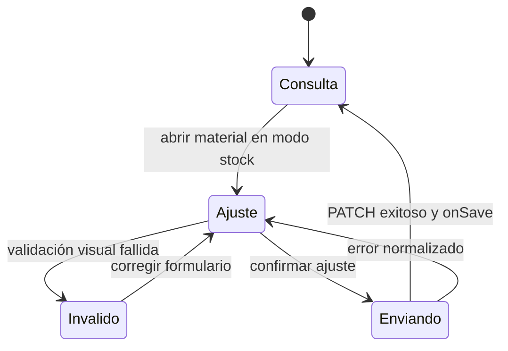

# 2. Diagramas técnicos complementarios del frontend

### Relación con la colección canónica

La columna **Diagrama aplicable** del catálogo de componentes orienta hacia los 73
recorridos `DIA-FE-CU-*` de `frontend-code-sequences/index.md`. Esa colección es propietaria del orden
interacción → UI → aplicación → request → endpoint → resultado visible. Este documento
conserva sólo diagramas que responden una pregunta adicional sobre los límites del
navegador. Ningún diagrama complementario extiende la seguridad hacia el servidor ni
sustituye la secuencia enlazada.

| Diagrama conservado | Pregunta adicional | Complementa |
| --- | --- | --- |
| `DIA-FE-ACT-001` · `CU-ALM-10` | ¿Cómo condicionan proveedor y plantilla la habilitación y el envío? | `DIA-FE-CU-ALM-10`; muestra decisiones de UI y termina en el mismo `POST`. |
| `DIA-FE-TEC-EST-CU-IDA-08` | ¿Cómo alterna el formulario entre consulta, edición y contraseña? | `DIA-FE-CU-IDA-08`; no crea otro caso ni otra API. |
| `DIA-FE-TEC-EST-CU-ALM-05` | ¿Cómo evoluciona el modo de ajuste ante validación, envío y error? | `DIA-FE-CU-ALM-05`; no representa estado persistido ni validación definitiva. |

Las antiguas secuencias selectivas de login, ajuste, corrección y devoluciones no se
mantienen aquí: repetían la pregunta ya contestada por sus `DIA-FE-CU-*`. Su detalle se
consolidó en la colección canónica. La reutilización de factories o UI compartida se
conecta mediante el código de patrón y los diagramas estructurales; no exige duplicar la
secuencia de cada consumidor.

### Alta de merma desde una plantilla de material

**Identificador:** `DIA-FE-ACT-001`. **Caso:** `CU-ALM-10`. Esta actividad hace visible
la dependencia proveedor → material y la preparación de snapshots; no representa las
decisiones de persistencia del servicio.

### Estados técnicos complementarios

Estos diagramas permanecen aquí porque añaden ciclos técnicos que no repite la colección
de secuencias por caso.

**Estado técnico complementario:** `DIA-FE-TEC-EST-CU-IDA-08`. Expone los modos
que gobiernan los campos y la mutación del formulario de usuario.

**Estado técnico complementario:** `DIA-FE-TEC-EST-CU-ALM-05`. Representa el ciclo
del modo de ajuste sin atribuir al navegador la validación definitiva del stock.

