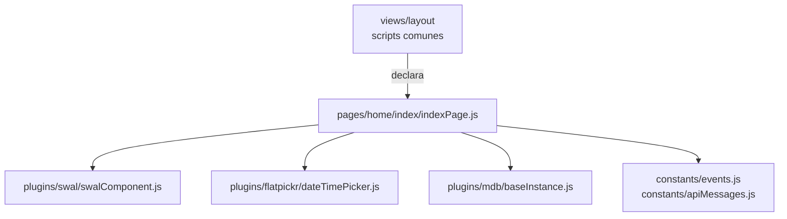
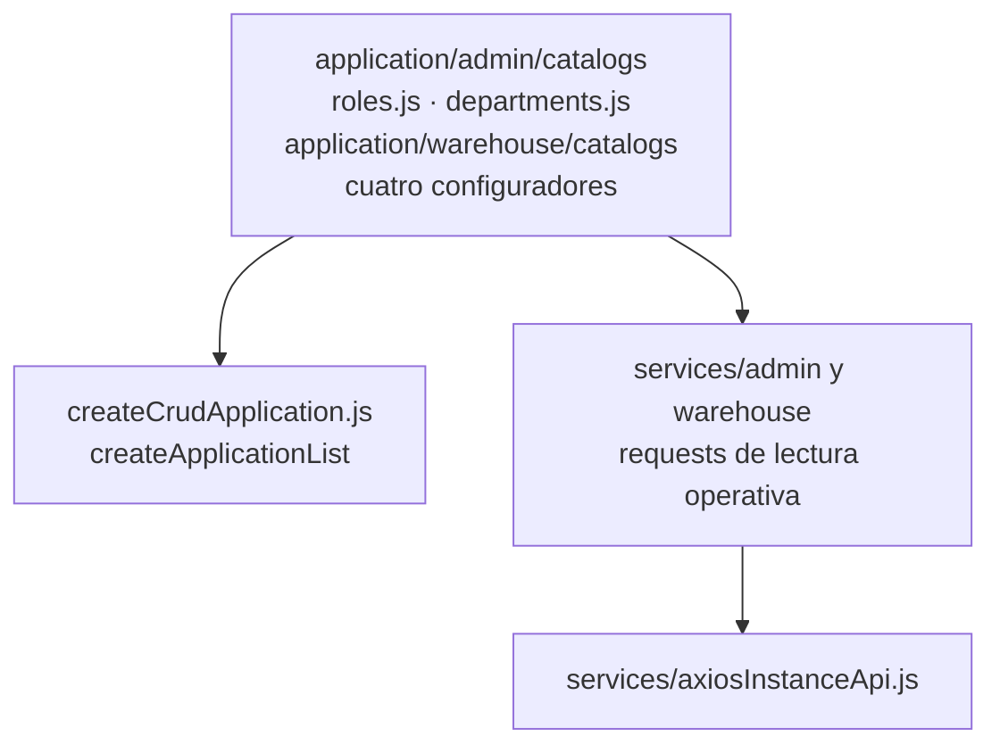
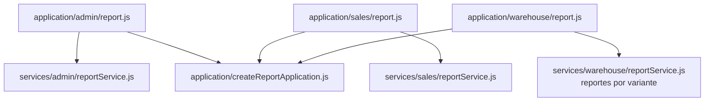

# 3. Código compartido y cobertura de pantallas frontend

Los mapas de módulos cubren personas, usuarios, clientes, proveedores, inventarios,
entradas, salidas, movimientos, catálogos y autenticación. Este capítulo completa el
layout/entry point común, los reportes, las lecturas para selects y el transporte.

## Layout y entrada común

**Identificador:** `DIA-FE-MOD-SHELL-001`. **Fuente:** imports de `pages/home/index/indexPage.js`
y scripts del layout. **Leyenda:** el layout declara el módulo; las demás flechas son imports.

`indexPage.js` es la entrada común de notificaciones, controles compartidos y puente
Socket.IO/CustomEvent; no corresponde a una página CRUD de portada. El router `/`
redirige a materiales o login. Las entradas de cada recurso se declaran en su EJS y
se representan en sus capítulos propietarios.

## Lecturas operativas de catálogos

Los selects operativos tienen applications propias para roles, áreas, unidades,
presentaciones, motivos y cumplimiento. Importan requests de sus endpoints de lectura;
no usan el registro administrativo de `catalogs.js` para cualquier consulta.

**Identificador:** `DIA-FE-MOD-OPS-001`. **Fuente:** imports de las applications de
catálogo y sus servicios. **Leyenda:** flechas = import de módulos y funciones.

| Application de lectura | Servicio HTTP importado |
| --- | --- |
| `src/public/js/application/admin/catalogs/` `departments.js` | `src/public/js/services/admin/` `departmentService.js` |
| `src/public/js/application/admin/catalogs/` `roles.js` | `src/public/js/services/admin/` `roleService.js` |
| `src/public/js/application/warehouse/` `catalogs/fulfillmentStatuses.js` | `src/public/js/services/warehouse/` `fulfillmentStatusService.js` |
| `src/public/js/application/warehouse/` `catalogs/presentations.js` | `src/public/js/services/warehouse/` `presentationService.js` |
| `src/public/js/application/warehouse/` `catalogs/reasons.js` | `src/public/js/services/warehouse/` `reasonService.js` |
| `src/public/js/application/warehouse/` `catalogs/unitMeasures.js` | `src/public/js/services/warehouse/` `unitMeasureService.js` |

Select2 y sus módulos de recurso convierten respuestas a opciones o precargan valores.
Las factories/helpers compartidos se describen en [reutilización](../reuse-and-refactoring/index.md);
las opciones no crean otra pantalla ni otra secuencia por catálogo.

## Applications de reporte

**Identificador:** `DIA-FE-MOD-REP-001`. **Fuente:** imports de `application/{admin,sales,warehouse}/report.js`.
**Leyenda:** flechas = import de funciones/configuración.

Las tablas propietarias importan estas applications. La factory devuelve `response.data`;
el consumidor conserva nombre de archivo, filtros y descarga. No hay una página general
de reportes. Los reportes de compras/salidas usan requests específicos por variante.

## Infraestructura de presentación y transporte

| Código | Contrato y cobertura |
| --- | --- |
| `application/createCrudApplication.js`, `warehouse/issues/createIssueApplication.js` | Closures y adaptación de mutaciones; los configuradores están en los mapas por módulo. |
| `services/axiosInstanceApi.js`, `api` | Request, sesión y normalización de errores. La [renovación compartida](../../processes/shared-runtime-behavior/02-browser-session-and-form-state.md#renovación-coordinada-del-transporte-http) tiene una colaboración canónica, dividida en espera y resolución, en procesos. |
| `ui/forms`, `ui/inventory`, `ui/issues`, `ui/modalUI.js` | Selectores, callbacks, modo y ownership; los consumidores se muestran en cada módulo y en reutilización. |
| `plugins/datatable/core`, `shared`, `select2`, `flatpickr`, `swal`, `mdb` | Adaptadores y builders; el código específico de cada recurso conserva su configuración. |
| `utils`, `constants` | Validaciones del navegador, formato, identidades, selectores y valores compartidos. |
| `views/pages`, `views/shared`, `views/layout` | Composición EJS en servidor y declaración de scripts; no son módulos que consulten Prisma en el navegador. |

Los [estados técnicos de formularios](../../processes/shared-runtime-behavior/02-browser-session-and-form-state.md#estados-técnicos-complementarios)
pertenecen a procesos. Desarrollo mantiene nombres de propiedades, modos y callbacks
como contratos de código, sin dibujar de nuevo la interacción del caso.
