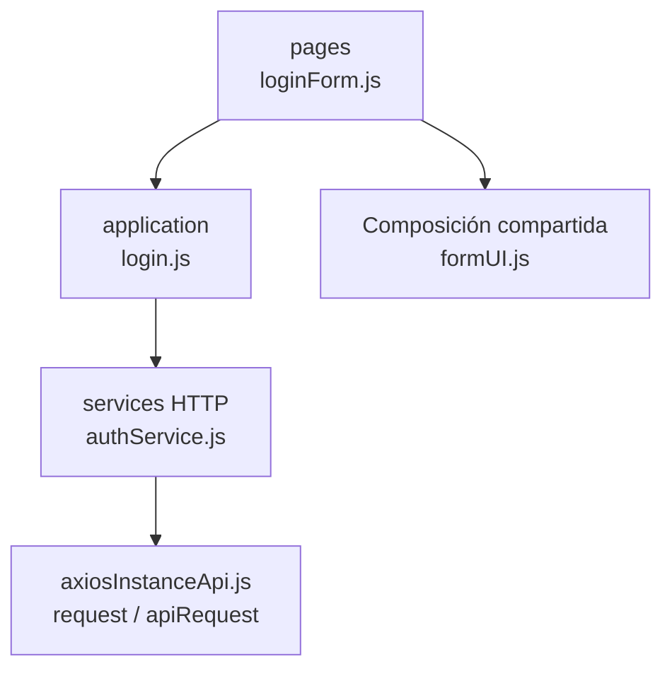

# 4. Autenticación: estructura de código

**Identificador:** `DIA-FE-MOD-AUT-001`.
**Alcance:** grupos de implementación del módulo y sus dependencias directas.
**Fuente:** imports de los archivos de la tabla.

loginForm compone useForm y la application de autenticación. Las funciones sin ruta/consumidor publicados no se presentan como otra pantalla implementada.

| Grupo del mapa | Archivos que lo componen |
| --- | --- |
| pages · loginForm.js | `src/public/js/pages/home/login/` `loginForm.js` |
| application · login.js | `src/public/js/application/auth/login.js` |
| services HTTP · authService.js | `src/public/js/services/authService.js` |
| Composición compartida · formUI.js | `src/public/js/ui/forms/formUI.js` |
| axiosInstanceApi.js · request / apiRequest | `src/public/js/services/axiosInstanceApi.js` |

Los reportes y la infraestructura transversal se localizan en el
[capítulo 3](03-shared-code-and-coverage.md); el orden de llamadas está en
[procesos](../../processes/frontend-code-sequences/index.md).

