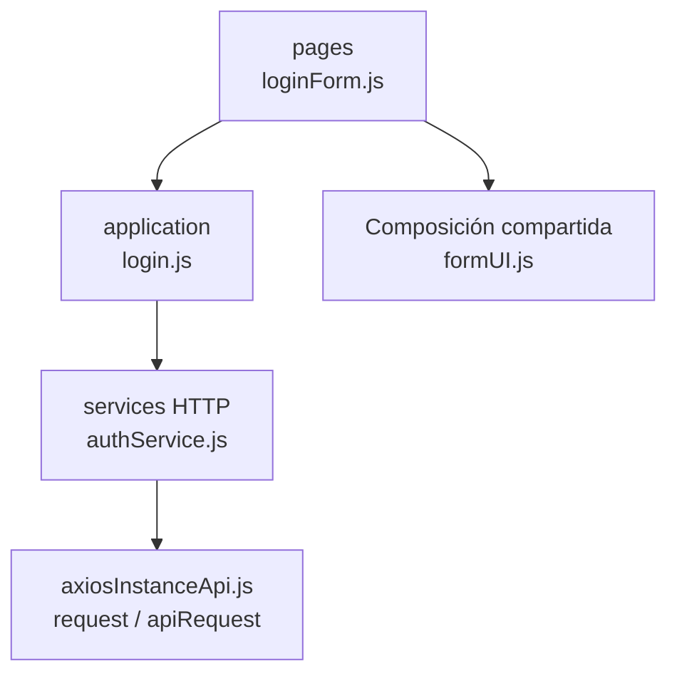

# 4. Autenticación: estructura de código

**Identificador:** `DIA-FE-MOD-AUT-001`.
**Alcance:** grupos de implementación del módulo y sus dependencias directas.
**Fuente:** imports de los archivos de la tabla.

| Grupo del mapa | Archivos que lo componen |
| --- | --- |
| pages · loginForm.js | `src/public/js/pages/home/login/` `loginForm.js` |
| application · login.js | `src/public/js/application/auth/login.js` |
| services HTTP · authService.js | `src/public/js/services/authService.js` |
| Composición compartida · formUI.js | `src/public/js/ui/forms/formUI.js` |
| axiosInstanceApi.js · request / apiRequest | `src/public/js/services/axiosInstanceApi.js` |

## Contratos de implementación

### Datos, resultados y efectos del módulo

| Capacidad | Composición de pantalla | Application y transporte | Contrato y variantes |
| --- | --- | --- | --- |
| Inicio de sesión | `loginPage.ejs` y `loginForm.js` recopilan credenciales; `indexPage.js` prepara la portada autenticada. | `application/auth/login.js` coordina `services/authService.js`; sus exports `registerRequest` y `resetPasswordRequest` no tienen consumidor ni ruta vigente y se registran como brecha, no como funcionalidad publicada. | `POST /api/auth/login`; normaliza la respuesta de éxito y deja cookies, tokens y permisos efectivos al servidor. |

La application exporta operaciones con vocabulario del recurso; la página/formulario
las consume sin acceder a Prisma. Los requests conservan el transporte separado. La tabla anterior define los datos y variantes propios; los modos compartidos
se consultan en el [contrato de formularios](01-catalog-complete-of-records-frontend.md#contrato-técnico-de-los-modos-de-formulario-de-almacén).

| Archivo bajo `src/` | Símbolos públicos y puntos de configuración |
| --- | --- |
| `public/js/application/auth/login.js` | `login` |

### Adaptadores de transporte

| Archivo bajo `src/` | Símbolos públicos y puntos de configuración |
| --- | --- |
| `public/js/services/authService.js` | `loginRequest` `registerRequest` `resetPasswordRequest` |

## Variantes y límites de reutilización

loginForm compone useForm y la application de autenticación. Las funciones sin ruta/consumidor publicados no se presentan como otra pantalla implementada.

El mapa distingue composición visual, application, requests y UI compartida. Cada
configurador conserva campos, modos, callbacks y claves del recurso; usar una factory
no significa que todas las pantallas ofrezcan las mismas operaciones. El contrato del
[núcleo de application/requests](../reuse-and-refactoring/02-browser-applications-and-requests.md)
y la [composición de interfaz](../reuse-and-refactoring/03-interface-and-table-lifecycle.md)
se documentan una vez.

Los reportes y la infraestructura transversal se localizan en el
[capítulo 3](03-shared-code-and-coverage.md); el orden de llamadas está en
[procesos](../../processes/frontend-code-sequences/index.md).

