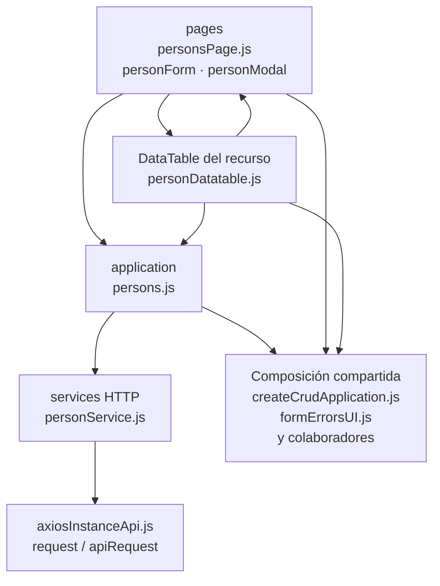

# 5. Personas: estructura de código

**Identificador:** `DIA-FE-MOD-PER-001`.
**Alcance:** grupos de implementación del módulo y sus dependencias directas.
**Fuente:** imports de los archivos de la tabla.

personsPage compone tabla y formulario; personForm adapta campos y usa persons.js. Los modales y selects conservan su configuración específica.

| Grupo del mapa | Archivos que lo componen |
| --- | --- |
| pages · personForm.js · personModal.js · y colaboradores | `src/public/js/pages/admin/persons/` `personForm.js` `src/public/js/pages/admin/persons/` `personModal.js` `src/public/js/pages/admin/persons/` `personsPage.js` |
| application · persons.js | `src/public/js/application/admin/persons/` `persons.js` |
| services HTTP · personService.js | `src/public/js/services/admin/` `personService.js` |
| DataTable del recurso · personDatatable.js | `src/public/js/plugins/datatable/admin/` `persons/personDatatable.js` |
| Composición compartida · createCrudApplication.js · formErrorsUI.js · y colaboradores | `src/public/js/application/` `createCrudApplication.js` `src/public/js/ui/forms/formErrorsUI.js` `src/public/js/ui/forms/formStateUI.js` `src/public/js/ui/forms/formUI.js` `src/public/js/ui/modalUI.js` `src/public/js/ui/tableUI.js` |
| axiosInstanceApi.js · request / apiRequest | `src/public/js/services/axiosInstanceApi.js` |

Los reportes y la infraestructura transversal se localizan en el
[capítulo 3](03-shared-code-and-coverage.md); el orden de llamadas está en
[procesos](../../processes/frontend-code-sequences/index.md).

