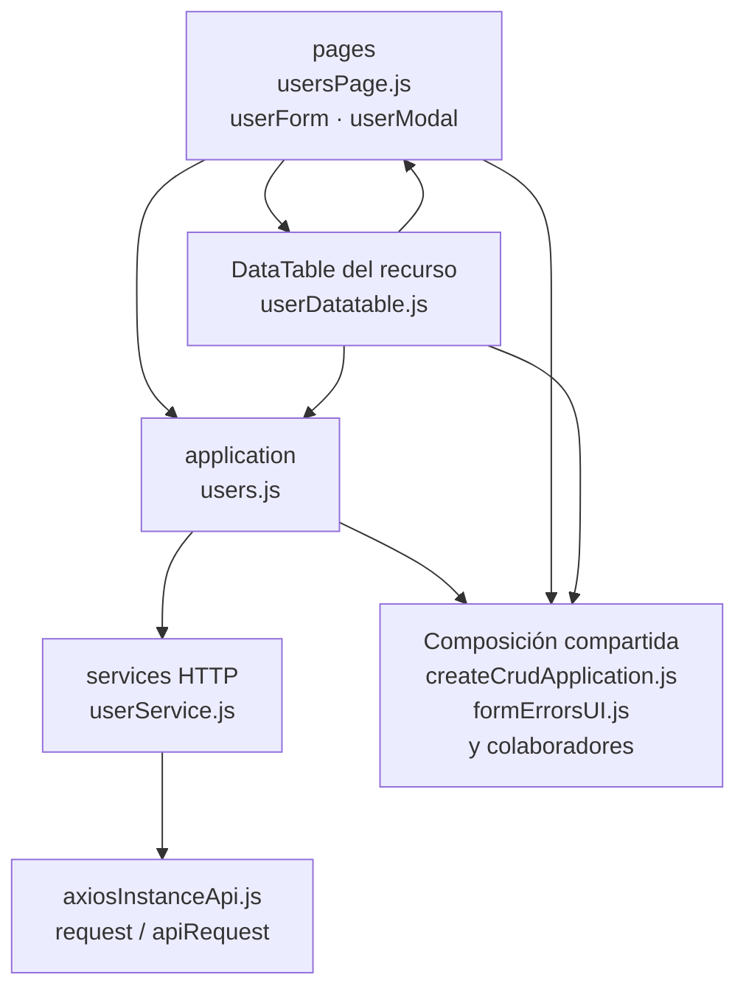

# 6. Usuarios: estructura de código

**Identificador:** `DIA-FE-MOD-USR-001`.
**Alcance:** grupos de implementación del módulo y sus dependencias directas.
**Fuente:** imports de los archivos de la tabla.

| Grupo del mapa | Archivos que lo componen |
| --- | --- |
| pages · userForm.js · userModal.js · y colaboradores | `src/public/js/pages/admin/users/` `userForm.js` `src/public/js/pages/admin/users/` `userModal.js` `src/public/js/pages/admin/users/` `usersPage.js` |
| application · users.js | `src/public/js/application/admin/users/` `users.js` |
| services HTTP · userService.js | `src/public/js/services/admin/` `userService.js` |
| DataTable del recurso · userDatatable.js | `src/public/js/plugins/datatable/admin/` `users/userDatatable.js` |
| Composición compartida · createCrudApplication.js · formErrorsUI.js · y colaboradores | `src/public/js/application/` `createCrudApplication.js` `src/public/js/ui/forms/formErrorsUI.js` `src/public/js/ui/forms/formStateUI.js` `src/public/js/ui/forms/formUI.js` `src/public/js/ui/modalUI.js` `src/public/js/ui/tableUI.js` |
| axiosInstanceApi.js · request / apiRequest | `src/public/js/services/axiosInstanceApi.js` |

## Contratos de implementación

### Datos, resultados y efectos del módulo

| Capacidad | Composición de pantalla | Application y transporte | Contrato y variantes |
| --- | --- | --- | --- |
| Usuarios | `usersPage.ejs`, `usersPage.js`, `userModal.js` y `userForm.js` separan alta, edición y cambio de contraseña. | `application/admin/users/users.js` usa `userService.js` y consume los catálogos de roles y departamentos. | `GET`, `POST`, `PATCH /api/admin/users/:id` y `PATCH .../:id/password`; el modo decide campos y mutación. |

La application exporta operaciones con vocabulario del recurso; la página/formulario
las consume sin acceder a Prisma. Los requests conservan el transporte separado. La tabla anterior define los datos y variantes propios; los modos compartidos
se consultan en el [contrato de formularios](01-catalog-complete-of-records-frontend.md#contrato-técnico-de-los-modos-de-formulario-de-almacén).

| Archivo bajo `src/` | Símbolos públicos y puntos de configuración |
| --- | --- |
| `public/js/application/admin/users/users.js` | `getAllUsers` `registerUser` `editUser` `editUserPassword` |

### Adaptadores de transporte

| Archivo bajo `src/` | Símbolos públicos y puntos de configuración |
| --- | --- |
| `public/js/services/admin/userService.js` | `getAllUsersRequest` `registerUserRequest` `editUserRequest` `editUserPasswordRequest` |

## Variantes y límites de reutilización

userForm selecciona operaciones por FORM_MODES; users.js configura también la mutación de contraseña. El modal mantiene selectores y campos del usuario.

El mapa distingue composición visual, application, requests y UI compartida. Cada
configurador conserva campos, modos, callbacks y claves del recurso; usar una factory
no significa que todas las pantallas ofrezcan las mismas operaciones. El contrato del
[núcleo de application/requests](../reuse-and-refactoring/02-browser-applications-and-requests.md)
y la [composición de interfaz](../reuse-and-refactoring/03-interface-and-table-lifecycle.md)
se documentan una vez.

Los reportes y la infraestructura transversal se localizan en el
[capítulo 3](03-shared-code-and-coverage.md); el orden de llamadas está en
[procesos](../../processes/frontend-code-sequences/index.md).

