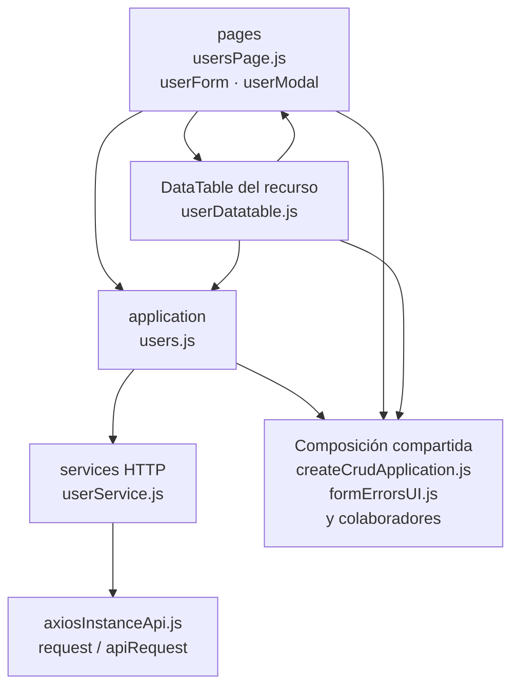

# 6. Usuarios: estructura de código

**Identificador:** `DIA-FE-MOD-USR-001`.
**Alcance:** grupos de implementación del módulo y sus dependencias directas.
**Fuente:** imports de los archivos de la tabla.

userForm selecciona operaciones por FORM_MODES; users.js configura también la mutación de contraseña. El modal mantiene selectores y campos del usuario.

| Grupo del mapa | Archivos que lo componen |
| --- | --- |
| pages · userForm.js · userModal.js · y colaboradores | `src/public/js/pages/admin/users/` `userForm.js` `src/public/js/pages/admin/users/` `userModal.js` `src/public/js/pages/admin/users/` `usersPage.js` |
| application · users.js | `src/public/js/application/admin/users/` `users.js` |
| services HTTP · userService.js | `src/public/js/services/admin/` `userService.js` |
| DataTable del recurso · userDatatable.js | `src/public/js/plugins/datatable/admin/` `users/userDatatable.js` |
| Composición compartida · createCrudApplication.js · formErrorsUI.js · y colaboradores | `src/public/js/application/` `createCrudApplication.js` `src/public/js/ui/forms/formErrorsUI.js` `src/public/js/ui/forms/formStateUI.js` `src/public/js/ui/forms/formUI.js` `src/public/js/ui/modalUI.js` `src/public/js/ui/tableUI.js` |
| axiosInstanceApi.js · request / apiRequest | `src/public/js/services/axiosInstanceApi.js` |

Los reportes y la infraestructura transversal se localizan en el
[capítulo 3](03-shared-code-and-coverage.md); el orden de llamadas está en
[procesos](../../processes/frontend-code-sequences/index.md).

