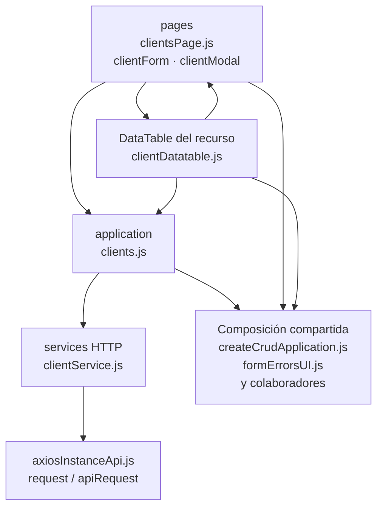

# 7. Clientes: estructura de código

**Identificador:** `DIA-FE-MOD-CLI-001`.
**Alcance:** grupos de implementación del módulo y sus dependencias directas.
**Fuente:** imports de los archivos de la tabla.

clientsPage compone tabla y formulario. El plugin tabular consume getAllClients y la application de reportes; el formulario consume las mutaciones de clients.js.

| Grupo del mapa | Archivos que lo componen |
| --- | --- |
| pages · clientForm.js · clientModal.js · y colaboradores | `src/public/js/pages/sales/clients/` `clientForm.js` `src/public/js/pages/sales/clients/` `clientModal.js` `src/public/js/pages/sales/clients/` `clientsPage.js` |
| application · clients.js | `src/public/js/application/sales/clients/` `clients.js` |
| services HTTP · clientService.js | `src/public/js/services/sales/` `clientService.js` |
| DataTable del recurso · clientDatatable.js | `src/public/js/plugins/datatable/sales/` `clients/clientDatatable.js` |
| Composición compartida · createCrudApplication.js · formErrorsUI.js · y colaboradores | `src/public/js/application/` `createCrudApplication.js` `src/public/js/ui/forms/formErrorsUI.js` `src/public/js/ui/forms/formStateUI.js` `src/public/js/ui/forms/formUI.js` `src/public/js/ui/modalUI.js` `src/public/js/ui/tableUI.js` |
| axiosInstanceApi.js · request / apiRequest | `src/public/js/services/axiosInstanceApi.js` |

Los reportes y la infraestructura transversal se localizan en el
[capítulo 3](03-shared-code-and-coverage.md); el orden de llamadas está en
[procesos](../../processes/frontend-code-sequences/index.md).

