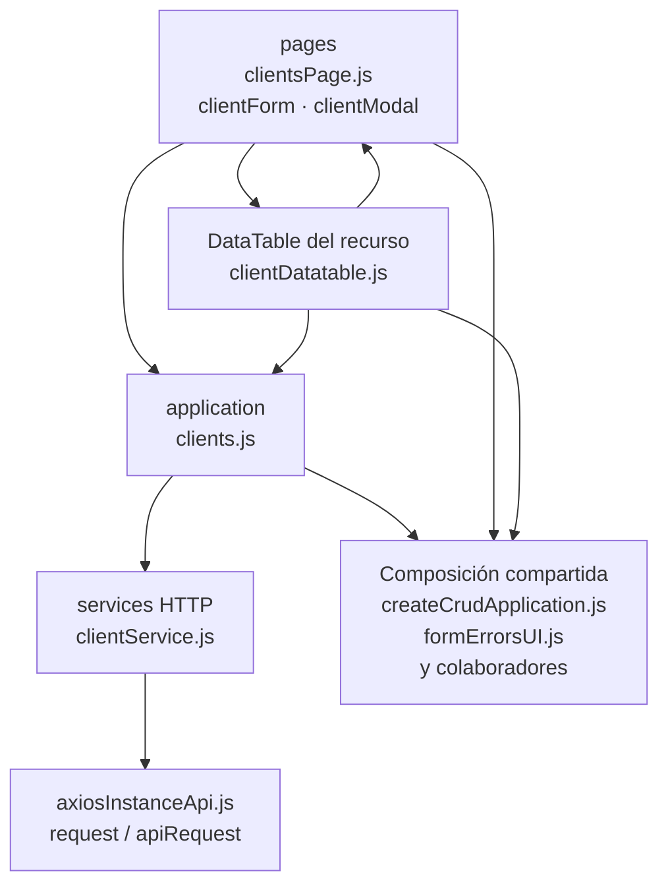

# 7. Clientes: estructura de código

**Identificador:** `DIA-FE-MOD-CLI-001`.
**Alcance:** grupos de implementación del módulo y sus dependencias directas.
**Fuente:** imports de los archivos de la tabla.

| Grupo del mapa | Archivos que lo componen |
| --- | --- |
| pages · clientForm.js · clientModal.js · y colaboradores | `src/public/js/pages/sales/clients/` `clientForm.js` `src/public/js/pages/sales/clients/` `clientModal.js` `src/public/js/pages/sales/clients/` `clientsPage.js` |
| application · clients.js | `src/public/js/application/sales/clients/` `clients.js` |
| services HTTP · clientService.js | `src/public/js/services/sales/` `clientService.js` |
| DataTable del recurso · clientDatatable.js | `src/public/js/plugins/datatable/sales/` `clients/clientDatatable.js` |
| Composición compartida · createCrudApplication.js · formErrorsUI.js · y colaboradores | `src/public/js/application/` `createCrudApplication.js` `src/public/js/ui/forms/formErrorsUI.js` `src/public/js/ui/forms/formStateUI.js` `src/public/js/ui/forms/formUI.js` `src/public/js/ui/modalUI.js` `src/public/js/ui/tableUI.js` |
| axiosInstanceApi.js · request / apiRequest | `src/public/js/services/axiosInstanceApi.js` |

## Contratos de implementación

### Datos, resultados y efectos del módulo

| Capacidad | Composición de pantalla | Application y transporte | Contrato y variantes |
| --- | --- | --- | --- |
| Clientes | `clientsPage.ejs`, `clientModal.ejs`, `clientsPage.js`, `clientModal.js` y `clientForm.js`; `goodsIssuesPage.ejs` reutiliza el modal y `plugins/select2/domains/client.js` lo abre desde el selector operativo. | `application/sales/clients/clients.js` usa `services/sales/clientService.js`; `form.onSave` entrega el alta contextual a `toggleClientOption`; `application/sales/report.js` usa el servicio de reporte. | CRUD de `/api/sales/clients` y exportación `/api/sales/reports/clients/excel`; la vista `/clientes` conserva autorización separada. |

La application exporta operaciones con vocabulario del recurso; la página/formulario
las consume sin acceder a Prisma. Los requests conservan el transporte separado. La tabla anterior define los datos y variantes propios; los modos compartidos
se consultan en el [contrato de formularios](01-catalog-complete-of-records-frontend.md#contrato-técnico-de-los-modos-de-formulario-de-almacén).

| Archivo bajo `src/` | Símbolos públicos y puntos de configuración |
| --- | --- |
| `public/js/application/sales/clients/` `clients.js` | `getAllClients` `registerClient` `editClient` |

### Adaptadores de transporte

| Archivo bajo `src/` | Símbolos públicos y puntos de configuración |
| --- | --- |
| `public/js/services/sales/clientService.js` | `CLIENTS_API_ROUTE` `getAllClientsRequest` `createClientRequest` `editClientRequest` |

## Variantes y límites de reutilización

clientsPage compone tabla y formulario. El plugin tabular consume getAllClients y la application de reportes; el formulario consume las mutaciones de clients.js.

El mapa distingue composición visual, application, requests y UI compartida. Cada
configurador conserva campos, modos, callbacks y claves del recurso; usar una factory
no significa que todas las pantallas ofrezcan las mismas operaciones. El contrato del
[núcleo de application/requests](../reuse-and-refactoring/02-browser-applications-and-requests.md)
y la [composición de interfaz](../reuse-and-refactoring/03-interface-and-table-lifecycle.md)
se documentan una vez.

Los reportes y la infraestructura transversal se localizan en el
[capítulo 3](03-shared-code-and-coverage.md); el orden de llamadas está en
[procesos](../../processes/frontend-code-sequences/index.md).

