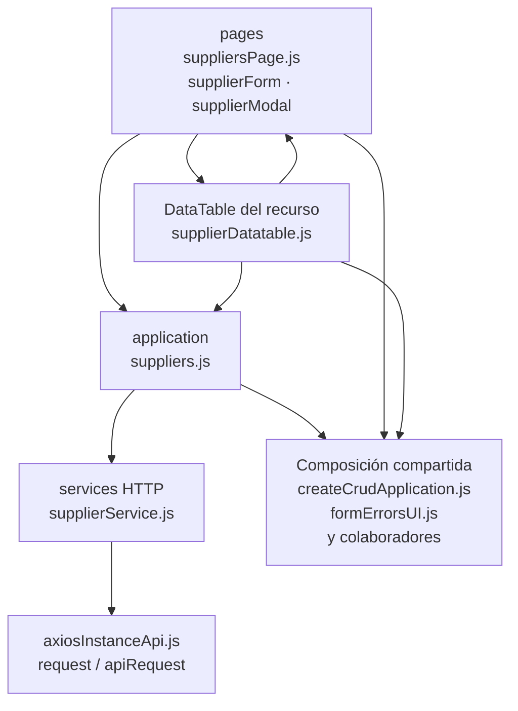

# 8. Proveedores: estructura de código

**Identificador:** `DIA-FE-MOD-SUP-001`.
**Alcance:** grupos de implementación del módulo y sus dependencias directas.
**Fuente:** imports de los archivos de la tabla.

| Grupo del mapa | Archivos que lo componen |
| --- | --- |
| pages · supplierForm.js · supplierModal.js · y colaboradores | `src/public/js/pages/warehouse/suppliers/` `supplierForm.js` `src/public/js/pages/warehouse/suppliers/` `supplierModal.js` `src/public/js/pages/warehouse/suppliers/` `suppliersPage.js` |
| application · suppliers.js | `src/public/js/application/warehouse/` `suppliers/suppliers.js` |
| services HTTP · supplierService.js | `src/public/js/services/warehouse/` `supplierService.js` |
| DataTable del recurso · supplierDatatable.js | `src/public/js/plugins/datatable/warehouse/` `suppliers/supplierDatatable.js` |
| Composición compartida · createCrudApplication.js · formErrorsUI.js · y colaboradores | `src/public/js/application/` `createCrudApplication.js` `src/public/js/ui/forms/formErrorsUI.js` `src/public/js/ui/forms/formStateUI.js` `src/public/js/ui/forms/formUI.js` `src/public/js/ui/modalUI.js` `src/public/js/ui/tableUI.js` |
| axiosInstanceApi.js · request / apiRequest | `src/public/js/services/axiosInstanceApi.js` |

## Contratos de implementación

### Datos, resultados y efectos del módulo

| Capacidad | Composición de pantalla | Application y transporte | Contrato y variantes |
| --- | --- | --- | --- |
| Proveedores | `suppliersPage.ejs`, `supplierModal.ejs`, `suppliersPage.js`, `supplierModal.js` y `supplierForm.js`; `goodsReceiptsPage.ejs` reutiliza el modal y `plugins/select2/domains/supplier.js` lo abre desde el selector operativo. | `application/warehouse/suppliers/suppliers.js` usa `supplierService.js`; `form.onSave` entrega el alta contextual a `toggleSupplierOption`; el reporte usa la fábrica común. | CRUD de `/api/warehouse/suppliers` y reporte de proveedores; la vista `/proveedores` conserva autorización separada. |

La application exporta operaciones con vocabulario del recurso; la página/formulario
las consume sin acceder a Prisma. Los requests conservan el transporte separado. La tabla anterior define los datos y variantes propios; los modos compartidos
se consultan en el [contrato de formularios](01-catalog-complete-of-records-frontend.md#contrato-técnico-de-los-modos-de-formulario-de-almacén).

| Archivo bajo `src/` | Símbolos públicos y puntos de configuración |
| --- | --- |
| `public/js/application/warehouse/suppliers/` `suppliers.js` | `getAllSuppliers` `registerSupplier` `editSupplier` |

### Adaptadores de transporte

| Archivo bajo `src/` | Símbolos públicos y puntos de configuración |
| --- | --- |
| `public/js/services/warehouse/` `supplierService.js` | `SUPPLIERS_API_ROUTE` `getAllSuppliersRequest` `registerSupplierRequest` `editSupplierRequest` |

## Variantes y límites de reutilización

supplierForm también se importa desde pantallas de inventario/compras. El módulo conserva su selector y operaciones aunque se abra desde otra página.

El mapa distingue composición visual, application, requests y UI compartida. Cada
configurador conserva campos, modos, callbacks y claves del recurso; usar una factory
no significa que todas las pantallas ofrezcan las mismas operaciones. El contrato del
[núcleo de application/requests](../reuse-and-refactoring/02-browser-applications-and-requests.md)
y la [composición de interfaz](../reuse-and-refactoring/03-interface-and-table-lifecycle.md)
se documentan una vez.

Los reportes y la infraestructura transversal se localizan en el
[capítulo 3](03-shared-code-and-coverage.md); el orden de llamadas está en
[procesos](../../processes/frontend-code-sequences/index.md).

