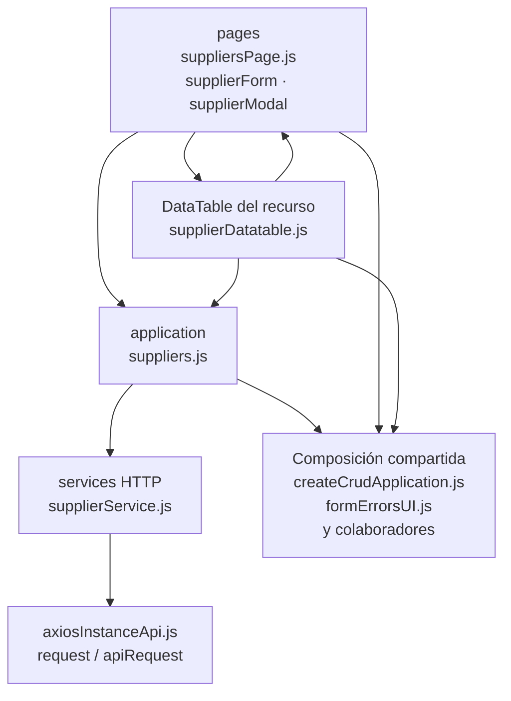

# 8. Proveedores: estructura de código

**Identificador:** `DIA-FE-MOD-SUP-001`.
**Alcance:** grupos de implementación del módulo y sus dependencias directas.
**Fuente:** imports de los archivos de la tabla.

supplierForm también se importa desde pantallas de inventario/compras. El módulo conserva su selector y operaciones aunque se abra desde otra página.

| Grupo del mapa | Archivos que lo componen |
| --- | --- |
| pages · supplierForm.js · supplierModal.js · y colaboradores | `src/public/js/pages/warehouse/suppliers/` `supplierForm.js` `src/public/js/pages/warehouse/suppliers/` `supplierModal.js` `src/public/js/pages/warehouse/suppliers/` `suppliersPage.js` |
| application · suppliers.js | `src/public/js/application/warehouse/` `suppliers/suppliers.js` |
| services HTTP · supplierService.js | `src/public/js/services/warehouse/` `supplierService.js` |
| DataTable del recurso · supplierDatatable.js | `src/public/js/plugins/datatable/warehouse/` `suppliers/supplierDatatable.js` |
| Composición compartida · createCrudApplication.js · formErrorsUI.js · y colaboradores | `src/public/js/application/` `createCrudApplication.js` `src/public/js/ui/forms/formErrorsUI.js` `src/public/js/ui/forms/formStateUI.js` `src/public/js/ui/forms/formUI.js` `src/public/js/ui/modalUI.js` `src/public/js/ui/tableUI.js` |
| axiosInstanceApi.js · request / apiRequest | `src/public/js/services/axiosInstanceApi.js` |

Los reportes y la infraestructura transversal se localizan en el
[capítulo 3](03-shared-code-and-coverage.md); el orden de llamadas está en
[procesos](../../processes/frontend-code-sequences/index.md).

