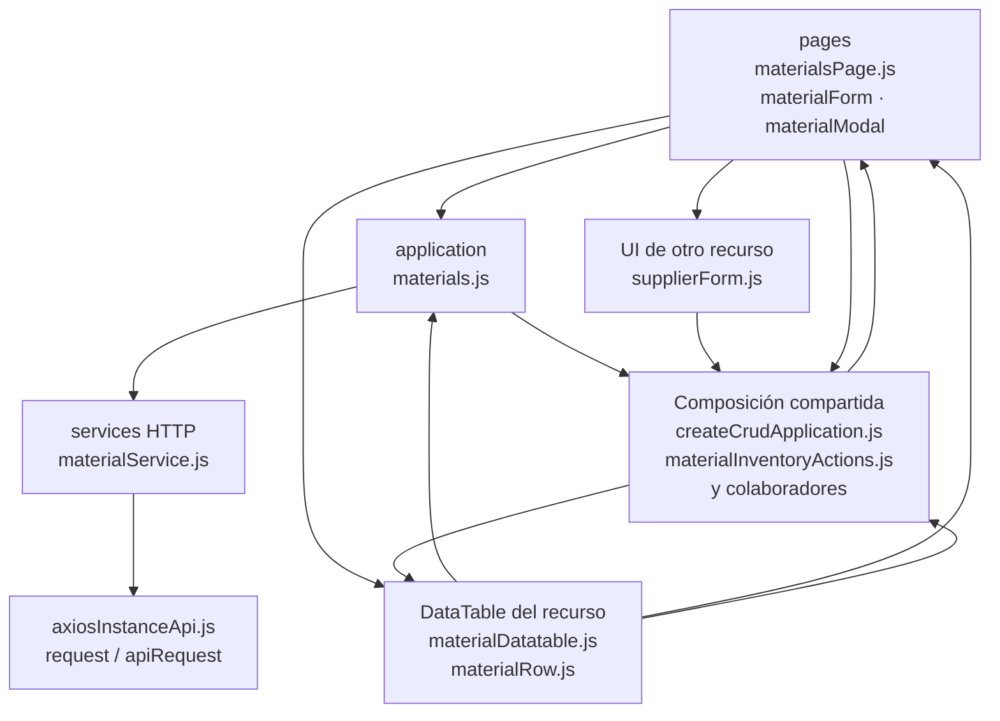

# 9. Materiales: estructura de código

**Identificador:** `DIA-FE-MOD-MAT-001`.
**Alcance:** grupos de implementación del módulo y sus dependencias directas.
**Fuente:** imports de los archivos de la tabla.

materialsPage inicializa la tabla; materialForm y materialModal conservan la selección de modo y campos. materials.js adapta el alta desde compra y configura CRUD/mutaciones adicionales.

| Grupo del mapa | Archivos que lo componen |
| --- | --- |
| pages · materialFields.js · materialForm.js · y colaboradores | `src/public/js/pages/warehouse/materials/` `materialFields.js` `src/public/js/pages/warehouse/materials/` `materialForm.js` `src/public/js/pages/warehouse/materials/` `materialModal.js` `src/public/js/pages/warehouse/materials/` `materialsPage.js` |
| application · materials.js | `src/public/js/application/warehouse/` `materials/materials.js` |
| services HTTP · materialService.js | `src/public/js/services/warehouse/` `materialService.js` |
| DataTable del recurso · materialDatatable.js · materialRow.js | `src/public/js/plugins/datatable/warehouse/` `materials/materialDatatable.js` `src/public/js/plugins/datatable/warehouse/` `materials/materialRow.js` |
| UI de otro recurso · supplierForm.js | `src/public/js/pages/warehouse/suppliers/` `supplierForm.js` |
| Composición compartida · createCrudApplication.js · materialInventoryActions.js · y colaboradores | `src/public/js/application/` `createCrudApplication.js` `src/public/js/plugins/datatable/shared/` `inventory/materialInventoryActions.js` `src/public/js/plugins/datatable/shared/` `inventory/warehouseInventoryDatatable.js` `src/public/js/ui/forms/formStateUI.js` `src/public/js/ui/forms/formUI.js` `src/public/js/ui/inventory/` `inventoryCrudModalUI.js` `src/public/js/ui/modalUI.js` `src/public/js/ui/tableUI.js` |
| axiosInstanceApi.js · request / apiRequest | `src/public/js/services/axiosInstanceApi.js` |

Los reportes y la infraestructura transversal se localizan en el
[capítulo 3](03-shared-code-and-coverage.md); el orden de llamadas está en
[procesos](../../processes/frontend-code-sequences/index.md).

