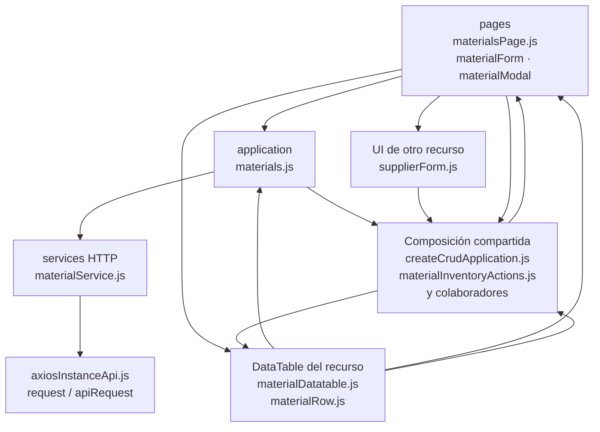

# 9. Materiales: estructura de código

**Identificador:** `DIA-FE-MOD-MAT-001`.
**Alcance:** grupos de implementación del módulo y sus dependencias directas.
**Fuente:** imports de los archivos de la tabla.

| Grupo del mapa | Archivos que lo componen |
| --- | --- |
| pages · materialFields.js · materialForm.js · y colaboradores | `src/public/js/pages/warehouse/materials/` `materialFields.js` `src/public/js/pages/warehouse/materials/` `materialForm.js` `src/public/js/pages/warehouse/materials/` `materialModal.js` `src/public/js/pages/warehouse/materials/` `materialsPage.js` |
| application · materials.js | `src/public/js/application/warehouse/` `materials/materials.js` |
| services HTTP · materialService.js | `src/public/js/services/warehouse/` `materialService.js` |
| DataTable del recurso · materialDatatable.js · materialRow.js | `src/public/js/plugins/datatable/warehouse/` `materials/materialDatatable.js` `src/public/js/plugins/datatable/warehouse/` `materials/materialRow.js` |
| UI de otro recurso · supplierForm.js | `src/public/js/pages/warehouse/suppliers/` `supplierForm.js` |
| Composición compartida · createCrudApplication.js · materialInventoryActions.js · y colaboradores | `src/public/js/application/` `createCrudApplication.js` `src/public/js/plugins/datatable/shared/` `inventory/materialInventoryActions.js` `src/public/js/plugins/datatable/shared/` `inventory/warehouseInventoryDatatable.js` `src/public/js/ui/forms/formStateUI.js` `src/public/js/ui/forms/formUI.js` `src/public/js/ui/inventory/` `inventoryCrudModalUI.js` `src/public/js/ui/modalUI.js` `src/public/js/ui/tableUI.js` |
| axiosInstanceApi.js · request / apiRequest | `src/public/js/services/axiosInstanceApi.js` |

## Contratos de implementación

### Datos, resultados y efectos del módulo

| Capacidad | Composición de pantalla | Application y transporte | Contrato y variantes |
| --- | --- | --- | --- |
| Materiales | `materialsPage.ejs`, `materialModal.ejs`, `materialsPage.js`, `materialModal.js`, `materialForm.js` y `materialFields.js`. | `application/warehouse/materials/materials.js` configura `createCrudApplication` sobre `materialService.js`. | CRUD de `/api/warehouse/materials`; `goodsReceipt` omite `maxUnitCost` al crear y el ajuste usa `PATCH /:id/stock`. |

La application exporta operaciones con vocabulario del recurso; la página/formulario
las consume sin acceder a Prisma. Los requests conservan el transporte separado. La tabla anterior define los datos y variantes propios; los modos compartidos
se consultan en el [contrato de formularios](01-catalog-complete-of-records-frontend.md#contrato-técnico-de-los-modos-de-formulario-de-almacén).

| Archivo bajo `src/` | Símbolos públicos y puntos de configuración |
| --- | --- |
| `public/js/application/warehouse/materials/` `materials.js` | `getAllMaterials` `registerMaterial` `editMaterial` `editMaterialStock` `deleteMaterial` |

### Adaptadores de transporte

| Archivo bajo `src/` | Símbolos públicos y puntos de configuración |
| --- | --- |
| `public/js/services/warehouse/` `materialService.js` | `MATERIALS_API_ROUTE` `getAllMaterialsRequest` `registerMaterialRequest` `editMaterialRequest` `editMaterialStockRequest` `deleteMaterialRequest` |

## Variantes y límites de reutilización

materialsPage inicializa la tabla; materialForm y materialModal conservan la selección de modo y campos. materials.js adapta el alta desde compra y configura CRUD/mutaciones adicionales.

El mapa distingue composición visual, application, requests y UI compartida. Cada
configurador conserva campos, modos, callbacks y claves del recurso; usar una factory
no significa que todas las pantallas ofrezcan las mismas operaciones. El contrato del
[núcleo de application/requests](../reuse-and-refactoring/02-browser-applications-and-requests.md)
y la [composición de interfaz](../reuse-and-refactoring/03-interface-and-table-lifecycle.md)
se documentan una vez.

Los reportes y la infraestructura transversal se localizan en el
[capítulo 3](03-shared-code-and-coverage.md); el orden de llamadas está en
[procesos](../../processes/frontend-code-sequences/index.md).

