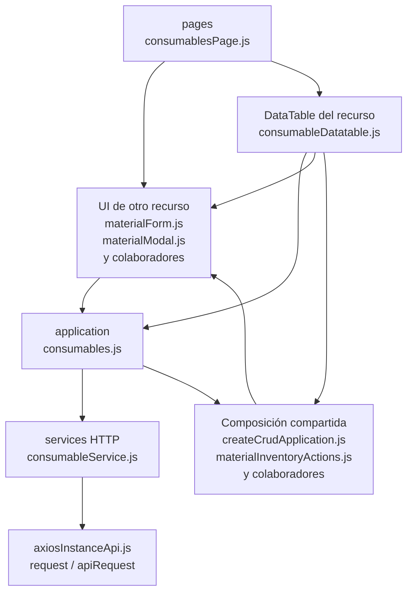

# 10. Consumibles: estructura de código

**Identificador:** `DIA-FE-MOD-CON-001`.
**Alcance:** grupos de implementación del módulo y sus dependencias directas.
**Fuente:** imports de los archivos de la tabla.

| Grupo del mapa | Archivos que lo componen |
| --- | --- |
| pages · consumablesPage.js | `src/public/js/pages/warehouse/consumables/` `consumablesPage.js` |
| application · consumables.js | `src/public/js/application/warehouse/` `consumables/consumables.js` |
| services HTTP · consumableService.js | `src/public/js/services/warehouse/` `consumableService.js` |
| DataTable del recurso · consumableDatatable.js | `src/public/js/plugins/datatable/warehouse/` `consumables/consumableDatatable.js` |
| UI de otro recurso · materialForm.js · materialModal.js · y colaboradores | `src/public/js/pages/warehouse/materials/` `materialForm.js` `src/public/js/pages/warehouse/materials/` `materialModal.js` `src/public/js/pages/warehouse/suppliers/` `supplierForm.js` |
| Composición compartida · createCrudApplication.js · materialInventoryActions.js · y colaboradores | `src/public/js/application/` `createCrudApplication.js` `src/public/js/plugins/datatable/shared/` `inventory/materialInventoryActions.js` `src/public/js/ui/tableUI.js` |
| axiosInstanceApi.js · request / apiRequest | `src/public/js/services/axiosInstanceApi.js` |

## Contratos de implementación

### Datos, resultados y efectos del módulo

| Capacidad | Composición de pantalla | Application y transporte | Contrato y variantes |
| --- | --- | --- | --- |
| Consumibles | `consumablesPage.ejs`, `consumablesPage.js` y `consumableDatatable.js` reutilizan `materialModal.ejs`, `materialModal.js` y `materialForm.js` con contexto `consumable`. | `application/warehouse/consumables/consumables.js` configura `createCrudApplication` sobre `consumableService.js`. | CRUD de `/api/warehouse/consumables`; oculta dimensiones, conserva unidad explícita y usa `PATCH /:id/stock` para el ajuste. |

La application exporta operaciones con vocabulario del recurso; la página/formulario
las consume sin acceder a Prisma. Los requests conservan el transporte separado. La tabla anterior define los datos y variantes propios; los modos compartidos
se consultan en el [contrato de formularios](01-catalog-complete-of-records-frontend.md#contrato-técnico-de-los-modos-de-formulario-de-almacén).

| Archivo bajo `src/` | Símbolos públicos y puntos de configuración |
| --- | --- |
| `public/js/application/warehouse/` `consumables/consumables.js` | `getAllConsumables` `registerConsumable` `editConsumable` `editConsumableStock` `deleteConsumable` |

### Adaptadores de transporte

| Archivo bajo `src/` | Símbolos públicos y puntos de configuración |
| --- | --- |
| `public/js/services/warehouse/` `consumableService.js` | `CONSUMABLES_API_ROUTE` `getAllConsumablesRequest` `registerConsumableRequest` `editConsumableRequest` `editConsumableStockRequest` `deleteConsumableRequest` |

## Variantes y límites de reutilización

consumablesPage importa materialForm; la UI comparte formulario/modal de inventario y oculta dimensiones por contexto. consumables.js y consumableService.js conservan operaciones y URL propias.

El mapa distingue composición visual, application, requests y UI compartida. Cada
configurador conserva campos, modos, callbacks y claves del recurso; usar una factory
no significa que todas las pantallas ofrezcan las mismas operaciones. El contrato del
[núcleo de application/requests](../reuse-and-refactoring/02-browser-applications-and-requests.md)
y la [composición de interfaz](../reuse-and-refactoring/03-interface-and-table-lifecycle.md)
se documentan una vez.

Los reportes y la infraestructura transversal se localizan en el
[capítulo 3](03-shared-code-and-coverage.md); el orden de llamadas está en
[procesos](../../processes/frontend-code-sequences/index.md).

