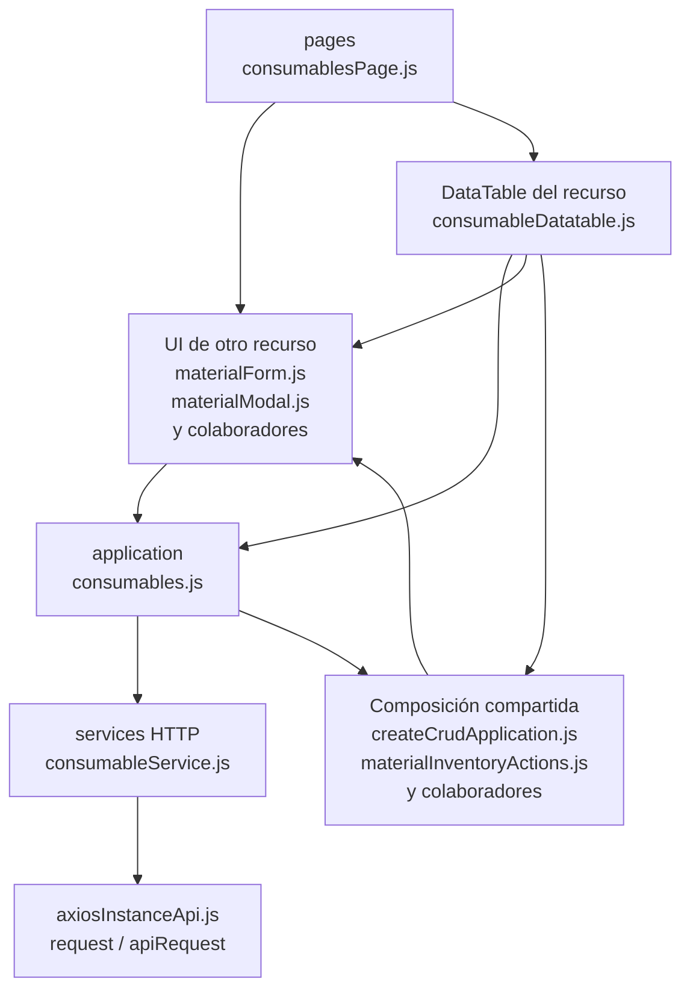

# 10. Consumibles: estructura de código

**Identificador:** `DIA-FE-MOD-CON-001`.
**Alcance:** grupos de implementación del módulo y sus dependencias directas.
**Fuente:** imports de los archivos de la tabla.

consumablesPage importa materialForm; la UI comparte formulario/modal de inventario y oculta dimensiones por contexto. consumables.js y consumableService.js conservan operaciones y URL propias.

| Grupo del mapa | Archivos que lo componen |
| --- | --- |
| pages · consumablesPage.js | `src/public/js/pages/warehouse/consumables/` `consumablesPage.js` |
| application · consumables.js | `src/public/js/application/warehouse/` `consumables/consumables.js` |
| services HTTP · consumableService.js | `src/public/js/services/warehouse/` `consumableService.js` |
| DataTable del recurso · consumableDatatable.js | `src/public/js/plugins/datatable/warehouse/` `consumables/consumableDatatable.js` |
| UI de otro recurso · materialForm.js · materialModal.js · y colaboradores | `src/public/js/pages/warehouse/materials/` `materialForm.js` `src/public/js/pages/warehouse/materials/` `materialModal.js` `src/public/js/pages/warehouse/suppliers/` `supplierForm.js` |
| Composición compartida · createCrudApplication.js · materialInventoryActions.js · y colaboradores | `src/public/js/application/` `createCrudApplication.js` `src/public/js/plugins/datatable/shared/` `inventory/materialInventoryActions.js` `src/public/js/ui/tableUI.js` |
| axiosInstanceApi.js · request / apiRequest | `src/public/js/services/axiosInstanceApi.js` |

Los reportes y la infraestructura transversal se localizan en el
[capítulo 3](03-shared-code-and-coverage.md); el orden de llamadas está en
[procesos](../../processes/frontend-code-sequences/index.md).

