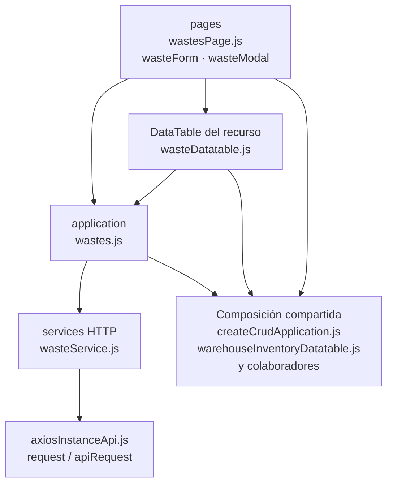

# 11. Mermas: estructura de código

**Identificador:** `DIA-FE-MOD-WAS-001`.
**Alcance:** grupos de implementación del módulo y sus dependencias directas.
**Fuente:** imports de los archivos de la tabla.

| Grupo del mapa | Archivos que lo componen |
| --- | --- |
| pages · wasteFields.js · wasteForm.js · y colaboradores | `src/public/js/pages/warehouse/wastes/` `wasteFields.js` `src/public/js/pages/warehouse/wastes/` `wasteForm.js` `src/public/js/pages/warehouse/wastes/` `wasteModal.js` `src/public/js/pages/warehouse/wastes/` `wasteStockAdditionForm.js` `src/public/js/pages/warehouse/wastes/` `wasteStockAdditionModal.js` `src/public/js/pages/warehouse/wastes/` `wastesPage.js` |
| application · wastes.js | `src/public/js/application/warehouse/` `wastes/wastes.js` |
| services HTTP · wasteService.js | `src/public/js/services/warehouse/` `wasteService.js` |
| DataTable del recurso · wasteDatatable.js | `src/public/js/plugins/datatable/warehouse/` `wastes/wasteDatatable.js` |
| Composición compartida · createCrudApplication.js · warehouseInventoryDatatable.js · y colaboradores | `src/public/js/application/` `createCrudApplication.js` `src/public/js/plugins/datatable/shared/` `inventory/warehouseInventoryDatatable.js` `src/public/js/ui/forms/formStateUI.js` `src/public/js/ui/forms/formUI.js` `src/public/js/ui/inventory/` `inventoryCrudModalUI.js` `src/public/js/ui/inventory/` `inventorySelectUI.js` `src/public/js/ui/modalUI.js` `src/public/js/ui/tableUI.js` |
| axiosInstanceApi.js · request / apiRequest | `src/public/js/services/axiosInstanceApi.js` |

## Contratos de implementación

### Datos, resultados y efectos del módulo

| Capacidad | Composición de pantalla | Application y transporte | Contrato y variantes |
| --- | --- | --- | --- |
| Mermas | `wastesPage.ejs` incluye ambos parciales y carga únicamente `wastesPage.js`; ese entry point importa los formularios, inyecta las aperturas de modal al DataTable y `wasteFields.js` conserva los contratos del CRUD. | `application/warehouse/wastes/wastes.js` configura la fábrica CRUD y la mutación incremental sobre `wasteService.js`. | CRUD de `/api/warehouse/wastes`, plantillas de material, ajuste `PATCH /:id/stock` y adición `POST /:id/stock-additions`. |

La application exporta operaciones con vocabulario del recurso; la página/formulario
las consume sin acceder a Prisma. Los requests conservan el transporte separado. La tabla anterior define los datos y variantes propios; los modos compartidos
se consultan en el [contrato de formularios](01-catalog-complete-of-records-frontend.md#contrato-técnico-de-los-modos-de-formulario-de-almacén).

| Archivo bajo `src/` | Símbolos públicos y puntos de configuración |
| --- | --- |
| `public/js/application/warehouse/wastes/` `wastes.js` | `getAllWastes` `getWasteMaterialTemplates` `registerWaste` `editWaste` `editWasteStock` `addWasteStock` |

### Adaptadores de transporte

| Archivo bajo `src/` | Símbolos públicos y puntos de configuración |
| --- | --- |
| `public/js/services/warehouse/` `wasteService.js` | `WASTES_API_ROUTE` `getAllWastesRequest` `getWasteMaterialTemplatesRequest` `registerWasteRequest` `editWasteRequest` `editWasteStockRequest` `addWasteStockRequest` |

## Variantes y límites de reutilización

wastesPage compone formulario, modal y tabla; los archivos wasteStockAddition* mantienen su variante de captura. Los selects de plantilla y los adaptadores permanecen junto a esta UI.

El mapa distingue composición visual, application, requests y UI compartida. Cada
configurador conserva campos, modos, callbacks y claves del recurso; usar una factory
no significa que todas las pantallas ofrezcan las mismas operaciones. El contrato del
[núcleo de application/requests](../reuse-and-refactoring/02-browser-applications-and-requests.md)
y la [composición de interfaz](../reuse-and-refactoring/03-interface-and-table-lifecycle.md)
se documentan una vez.

Los reportes y la infraestructura transversal se localizan en el
[capítulo 3](03-shared-code-and-coverage.md); el orden de llamadas está en
[procesos](../../processes/frontend-code-sequences/index.md).

