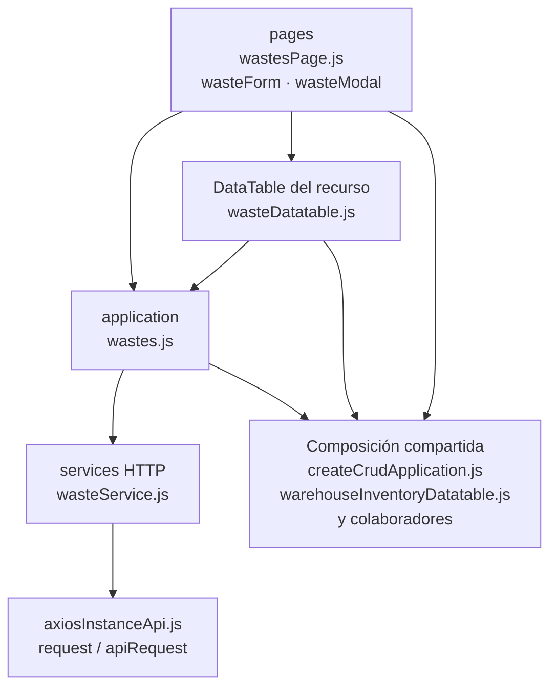

# 11. Mermas: estructura de código

**Identificador:** `DIA-FE-MOD-WAS-001`.
**Alcance:** grupos de implementación del módulo y sus dependencias directas.
**Fuente:** imports de los archivos de la tabla.

wastesPage compone formulario, modal y tabla; los archivos wasteStockAddition* mantienen su variante de captura. Los selects de plantilla y los adaptadores permanecen junto a esta UI.

| Grupo del mapa | Archivos que lo componen |
| --- | --- |
| pages · wasteFields.js · wasteForm.js · y colaboradores | `src/public/js/pages/warehouse/wastes/` `wasteFields.js` `src/public/js/pages/warehouse/wastes/` `wasteForm.js` `src/public/js/pages/warehouse/wastes/` `wasteModal.js` `src/public/js/pages/warehouse/wastes/` `wasteStockAdditionForm.js` `src/public/js/pages/warehouse/wastes/` `wasteStockAdditionModal.js` `src/public/js/pages/warehouse/wastes/` `wastesPage.js` |
| application · wastes.js | `src/public/js/application/warehouse/` `wastes/wastes.js` |
| services HTTP · wasteService.js | `src/public/js/services/warehouse/` `wasteService.js` |
| DataTable del recurso · wasteDatatable.js | `src/public/js/plugins/datatable/warehouse/` `wastes/wasteDatatable.js` |
| Composición compartida · createCrudApplication.js · warehouseInventoryDatatable.js · y colaboradores | `src/public/js/application/` `createCrudApplication.js` `src/public/js/plugins/datatable/shared/` `inventory/warehouseInventoryDatatable.js` `src/public/js/ui/forms/formStateUI.js` `src/public/js/ui/forms/formUI.js` `src/public/js/ui/inventory/` `inventoryCrudModalUI.js` `src/public/js/ui/inventory/` `inventorySelectUI.js` `src/public/js/ui/modalUI.js` `src/public/js/ui/tableUI.js` |
| axiosInstanceApi.js · request / apiRequest | `src/public/js/services/axiosInstanceApi.js` |

Los reportes y la infraestructura transversal se localizan en el
[capítulo 3](03-shared-code-and-coverage.md); el orden de llamadas está en
[procesos](../../processes/frontend-code-sequences/index.md).

