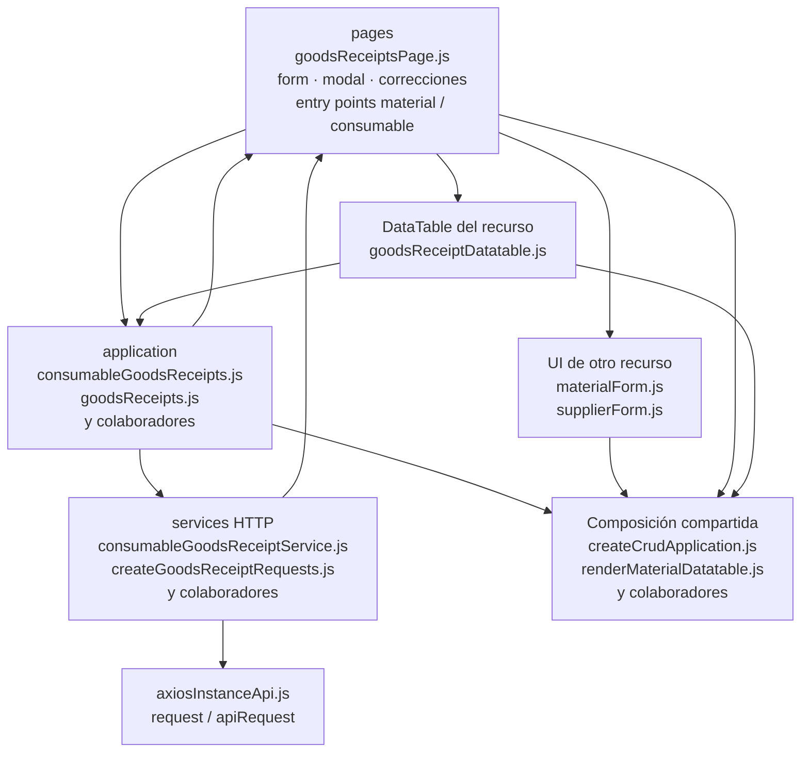

# 12. Entradas: materiales y consumibles: estructura de código

**Identificador:** `DIA-FE-MOD-REC-001`.
**Alcance:** grupos de implementación del módulo y sus dependencias directas.
**Fuente:** imports de los archivos de la tabla.

| Grupo del mapa | Archivos que lo componen |
| --- | --- |
| pages · consumableGoodsReceiptsPage.js · correctionForm.js · y colaboradores | `src/public/js/pages/warehouse/` `goodsReceipts/consumables/` `consumableGoodsReceiptsPage.js` `src/public/js/pages/warehouse/` `goodsReceipts/corrections/` `correctionForm.js` `src/public/js/pages/warehouse/` `goodsReceipts/corrections/` `correctionModal.js` `src/public/js/pages/warehouse/` `goodsReceipts/goodsReceiptContext.js` `src/public/js/pages/warehouse/` `goodsReceipts/goodsReceiptDetails.js` `src/public/js/pages/warehouse/` `goodsReceipts/goodsReceiptForm.js` `src/public/js/pages/warehouse/` `goodsReceipts/goodsReceiptModal.js` `src/public/js/pages/warehouse/` `goodsReceipts/goodsReceiptsPage.js` `src/public/js/pages/warehouse/` `goodsReceipts/materials/` `materialGoodsReceiptsPage.js` |
| application · consumableGoodsReceipts.js · goodsReceipts.js · y colaboradores | `src/public/js/application/warehouse/` `goodsReceipts/consumables/` `consumableGoodsReceipts.js` `src/public/js/application/warehouse/` `goodsReceipts/goodsReceipts.js` `src/public/js/application/warehouse/` `goodsReceipts/materials/` `materialGoodsReceipts.js` |
| services HTTP · consumableGoodsReceiptService.js · createGoodsReceiptRequests.js · y colaboradores | `src/public/js/services/warehouse/` `goodsReceipts/consumables/` `consumableGoodsReceiptService.js` `src/public/js/services/warehouse/` `goodsReceipts/` `createGoodsReceiptRequests.js` `src/public/js/services/warehouse/` `goodsReceipts/goodsReceiptService.js` `src/public/js/services/warehouse/` `goodsReceipts/materials/` `materialGoodsReceiptService.js` |
| DataTable del recurso · goodsReceiptDatatable.js | `src/public/js/plugins/datatable/warehouse/` `goodsReceipts/goodsReceiptDatatable.js` |
| UI de otro recurso · materialForm.js · supplierForm.js | `src/public/js/pages/warehouse/materials/` `materialForm.js` `src/public/js/pages/warehouse/suppliers/` `supplierForm.js` |
| Composición compartida · createCrudApplication.js · renderMaterialDatatable.js · y colaboradores | `src/public/js/application/` `createCrudApplication.js` `src/public/js/plugins/datatable/shared/` `inventory/renderMaterialDatatable.js` `src/public/js/plugins/datatable/shared/` `issues/detailBuilder/detailColumns.js` `src/public/js/plugins/datatable/shared/` `issues/detailBuilder/detailHeader.js` `src/public/js/ui/forms/detailFormUI.js` `src/public/js/ui/forms/formErrorsUI.js` `src/public/js/ui/forms/formStateUI.js` `src/public/js/ui/forms/formUI.js` `src/public/js/ui/forms/totalsSummaryUI.js` `src/public/js/ui/inventory/` `inventoryCrudModalUI.js` `src/public/js/ui/modalUI.js` `src/public/js/ui/tableUI.js` |
| axiosInstanceApi.js · request / apiRequest | `src/public/js/services/axiosInstanceApi.js` |

## Contratos de implementación

### Datos, resultados y efectos del módulo

| Capacidad | Composición de pantalla | Application y transporte | Contrato y variantes |
| --- | --- | --- | --- |
| Entradas de almacén | `goodsReceiptsPage.ejs`, `goodsReceiptsPage.js`, formulario, modal y detalles componen el documento; `correctionForm.js` y `correctionModal.js` aíslan corrección/cancelación. | `application/warehouse/goodsReceipts/goodsReceipts.js` usa `goodsReceiptService.js` y catálogos; el reporte usa `createReportApplication`. | Lista, alta, edición de encabezado, corrección y cancelación bajo `/api/warehouse/goods-receipts/materials` o `/api/warehouse/goods-receipts/consumables`, con el contexto fijado por el servidor. |

La application exporta operaciones con vocabulario del recurso; la página/formulario
las consume sin acceder a Prisma. Los requests conservan el transporte separado. La tabla anterior define los datos y variantes propios; los modos compartidos
se consultan en el [contrato de formularios](01-catalog-complete-of-records-frontend.md#contrato-técnico-de-los-modos-de-formulario-de-almacén).

| Archivo bajo `src/` | Símbolos públicos y puntos de configuración |
| --- | --- |
| `public/js/application/warehouse/` `goodsReceipts/consumables/` `consumableGoodsReceipts.js` | `getAllConsumableGoodsReceipts` `registerConsumableGoodsReceipt` `editConsumableGoodsReceiptHeader` `correctConsumableGoodsReceiptDetail` `cancelConsumableGoodsReceiptDetail` |
| `public/js/application/warehouse/` `goodsReceipts/goodsReceipts.js` | `getAllGoodsReceipts` `registerGoodsReceipt` `editGoodsReceiptHeader` `correctGoodsReceiptDetail` `cancelGoodsReceiptDetail` |
| `public/js/application/warehouse/` `goodsReceipts/materials/` `materialGoodsReceipts.js` | `getAllMaterialGoodsReceipts` `registerMaterialGoodsReceipt` `editMaterialGoodsReceiptHeader` `correctMaterialGoodsReceiptDetail` `cancelMaterialGoodsReceiptDetail` |

### Adaptadores de transporte

| Archivo bajo `src/` | Símbolos públicos y puntos de configuración |
| --- | --- |
| `public/js/services/warehouse/` `goodsReceipts/consumables/` `consumableGoodsReceiptService.js` | `CONSUMABLE_GOODS_RECEIPTS_API_ROUTE` `getAllConsumableGoodsReceiptsRequest` `registerConsumableGoodsReceiptRequest` `editConsumableGoodsReceiptHeaderRequest` `correctConsumableGoodsReceiptDetailRequest` `cancelConsumableGoodsReceiptDetailRequest` `exportConsumableGoodsReceiptReportRequest` |
| `public/js/services/warehouse/` `goodsReceipts/` `createGoodsReceiptRequests.js` | `createGoodsReceiptRequests` |
| `public/js/services/warehouse/` `goodsReceipts/goodsReceiptService.js` | `GOODS_RECEIPTS_API_ROUTE` `getAllGoodsReceiptsRequest` `registerGoodsReceiptRequest` `editGoodsReceiptHeaderRequest` `correctGoodsReceiptDetailRequest` `cancelGoodsReceiptDetailRequest` `exportGoodsReceiptReportRequest` |
| `public/js/services/warehouse/` `goodsReceipts/materials/` `materialGoodsReceiptService.js` | `MATERIAL_GOODS_RECEIPTS_API_ROUTE` `getAllMaterialGoodsReceiptsRequest` `registerMaterialGoodsReceiptRequest` `editMaterialGoodsReceiptHeaderRequest` `correctMaterialGoodsReceiptDetailRequest` `cancelMaterialGoodsReceiptDetailRequest` `exportMaterialGoodsReceiptReportRequest` |

## Variantes y límites de reutilización

Los entry points material/consumable comparten goodsReceiptsPage, form/modal y correcciones. goodsReceiptContext selecciona referencias de la variante; las factories de requests reciben rutas distintas.

El mapa distingue composición visual, application, requests y UI compartida. Cada
configurador conserva campos, modos, callbacks y claves del recurso; usar una factory
no significa que todas las pantallas ofrezcan las mismas operaciones. El contrato del
[núcleo de application/requests](../reuse-and-refactoring/02-browser-applications-and-requests.md)
y la [composición de interfaz](../reuse-and-refactoring/03-interface-and-table-lifecycle.md)
se documentan una vez.

Los reportes y la infraestructura transversal se localizan en el
[capítulo 3](03-shared-code-and-coverage.md); el orden de llamadas está en
[procesos](../../processes/frontend-code-sequences/index.md).

