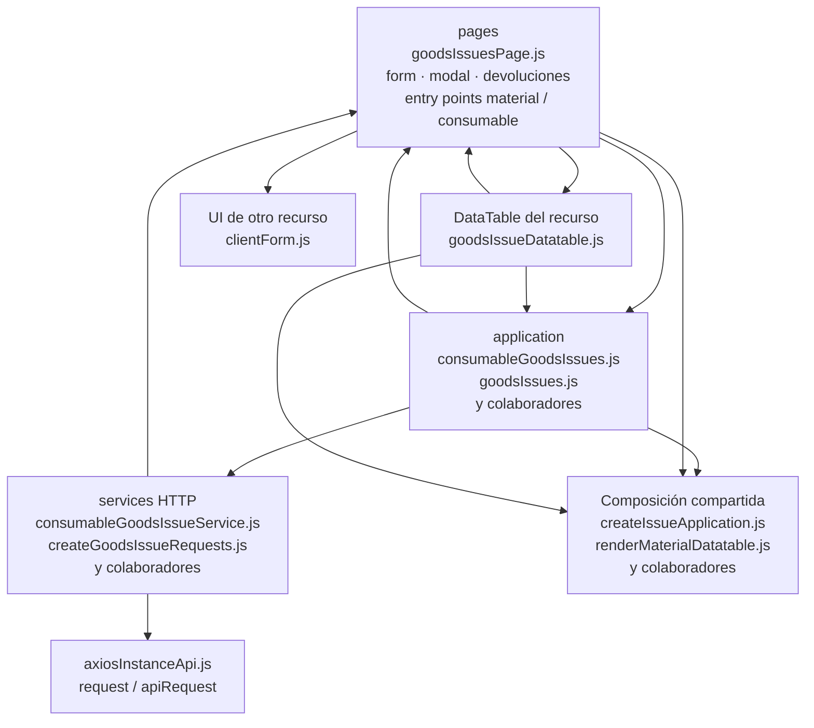

# 13. Salidas: materiales y consumibles: estructura de código

**Identificador:** `DIA-FE-MOD-ISS-001`.
**Alcance:** grupos de implementación del módulo y sus dependencias directas.
**Fuente:** imports de los archivos de la tabla.

| Grupo del mapa | Archivos que lo componen |
| --- | --- |
| pages · consumableGoodsIssuesPage.js · goodsIssueContext.js · y colaboradores | `src/public/js/pages/warehouse/goodsIssues/` `consumables/consumableGoodsIssuesPage.js` `src/public/js/pages/warehouse/goodsIssues/` `goodsIssueContext.js` `src/public/js/pages/warehouse/goodsIssues/` `goodsIssueForm.js` `src/public/js/pages/warehouse/goodsIssues/` `goodsIssueModal.js` `src/public/js/pages/warehouse/goodsIssues/` `goodsIssuesPage.js` `src/public/js/pages/warehouse/goodsIssues/` `materials/materialGoodsIssuesPage.js` `src/public/js/pages/warehouse/goodsIssues/` `returns/goodsIssueReturn.js` |
| application · consumableGoodsIssues.js · goodsIssues.js · y colaboradores | `src/public/js/application/warehouse/` `goodsIssues/consumables/` `consumableGoodsIssues.js` `src/public/js/application/warehouse/` `goodsIssues/goodsIssues.js` `src/public/js/application/warehouse/` `goodsIssues/materials/` `materialGoodsIssues.js` |
| services HTTP · consumableGoodsIssueService.js · createGoodsIssueRequests.js · y colaboradores | `src/public/js/services/warehouse/` `goodsIssues/consumables/` `consumableGoodsIssueService.js` `src/public/js/services/warehouse/` `goodsIssues/createGoodsIssueRequests.js` `src/public/js/services/warehouse/` `goodsIssues/goodsIssueService.js` `src/public/js/services/warehouse/` `goodsIssues/materials/` `materialGoodsIssueService.js` |
| DataTable del recurso · goodsIssueDatatable.js | `src/public/js/plugins/datatable/warehouse/` `goodsIssues/goodsIssueDatatable.js` |
| UI de otro recurso · clientForm.js | `src/public/js/pages/sales/clients/` `clientForm.js` |
| Composición compartida · createIssueApplication.js · renderMaterialDatatable.js · y colaboradores | `src/public/js/application/warehouse/` `issues/createIssueApplication.js` `src/public/js/plugins/datatable/shared/` `inventory/renderMaterialDatatable.js` `src/public/js/plugins/datatable/shared/` `issues/issueDatatable.js` `src/public/js/plugins/datatable/shared/` `issues/warehouseIssueDetailDatatable.js` `src/public/js/ui/forms/detailFormUI.js` `src/public/js/ui/forms/formErrorsUI.js` `src/public/js/ui/issues/issueFormUI.js` `src/public/js/ui/issues/issueReturnUI.js` `src/public/js/ui/modalUI.js` |
| axiosInstanceApi.js · request / apiRequest | `src/public/js/services/axiosInstanceApi.js` |

## Contratos de implementación

### Datos, resultados y efectos del módulo

| Capacidad | Composición de pantalla | Application y transporte | Contrato y variantes |
| --- | --- | --- | --- |
| Salidas de materiales y consumibles | `goodsIssuesPage.ejs`, página, modal y formulario coordinan encabezado y detalles; `returns/goodsIssueReturn.js` gestiona devoluciones. | Los módulos `goodsIssues/materials` y `goodsIssues/consumables` componen `createIssueApplication` sobre sus solicitudes específicas; `goodsIssues.js` selecciona referencias para la UI compartida. | Lista, alta, edición, encabezado, surtimiento y devolución bajo `/api/warehouse/goods-issues/materials` o `/api/warehouse/goods-issues/consumables`. |

La application exporta operaciones con vocabulario del recurso; la página/formulario
las consume sin acceder a Prisma. Los requests conservan el transporte separado. La tabla anterior define los datos y variantes propios; los modos compartidos
se consultan en el [contrato de formularios](01-catalog-complete-of-records-frontend.md#contrato-técnico-de-los-modos-de-formulario-de-almacén).

| Archivo bajo `src/` | Símbolos públicos y puntos de configuración |
| --- | --- |
| `public/js/application/warehouse/` `goodsIssues/consumables/` `consumableGoodsIssues.js` | `getAllConsumableGoodsIssues` `registerConsumableGoodsIssue` `editConsumableGoodsIssue` `editConsumableGoodsIssueHeader` `editConsumableGoodsIssueDetails` `returnConsumableGoodsIssueDetail` |
| `public/js/application/warehouse/` `goodsIssues/goodsIssues.js` | `getAllGoodsIssues` `registerGoodsIssue` `editGoodsIssue` `editGoodsIssueHeader` `editGoodsIssueDetails` `returnGoodsIssueDetail` |
| `public/js/application/warehouse/` `goodsIssues/materials/` `materialGoodsIssues.js` | `getAllMaterialGoodsIssues` `registerMaterialGoodsIssue` `editMaterialGoodsIssue` `editMaterialGoodsIssueHeader` `editMaterialGoodsIssueDetails` `returnMaterialGoodsIssueDetail` |

### Adaptadores de transporte

| Archivo bajo `src/` | Símbolos públicos y puntos de configuración |
| --- | --- |
| `public/js/services/warehouse/goodsIssues/` `consumables/consumableGoodsIssueService.js` | `CONSUMABLE_GOODS_ISSUES_API_ROUTE` `getAllConsumableGoodsIssuesRequest` `registerConsumableGoodsIssueRequest` `editConsumableGoodsIssueRequest` `editConsumableGoodsIssueHeaderRequest` `editConsumableGoodsIssueDetailsRequest` `returnConsumableGoodsIssueDetailRequest` `exportConsumableGoodsIssueReportRequest` |
| `public/js/services/warehouse/goodsIssues/` `createGoodsIssueRequests.js` | `createGoodsIssueRequests` |
| `public/js/services/warehouse/goodsIssues/` `goodsIssueService.js` | `GOODS_ISSUES_API_ROUTE` `getAllGoodsIssuesRequest` `registerGoodsIssueRequest` `editGoodsIssueRequest` `editGoodsIssueHeaderRequest` `editGoodsIssueDetailsRequest` `returnGoodsIssueDetailRequest` `exportGoodsIssueReportRequest` |
| `public/js/services/warehouse/goodsIssues/` `materials/materialGoodsIssueService.js` | `MATERIAL_GOODS_ISSUES_API_ROUTE` `getAllMaterialGoodsIssuesRequest` `registerMaterialGoodsIssueRequest` `editMaterialGoodsIssueRequest` `editMaterialGoodsIssueHeaderRequest` `editMaterialGoodsIssueDetailsRequest` `returnMaterialGoodsIssueDetailRequest` `exportMaterialGoodsIssueReportRequest` |

## Variantes y límites de reutilización

Los entry points y goodsIssueContext componen la UI compartida. Las applications por variante usan createIssueApplication; las devoluciones están en returns y las tablas compartidas en plugins/datatable/shared/issues.

El mapa distingue composición visual, application, requests y UI compartida. Cada
configurador conserva campos, modos, callbacks y claves del recurso; usar una factory
no significa que todas las pantallas ofrezcan las mismas operaciones. El contrato del
[núcleo de application/requests](../reuse-and-refactoring/02-browser-applications-and-requests.md)
y la [composición de interfaz](../reuse-and-refactoring/03-interface-and-table-lifecycle.md)
se documentan una vez.

Los reportes y la infraestructura transversal se localizan en el
[capítulo 3](03-shared-code-and-coverage.md); el orden de llamadas está en
[procesos](../../processes/frontend-code-sequences/index.md).

