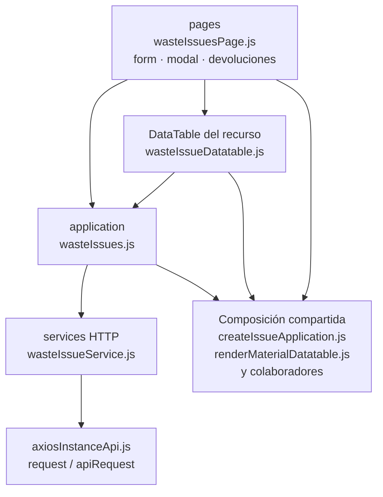

# 14. Salidas de mermas: estructura de código

**Identificador:** `DIA-FE-MOD-WIS-001`.
**Alcance:** grupos de implementación del módulo y sus dependencias directas.
**Fuente:** imports de los archivos de la tabla.

wasteIssues.js comparte createIssueApplication; wasteIssueModal configura la tabla de detalles y el permiso visual de merma. Sus requests son propios, no configuradores de createGoodsIssueRequests.

| Grupo del mapa | Archivos que lo componen |
| --- | --- |
| pages · wasteIssueReturn.js · wasteIssueForm.js · y colaboradores | `src/public/js/pages/warehouse/wasteIssues/` `returns/wasteIssueReturn.js` `src/public/js/pages/warehouse/wasteIssues/` `wasteIssueForm.js` `src/public/js/pages/warehouse/wasteIssues/` `wasteIssueModal.js` `src/public/js/pages/warehouse/wasteIssues/` `wasteIssuesPage.js` |
| application · wasteIssues.js | `src/public/js/application/warehouse/` `wasteIssues/wasteIssues.js` |
| services HTTP · wasteIssueService.js | `src/public/js/services/warehouse/` `wasteIssueService.js` |
| DataTable del recurso · wasteIssueDatatable.js | `src/public/js/plugins/datatable/warehouse/` `wasteIssues/wasteIssueDatatable.js` |
| Composición compartida · createIssueApplication.js · renderMaterialDatatable.js · y colaboradores | `src/public/js/application/warehouse/` `issues/createIssueApplication.js` `src/public/js/plugins/datatable/shared/` `inventory/renderMaterialDatatable.js` `src/public/js/plugins/datatable/shared/` `issues/issueDatatable.js` `src/public/js/plugins/datatable/shared/` `issues/warehouseIssueDetailDatatable.js` `src/public/js/ui/forms/detailFormUI.js` `src/public/js/ui/forms/formErrorsUI.js` `src/public/js/ui/issues/issueFormUI.js` `src/public/js/ui/issues/issueReturnUI.js` `src/public/js/ui/modalUI.js` |
| axiosInstanceApi.js · request / apiRequest | `src/public/js/services/axiosInstanceApi.js` |

Los reportes y la infraestructura transversal se localizan en el
[capítulo 3](03-shared-code-and-coverage.md); el orden de llamadas está en
[procesos](../../processes/frontend-code-sequences/index.md).

