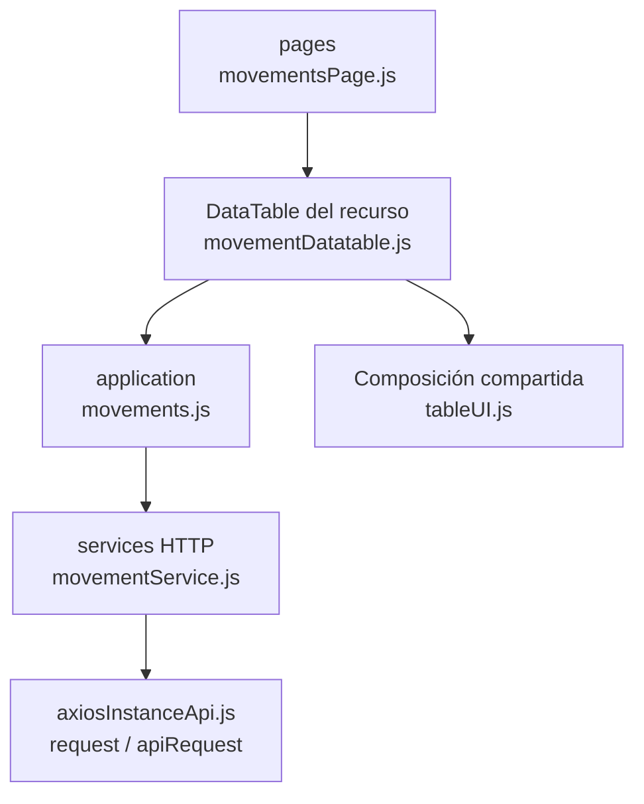

# 15. Consulta de movimientos: estructura de código

**Identificador:** `DIA-FE-MOD-MOV-001`.
**Alcance:** grupos de implementación del módulo y sus dependencias directas.
**Fuente:** imports de los archivos de la tabla.

| Grupo del mapa | Archivos que lo componen |
| --- | --- |
| pages · movementsPage.js | `src/public/js/pages/admin/movements/` `movementsPage.js` |
| application · movements.js | `src/public/js/application/admin/movements/` `movements.js` |
| services HTTP · movementService.js | `src/public/js/services/admin/` `movementService.js` |
| DataTable del recurso · movementDatatable.js | `src/public/js/plugins/datatable/admin/` `movements/movementDatatable.js` |
| Composición compartida · tableUI.js | `src/public/js/ui/tableUI.js` |
| axiosInstanceApi.js · request / apiRequest | `src/public/js/services/axiosInstanceApi.js` |

## Contratos de implementación

### Datos, resultados y efectos del módulo

| Capacidad | Composición de pantalla | Application y transporte | Contrato y variantes |
| --- | --- | --- | --- |
| Movimientos | `movementsPage.ejs` y `movementsPage.js` eligen inventario de materiales o mermas según contexto de la vista. | `application/admin/movements/movements.js` usa `movementService.js`; `application/admin/report.js` coordina exportaciones. | Lecturas `/api/admin/movements/{materials,wastes}` y reportes correspondientes. |

La application exporta operaciones con vocabulario del recurso; la página/formulario
las consume sin acceder a Prisma. Los requests conservan el transporte separado. La tabla anterior define los datos y variantes propios; los modos compartidos
se consultan en el [contrato de formularios](01-catalog-complete-of-records-frontend.md#contrato-técnico-de-los-modos-de-formulario-de-almacén).

| Archivo bajo `src/` | Símbolos públicos y puntos de configuración |
| --- | --- |
| `public/js/application/admin/movements/` `movements.js` | `getAllMovements` |

### Adaptadores de transporte

| Archivo bajo `src/` | Símbolos públicos y puntos de configuración |
| --- | --- |
| `public/js/services/admin/` `movementService.js` | `MOVEMENTS_API_ROUTE` `getAllMovementsRequest` |

## Variantes y límites de reutilización

movementsPage configura una tabla de consulta por contexto. movements.js delega requests y el reporte reutiliza application/admin/report.js; no existe un formulario CRUD de movimientos.

El mapa distingue composición visual, application, requests y UI compartida. Cada
configurador conserva campos, modos, callbacks y claves del recurso; usar una factory
no significa que todas las pantallas ofrezcan las mismas operaciones. El contrato del
[núcleo de application/requests](../reuse-and-refactoring/02-browser-applications-and-requests.md)
y la [composición de interfaz](../reuse-and-refactoring/03-interface-and-table-lifecycle.md)
se documentan una vez.

Los reportes y la infraestructura transversal se localizan en el
[capítulo 3](03-shared-code-and-coverage.md); el orden de llamadas está en
[procesos](../../processes/frontend-code-sequences/index.md).

