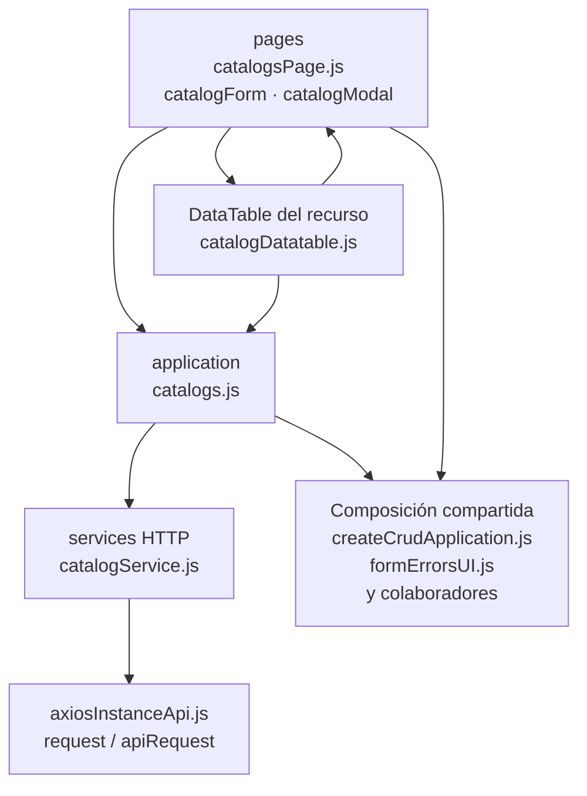

# 16. Catálogos: pantalla administrativa y adaptadores operativos

**Identificador:** `DIA-FE-MOD-CAT-001`.
**Pregunta:** ¿qué módulos comparten la pantalla administrativa?
**Alcance:** imports de los grupos de JavaScript; la configuración EJS se describe aparte.
**Fuente:** imports de los archivos de la tabla.

catalogsPage, form/modal y catalogDatatable son comunes al recurso seleccionado. catalogs.js propaga catalog al request; los adaptadores de selects operativos no pasan por esta pantalla administrativa.

| Grupo del mapa | Archivos que lo componen |
| --- | --- |
| pages · catalogForm.js · catalogModal.js · y colaboradores | `src/public/js/pages/admin/catalogs/` `catalogForm.js` `src/public/js/pages/admin/catalogs/` `catalogModal.js` `src/public/js/pages/admin/catalogs/` `catalogsPage.js` |
| application · catalogs.js | `src/public/js/application/admin/catalogs/` `catalogs.js` |
| services HTTP · catalogService.js | `src/public/js/services/admin/` `catalogService.js` |
| DataTable del recurso · catalogDatatable.js | `src/public/js/plugins/datatable/admin/` `catalogs/catalogDatatable.js` |
| Composición compartida · createCrudApplication.js · formErrorsUI.js · y colaboradores | `src/public/js/application/` `createCrudApplication.js` `src/public/js/ui/forms/formErrorsUI.js` `src/public/js/ui/forms/formStateUI.js` `src/public/js/ui/forms/formUI.js` `src/public/js/ui/modalUI.js` |
| axiosInstanceApi.js · request / apiRequest | `src/public/js/services/axiosInstanceApi.js` |

## Configuración entre EJS y el navegador

`controllers/web/admin/catalogController.js` recibe `getManagedCatalog` del servidor y
renderiza `views/pages/admin/catalogs/catalogsPage.ejs`. La plantilla declara el entry
point e incluye `catalogModal.ejs`, que compone el formulario con el parcial compartido.
No se crea una página ni una factory CRUD independiente para cada catálogo.

| Productor / dato | Consumidor y aplicación |
| --- | --- |
| `getManagedCatalog`: nombre, campos, longitudes y etiquetas | `catalogsPage.ejs` los publica como atributos `data-*` de `#catalogContext`; no expone el delegado Prisma. |
| `data-catalog`, etiquetas y `data-fields` | `catalogDatatable` configura lectura, textos y columnas; sólo añade Símbolo cuando los campos lo incluyen. |
| `data-name-max-length`, `data-symbol-max-length` | `catalogForm` configura `createCatalogValidation`; la validación del servidor conserva autoridad. |
| Catálogo, modo e identidad del registro | `openCatalogModal` establece `form.dataset.catalog`, inicializa datos/modo y muestra Símbolo para `unit-measures`. |
| `form.dataset.catalog` y campos normalizados | `catalogForm` pasa catálogo a `registerCatalogEntry` o `editCatalogEntry`; `isActive` se obtiene del checkbox cuando está habilitado. |
| `requests` y `dataKey: 'data'` | `application/admin/catalogs/catalogs.js` configura `createCrudApplication` con consulta, registro y edición; no configura `remove`. |
| Catálogo e `id` | `services/admin/catalogService.js` construye URLs de consulta, POST y PUT; las escrituras envían body, sin modelo ni campos de configuración del servidor. |

La configuración renderizada sólo guía la presentación y la URL: modificar el DOM no
amplía la lista blanca ni evita `catalogs:manage`. Todas las pantallas muestran Activo;
la desactivación y reactivación usan edición, sin botón de borrado ni request DELETE.
El listado administrativo admite ambos estados. Los contratos y los seis registros
permitidos tienen una fuente única en la [referencia backend](../backend-technical-documentation/16-catalogs-code.md#configuración-de-los-seis-catálogos).

## Adaptadores de las lecturas operativas

Las opciones de formularios y filtros tienen módulos distintos de esta pantalla.
`plugins/select2/domains` configura los selects; cada módulo importa su application de
lectura, que usa el servicio HTTP correspondiente. Esos requests consultan las rutas
operativas, no `/api/admin/catalogs/:catalog`, y ofrecen las opciones activas.

| Adaptador bajo `plugins/select2/domains` | Application bajo `application` | Servicio HTTP bajo `services` |
| --- | --- | --- |
| `department.js` | `admin/catalogs/departments.js` | `admin/departmentService.js` |
| `role.js` | `admin/catalogs/roles.js` | `admin/roleService.js` |
| `presentation.js` | `warehouse/catalogs/presentations.js` | `warehouse/presentationService.js` |
| `unitMeasure.js` | `warehouse/catalogs/unitMeasures.js` | `warehouse/unitMeasureService.js` |
| `reason.js` | `warehouse/catalogs/reasons.js` | `warehouse/reasonService.js` |
| `fulfillmentStatus.js` | `warehouse/catalogs/fulfillmentStatuses.js` | `warehouse/fulfillmentStatusService.js` |

El prefijo base de las tres columnas es `src/public/js/`. Sus imports se representan
una vez en el [mapa de lecturas operativas](03-shared-code-and-coverage.md#lecturas-operativas-de-catálogos).
Los [patrones](../design-and-construction-patterns/08-catalog-registry-and-allowlist.md)
explican la decisión del registro y la [reutilización](../reuse-and-refactoring/02-browser-applications-and-requests.md)
el contrato de la factory. Las interacciones y estados se consultan en las
[secuencias de catálogos frontend](../../processes/frontend-code-sequences/catalogs/index.md).
