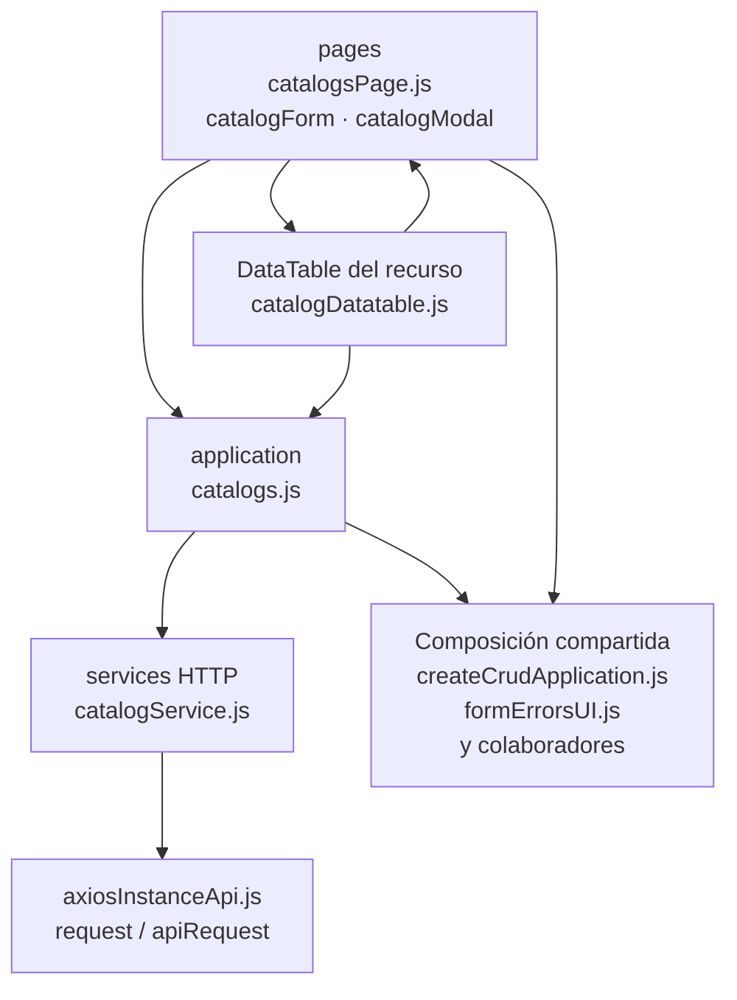

# 16. Catálogos administrables: estructura de código

**Identificador:** `DIA-FE-MOD-CAT-001`.
**Alcance:** grupos de implementación del módulo y sus dependencias directas.
**Fuente:** imports de los archivos de la tabla.

catalogsPage, form/modal y catalogDatatable son comunes al recurso seleccionado. catalogs.js propaga catalog al request; los adaptadores de selects operativos no pasan por esta pantalla administrativa.

| Grupo del mapa | Archivos que lo componen |
| --- | --- |
| pages · catalogForm.js · catalogModal.js · y colaboradores | `src/public/js/pages/admin/catalogs/` `catalogForm.js` `src/public/js/pages/admin/catalogs/` `catalogModal.js` `src/public/js/pages/admin/catalogs/` `catalogsPage.js` |
| application · catalogs.js | `src/public/js/application/admin/catalogs/` `catalogs.js` |
| services HTTP · catalogService.js | `src/public/js/services/admin/` `catalogService.js` |
| DataTable del recurso · catalogDatatable.js | `src/public/js/plugins/datatable/admin/` `catalogs/catalogDatatable.js` |
| Composición compartida · createCrudApplication.js · formErrorsUI.js · y colaboradores | `src/public/js/application/` `createCrudApplication.js` `src/public/js/ui/forms/formErrorsUI.js` `src/public/js/ui/forms/formStateUI.js` `src/public/js/ui/forms/formUI.js` `src/public/js/ui/modalUI.js` |
| axiosInstanceApi.js · request / apiRequest | `src/public/js/services/axiosInstanceApi.js` |

Los reportes y la infraestructura transversal se localizan en el
[capítulo 3](03-shared-code-and-coverage.md); el orden de llamadas está en
[procesos](../../processes/frontend-code-sequences/index.md).
