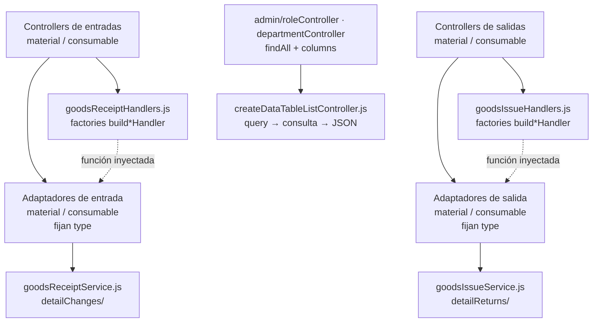
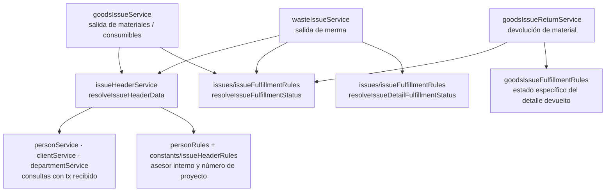

# 1. Backend: handlers y servicios compartidos

La reutilización backend tiene dos niveles: factories de handlers que reciben funciones
de servicio, y servicios de dominio que reciben un contexto explícito. Los controllers
material/consumable son configuradores; sus servicios adaptan el tipo y delegan en
núcleos comunes. Las flechas muestran uso/configuración, no herencia.

## Reutilización del transporte backend

**Identificador:** `DIA-COD-REU-002`. **Pregunta:** ¿qué coordinación HTTP se comparte
entre variantes de materiales y consumibles? **Fuente:**
`src/controllers/api/warehouse/{goodsReceipts,goodsIssues}` y sus servicios.
Las flechas continuas representan imports; las discontinuas, callbacks inyectados.

El controller configura funciones de servicio e `inventoryContext` cuando el handler lo
requiere. El handler compartido adapta HTTP, DTO, respuesta y publicación; el servicio
por contexto fija `type` y delega las reglas/persistencia en el núcleo compartido. La factory tabular concentra parsing y respuesta, y recibe consulta y
columnas permitidas. Esto evita reconstruir la misma coordinación para cada variante.

## Servicios y reglas compartidos por salidas

**Identificador:** `DIA-COD-REU-005`. **Pregunta:** ¿qué colaboración reutilizan las
salidas de materiales y mermas y qué reglas de detalle permanecen específicas?
**Fuente:** `src/services/warehouse/{goodsIssues,wasteIssues,issues}`.
Las flechas son dependencias; no representan transiciones normativas de estado.

`resolveIssueHeaderData` recibe identidades, datos, `tx`, clases de error y un estado
opcional. Valida referencias y reglas comunes y devuelve datos de encabezado; el
servicio propietario conserva documento, cantidades y límite transaccional. El helper
usa el contexto que recibe y no abre una transacción por cada consulta.

El cumplimiento del encabezado comparte `resolveIssueFulfillmentStatus`. La resolución
del detalle no se presenta como un algoritmo único: la devolución de material usa
`resolveGoodsIssueDetailFulfillmentStatusName`, que considera cantidades devueltas;
merma usa el resolver común de detalle en su coordinación específica. Las reglas y
transiciones de negocio se consultan en requisitos y el orden temporal en procesos.

## Configuración y comportamiento de los handlers

En `materialGoodsReceiptController.js`, `registerMaterialGoodsReceipt` es el resultado
de `buildRegisterHandler({ createGoodsReceipt: createMaterialGoodsReceipt,
inventoryContext: 'material' })`. El handler captura la función y el contexto al
cargar el módulo. Durante la petición construye/sanea el DTO, espera el servicio,
publica el evento y devuelve `{ goodsReceipt, code }`. El adaptador de servicio fija
`MATERIAL_TYPES.MATERIAL` y delega en `goodsReceiptService.js`; consumibles fija su
propio tipo y reutiliza el mismo núcleo. La persistencia no es una implementación
independiente para cada variante.

| Handler compartido | Contrato conservado y variación relevante |
| --- | --- |
| Entradas: `buildListHandler` | Extrae paginación, filtros y orden; invoca la consulta inyectada y devuelve su resultado tabular. |
| Entradas: register/edit/correction/cancellation | DTO y respuesta comunes; contexto de inventario configurado. Edit agrega `req.user.id` al DTO; corrección/cancelación lo pasan como `userId`. Register no añade ese actor en el handler. |
| Salidas: list/register/edit/header | Función específica inyectada; listado incorpora `req.user.accesses`; mutaciones adaptan DTO y respuesta. No todas publican inventario. |
| Salidas: details/return | Configuran `inventoryContext` y publican tras resolver el servicio. Return envía `id`, `detailId`, DTO y `req.user.id`; details no añade ese actor. |
| `createDataTableListController` | Captura `findAll`, `columns` y `defaultDirection`; adapta query y responde JSON 200. No decide permisos, DTO de escritura ni modelo Prisma. |

Los routers conservan autenticación, autorización y validación. Los handlers no abren
transacciones: ese límite pertenece al servicio coordinador. La publicación depende
de la operación; no se atribuye un evento ni un `userId` común a todos los handlers.
Las firmas exactas y los endpoints están en el código y el contrato OpenAPI.

## Reutilización adicional de servicios por tipo

`services/warehouse/consumables/consumableService.js` reutiliza las operaciones de
`materials/materialService.js`: cambia el tipo, adapta `consumableDto` a `materialDto`
y fuerza `base`/`height` a `null` en el alta. Compras y salidas de materiales/consumibles
también tienen adaptadores por tipo alrededor de sus núcleos. Merma conserva
`wasteService.js`, `wasteInventoryService.js` y `wasteMovementService.js`; reutiliza
colaboradores de encabezado/cumplimiento y conversión, no el servicio de stock de
materiales completo. Esas diferencias están en el [mapa backend](../code-structure/03-backend-domains-and-dependencies.md).
