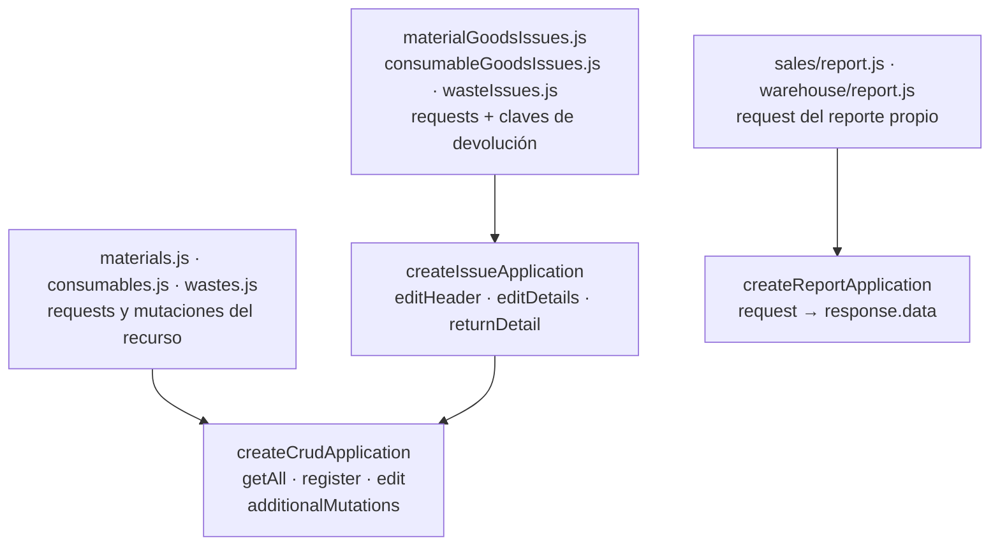
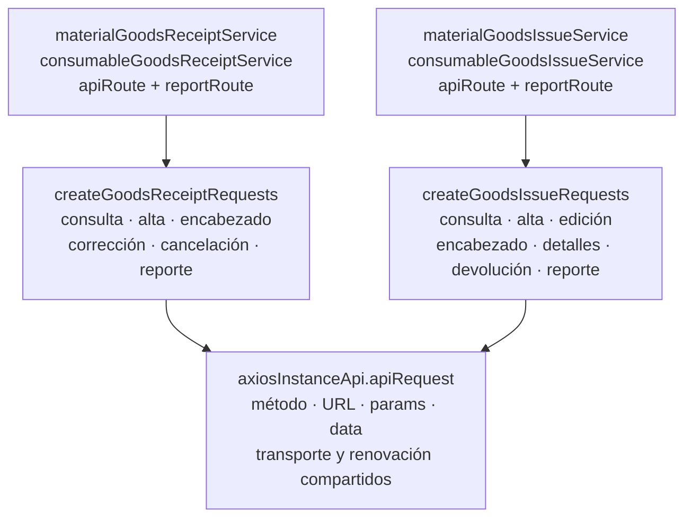

# 2. Navegador: aplicaciones CRUD y requests configurables

Las factories son funciones que devuelven operaciones configuradas. `application`
adapta argumentos y respuestas; `services` construye HTTP. Se distinguen porque
cambiar una clave de respuesta y cambiar una URL afectan contratos diferentes.
Las flechas apuntan del consumidor a la dependencia.

## Aplicaciones y contratos configurables

**Identificador:** `DIA-COD-REU-001`. **Pregunta:** ¿qué configuradores reutilizan las
factories y qué variación permanece local? **Alcance:** módulos del navegador bajo
`src/public/js/application`; se muestran consumidores representativos verificables.

`createCrudApplication` crea closures y congela el objeto de operaciones. El configurador
exporta referencias con vocabulario del recurso. `createIssueApplication` añade nombres
de mutaciones y claves de respuesta mediante configuración del CRUD. La factory de
reportes devuelve `response.data`; la descarga y la interacción visual continúan en los
consumidores, no dentro de esa factory.

La [secuencia de construcción](../design-and-construction-patterns/03-patterns-in-code.md#factories-y-composición-sobre-herencia)
explica cuándo se crea la configuración y cuándo se usa. Las diferencias de cantidades,
autorización y transacción se conservan en cada contrato y servicio propietario.

## Factories de requests por contexto

**Identificador:** `DIA-COD-REU-003`. **Pregunta:** ¿qué transporte comparten compras
y salidas de materiales/consumibles y qué fija cada adaptador?
**Fuente:** `src/public/js/services/warehouse/goodsReceipts` y `goodsIssues`.
Las flechas apuntan del consumidor a la dependencia; el diagrama muestra construcción,
no el orden de una petición completa.

Los servicios del navegador con nombre de dominio fijan las rutas y exportan las
referencias producidas por la factory. `apiRequest` conserva el transporte común;
`createCrudApplication` y `createIssueApplication` consumen después esos requests para
adaptar operaciones y respuestas. Son dos fronteras reutilizadas distintas:
**construcción del request** y **construcción de la aplicación**.

La factory de compras mantiene corrección y cancelación; la de salidas mantiene
encabezado, detalles y devolución. No se fusionan por semejanza de nombres, porque sus
URLs, argumentos y efectos difieren. Los reportes configuran `responseType: 'blob'`.
La factory de salidas de esta figura tiene configuradores de materiales y consumibles;
no se atribuye a merma un consumo que sus imports no demuestran.

## Cómo se ejecuta el contrato CRUD

`createCrudApplication` captura `requests`, `dataKey`, `dataKeys` y las mutaciones
adicionales. Devuelve un objeto congelado; el módulo del recurso exporta sus funciones
con nombres como `registerMaterial`. El objeto congelado fija las referencias de las
operaciones; no congela datos de formulario ni crea reglas de negocio.

| Operación | Argumentos y resultado comprobados en el código |
| --- | --- |
| `getAll(params = {})` | `createApplicationList` llama `request({ params })` y devuelve la respuesta sin transformarla. DataTable utiliza después `response.data`. |
| register/edit/adicionales | `createApplicationMutation` transforma `formData` a `data`, conserva `id`/`detailId` si existen y propaga opciones adicionales. Espera el request y llama `createSuccessResponseFromRequest`. |
| Respuesta de mutación | Siempre produce `message` desde `data.code`; sólo añade `data` cuando se configuró una clave. No devuelve automáticamente toda la entidad recibida. |
| `createIssueApplication` | Delega en CRUD y añade `editHeader`, `editDetails`, `returnDetail`; `dataKeys.issue` fija la clave general y `issueReturn` la de devolución. |
| `createReportApplication` | Propaga argumentos al request y devuelve `response.data`. Construcción de nombre, Blob/descarga y botones pertenecen al consumidor. |

Por ejemplo, `materials.js` configura `dataKeys.register='material'`: el alta devuelve
`{ message, data: response.data.material }`; sus mutaciones sin clave devuelven sólo
`{ message }`. Para alta desde compra, el configurador elimina `maxUnitCost`/`newStock`
y envía `creationContext='goodsReceipt'` antes del request. Esa adaptación permanece
local al recurso.

En salidas, `materialGoodsIssues.js` y `consumableGoodsIssues.js` configuran la clave de
devolución, mientras `wasteIssues.js` configura tanto `issue='wasteIssue'` como
`issueReturn='wasteIssueReturn'`. La coincidencia de la factory no implica respuestas
idénticas. Los errores del request se propagan: el manejo visual ocurre en el formulario.

## Configuración de URLs y reporte

`services/warehouse/goodsReceipts/materials/materialGoodsReceiptService.js` captura
`apiRoute='/api/warehouse/goods-receipts/materials'` y una URL de reporte Excel.
Consumibles utiliza sus propias rutas y los mismos builders. Los identificadores se
insertan en las URLs por operación (`/:id`, detalles, correcciones, cancelación o
devolución); los argumentos se convierten en `params`/`data`. La factory de requests
conserva la respuesta de `apiRequest`; no aplica `dataKey` ni decide permisos.

Los requests de reporte usan `responseType: 'blob'`. Las factories de compras y salidas
son distintas por sus firmas y URLs. `wasteIssueService.js` define sus requests propios,
aunque `wasteIssues.js` sí reutiliza `createIssueApplication` en la frontera de application.
