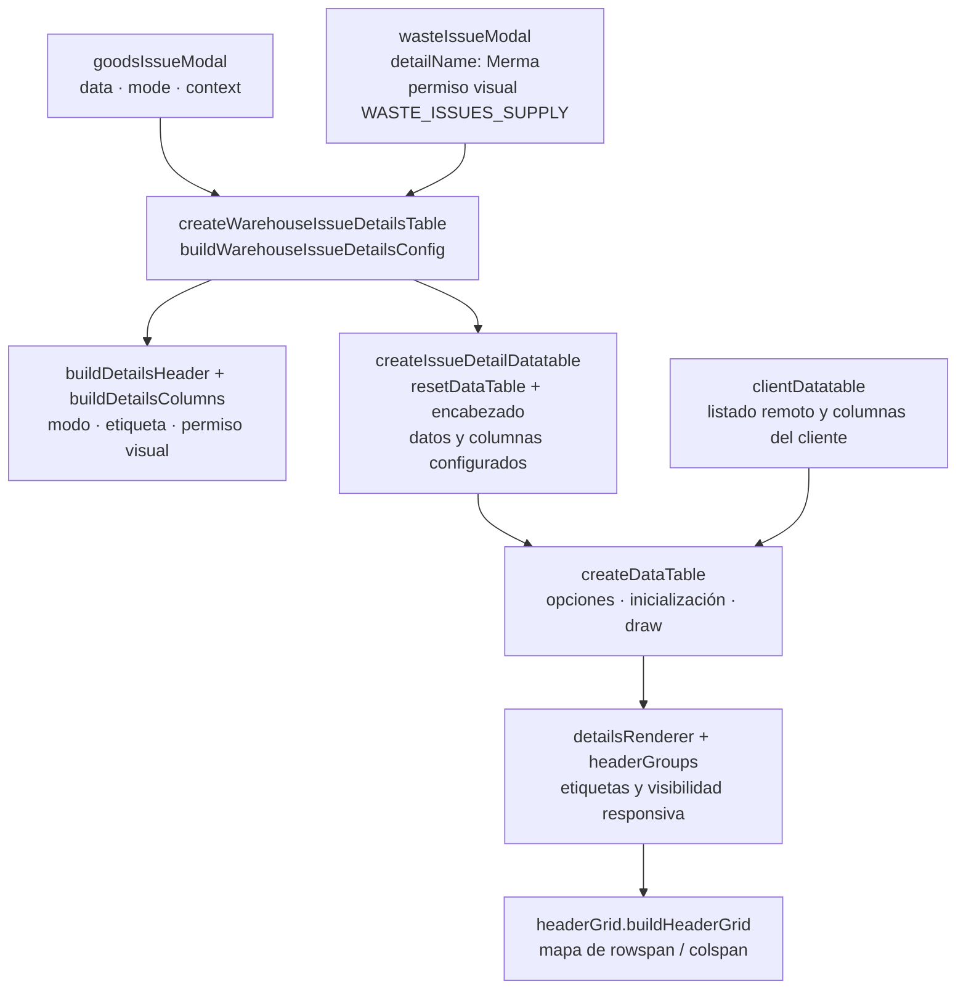

# 3. Interfaz: composición y ciclo de vida de tablas

La reutilización de interfaz separa plantillas EJS, formularios, modales y plugins.
El recurso conserva datos y acciones; las piezas comunes reciben selectores, opciones
y callbacks. La construcción y limpieza de una tabla tiene un contrato distinto del
transporte HTTP o de la adaptación de una mutación.

## Composición de la interfaz

La reutilización visual no obliga a compartir toda la pantalla. Los parciales EJS, los
formularios y los plugins mantienen contratos distintos. El [diagrama de ownership](../design-and-construction-patterns/12-composition-and-ownership-of-components-visual.md#composición-de-la-interfaz)
localiza un ejemplo concreto y separa page, formulario, application, transporte y UI.
El flujo de [adaptación de detalles](../design-and-construction-patterns/06-dtos-adapters-and-policies.md#adaptadores-de-detalles-de-inventario)
explica las identidades que se conservan entre API, tabla y request.

## Construcción y ciclo de vida de tablas de detalle

**Identificador:** `DIA-COD-REU-004`. **Pregunta:** ¿qué construcción comparten los
modales de salidas y quién conserva columnas, ciclo de vida y adaptación responsiva?
**Fuente:** `src/public/js/pages/warehouse/{goodsIssues,wasteIssues}` y
`src/public/js/plugins/datatable/{shared/issues,core}`.
Las flechas indican uso/configuración; los nodos agrupan responsabilidades.

Los modales preparan y adaptan sus detalles; la factory de almacén construye la misma
estructura con la variación de modo, etiqueta y permiso visual. La tabla de detalle
reinicia la instancia anterior antes de configurar el encabezado y crear la nueva.
`createDataTable` también sirve a listados remotos: activa `serverSide`/`processing`
cuando hay `ajax`, y conserva callbacks específicos del consumidor.

La infraestructura responsiva comparte el mapa del encabezado para etiquetas y grupos,
en lugar de inferirlos por índices distintos en cada pantalla. El permiso visual sólo
controla presentación; las escrituras siguen autorizadas por el servidor. Esta figura
explica la extracción común y su ownership, sin repetir la secuencia del CRUD.

## Responsabilidades y configuración de interfaz

| Pieza | Qué comparte | Qué mantiene el consumidor |
| --- | --- | --- |
| `src/views/shared` | Markup de formularios, tablas, filtros y otros parciales EJS. | Inclusión desde la plantilla y parámetros del recurso; se renderiza en el servidor. |
| `ui/forms/formUI.js#useForm` | Listener delegado de submit, normalización, validación, bloqueo de envío y delegación de errores. | `selector`, `normalizeData`, `getErrors`, `sendRequest`, normalizadores y efectos de éxito. |
| `ui/issues/issueFormUI.js` | Inicialización de encabezado/modal y aplicación del modo. | Selectores, selects, datos actuales, labels y acciones de cada salida. |
| `warehouseIssueDetailDatatable.js` | Construye header/columns por modo y permiso visual; delega la instancia. | Datos adaptados, contexto y opciones de etiqueta/permiso. |
| `issueDetailDatatable.js` | Reinicia la tabla existente, monta header y llama al constructor común. | Selector, datos, columnas y overrides `options`. |
| `core/base/createDataTable.js` | Normaliza columnas, integra AJAX, callbacks y responsive. | Consulta, columnas y callbacks del listado o detalle. |

`goodsIssueModal.js` vacía y rellena `goodsIssueDetails`, aplica el modo y llama a
`createWarehouseIssueDetailsTable({ data, mode, context })`. `wasteIssueModal.js` hace
lo propio con su arreglo y añade `detailName='Merma'` y
`projectQuantityPermission=UI_PERMISSIONS.WASTE_ISSUES_SUPPLY`. La factory toma por
defecto `GOODS_ISSUE_DETAILS_MANAGE` para salidas de materiales/consumibles.

Los datos pertenecen al modal; la factory no conserva una copia global ni destruye
ese arreglo. `resetDataTable` limpia/destruye la instancia existente y vacía el elemento;
se instala el nuevo encabezado y se construye la tabla. `createDataTable` activa
`serverSide`/`processing` si existe `ajax`; las tablas de detalle usan datos locales.
Los callbacks del consumidor se invocan además del comportamiento común.

En formularios, `useForm` no restaura por sí solo el estado tras cualquier resultado:
`sendRequest` y los helpers de éxito/error conservan el cierre, recarga y reintento
según el flujo. El [estado técnico de los formularios](../frontend-technical-documentation/02-module-code-maps.md)
y la [composición visual](../design-and-construction-patterns/12-composition-and-ownership-of-components-visual.md)
explican esas colaboraciones. Los permisos visuales sólo ocultan/habilitan controles;
los routers del servidor autorizan las escrituras.
