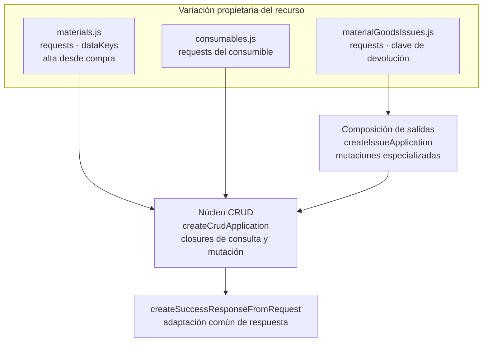

# 4. Refactorización y extensión de mecanismos compartidos

## Propósito

Una refactorización cambia la organización interna conservando el contrato observable.
En la vista de desarrollo se representa mediante las responsabilidades que quedan en el
núcleo y las que permanecen en sus configuradores. Este capítulo describe la estructura
vigente y un procedimiento de revisión; no reconstruye un estado anterior sin evidencia
histórica ni presenta una propuesta como implementación actual.

## Resultado vigente de extracción y configuración

**Identificador:** `DIA-PAT-REF-001`. **Pregunta:** ¿cómo se concentran los mecanismos
comunes sin absorber las variantes del dominio? **Fuente:** `createCrudApplication.js`,
`warehouse/issues/createIssueApplication.js` y sus configuradores en `src/public/js/application`.
Las flechas apuntan desde el consumidor a su dependencia.

La extracción observable es la concentración de adaptación y construcción en las
factories; la configuración permanece con el recurso. La instancia es privada y las
operaciones se exportan con nombres de dominio. Así una modificación del mecanismo
puede afectar varios recursos aunque ninguno cambie de endpoint.

En backend, el mismo criterio se materializa con handlers compartidos de compras y
salidas, configurados por controllers específicos. Sus consumidores y fronteras se
muestran en [`DIA-COD-REU-002`](01-backend-handlers-and-services.md#reutilización-del-transporte-backend).
La [decisión de propiedad visual](../design-and-construction-patterns/12-composition-and-ownership-of-components-visual.md#decisión-de-propiedad)
conserva un componente junto al recurso cuando su contrato todavía depende de él.

## Procedimiento para revisar una extracción

Estos criterios se expresan como revisión de código, sin otro diagrama de proceso:

1. Identificar consumidores existentes y comprobar que comparten contrato y responsabilidad.
2. Separar el mecanismo común de datos y reglas del dominio; conservar implementaciones locales si sus contratos difieren.
3. Buscar una pieza compatible antes de extraer otra abstracción.
4. Revisar configuradores, imports, exports y callbacks de todos los consumidores.
5. Comprobar comportamiento y errores con las pruebas correspondientes y actualizar los mapas afectados.

La semejanza de nombres no basta para fusionar operaciones: corrección/cancelación de
una compra y devolución de una salida tienen efectos y precondiciones diferentes.
El núcleo no debe seleccionar permisos ni modelos a partir de datos arbitrarios del
cliente, alterar el límite de `tx` ni convertir una variante en un endpoint genérico.

## Contrato que se conserva y evidencia

| Frontera | Qué se revisa | Evidencia propietaria |
| --- | --- | --- |
| Application del navegador | Argumentos, resultado, claves y exports de dominio. | Factory, configuradores y pruebas unitarias de application. |
| Controller/handler | Parsing, DTO, actor, códigos y respuesta HTTP. | Router, handlers, tests de controllers y contrato OpenAPI. |
| Servicio transaccional | `tx` propagado, errores y ausencia de efectos parciales. | Servicio coordinador e integración con base aislada. |
| UI compartida | Identidad, modos, callbacks, selectores y ciclo de vida. | Formularios, plugins, parciales y pruebas disponibles del mecanismo. |

Las pruebas existentes y sus brechas se consultan en el [plan de pruebas](../../../../testing/test-plan.md).
Un diagrama no acredita pruebas inexistentes. Si se necesita mostrar una migración
antes/después, ambas versiones deben rotularse con su estado y referencia de commit;
los identificadores de casos y patrones sirven después para localizar el impacto.

## Resultado de la revisión de cobertura visual

La reutilización necesita una figura cuando el texto por sí solo oculta una frontera,
una configuración o el impacto sobre consumidores. Tener dos imports no obliga a
crear un gráfico por función. La representación se elige por la pregunta que permite
resolver y se mantiene junto al mecanismo propietario.

| Pieza revisada | Representación vigente | Criterio de cobertura |
| --- | --- | --- |
| Factories CRUD y salidas; handlers y listado backend | [Factories y handlers](index.md) y `DIA-PAT-REF-001`. | Cubiertos: núcleo, configuradores y contrato de cada frontera. |
| Factories de requests de compras/salidas | [`DIA-COD-REU-003`](02-browser-applications-and-requests.md#factories-de-requests-por-contexto). | Se añade la frontera de transporte y las variantes de URLs/operaciones. |
| Tabla de detalle, builders y núcleo responsivo | [`DIA-COD-REU-004`](03-interface-and-table-lifecycle.md#construcción-y-ciclo-de-vida-de-tablas-de-detalle). | Se añade configuración, ownership, reinicialización y consumidores reales. |
| Encabezado y cumplimiento compartido de salidas | [`DIA-COD-REU-005`](01-backend-handlers-and-services.md#servicios-y-reglas-compartidos-por-salidas). | Se añade la colaboración backend y el límite de reglas específicas del detalle. |
| DTO/adaptadores, colecciones, UI, permisos, eventos, auditoría y `tx` | [Catálogo visual y capítulos propietarios](../design-and-construction-patterns/index.md#cobertura-visual). | Ya tienen una colaboración o flujo de datos; se actualiza su fuente canónica. |
| Arreglos compartidos de middleware de compras/salidas | [Pipeline](../design-and-construction-patterns/05-middleware-pipeline.md) y routers de cada contexto. | Basta explicar sus consumidores: comparten el orden declarado y permisos por operación; no necesitan otra secuencia equivalente. |
| Formatos, constantes y helpers simples sin coordinación nueva | Contrato, imports y pruebas disponibles. | No requieren figura individual; se muestran como dependencia cuando explican otro mecanismo. |

Las figuras muestran la concentración y composición comprobables hoy. Un antes/después
histórico requiere commits que demuestren la extracción; el criterio de revisión no se
presenta como una refactorización ya ejecutada. Al ampliar estas piezas se revisa el
núcleo, cada configurador y sus consumidores, conservando diferencias de contexto.
