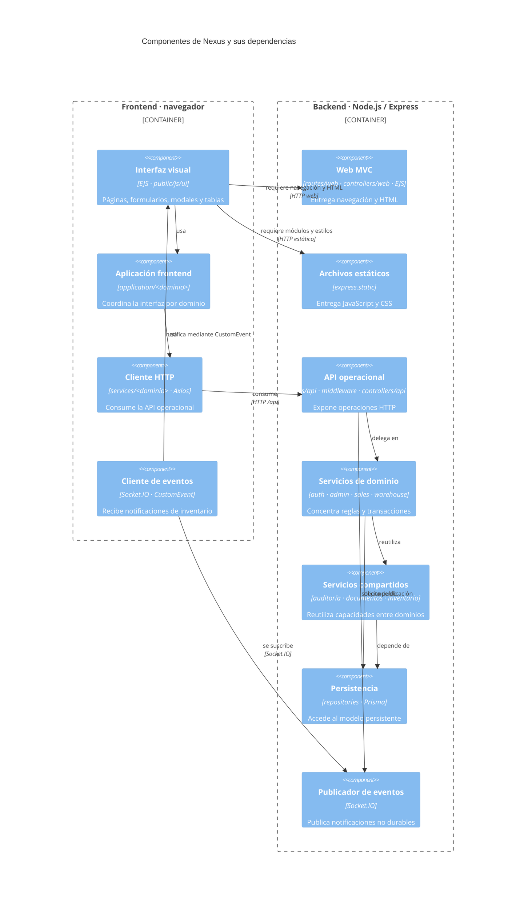

# 1. Componentes y reutilización de frontend y backend

Esta vista muestra la descomposición estática de Nexus: qué componentes existen, dónde
se ejecutan y de cuáles dependen. No representa el orden de una petición ni los pasos de
un caso de uso; esos recorridos pertenecen a la [vista de procesos](../processes/index.md).

## Componentes y dependencias

**Diagrama de componentes C4:** `DIA-ARQ-CMP-001`.

El diagrama usa `C4Component`: cada rectángulo es un componente y cada contenedor marca
su entorno de ejecución. Las flechas expresan dependencias estructurales, no una secuencia
temporal; se leen como «el origen usa o requiere al destino». Los protocolos sólo se
indican cuando la dependencia cruza una frontera técnica.

Esta vista evita representar cada interfaz como un nodo adicional. C4 permite comunicar
la responsabilidad y la dependencia sin simular los conectores *ball-and-socket* de UML,
que Mermaid no soporta de forma nativa. Los contratos HTTP detallados permanecen en
[OpenAPI](../../openapi/openapi.json) y las operaciones concretas en las secuencias por
[caso de uso](../processes/index.md).

## Límite con los diagramas de procesos

No se mantienen diagramas de componentes por compra, corrección, cancelación, surtimiento
o devolución. Esas vistas terminaban describiendo orden, transacciones y acciones
posteriores al commit, por lo que duplicaban los diagramas dinámicos existentes:

- el [recorrido extremo a extremo](../processes/01-end-to-end-interaction.md) explica el
  pipeline general de una interacción;
- las colecciones de secuencias de [frontend](../processes/frontend-code-sequences/index.md)
  y [backend](../processes/backend-code-sequences/index.md) explican cada `CU-*`; y
- los [diagramas dinámicos de implementación](../development/code-diagrams/05-views-dynamic.md)
  ubican middleware, DTO, transacción, persistencia y publicación de eventos.

Sólo se modifica `DIA-ARQ-CMP-001` cuando aparece, desaparece o cambia la responsabilidad
o dependencia estable de un componente. Un cambio de orden, endpoint, payload, regla de
transacción o respuesta se documenta en el artefacto dinámico propietario.

## Reutilización comprobada en el frontend

Las factories, configuradores y consumidores se detallan en los
[diagramas de reutilización](../development/code-diagrams/06-view-of-reuse-crud-and-interface.md)
y en el patrón [`DIA-PAT-CON-001`](../development/design-and-construction-patterns/04-catalog-visual-of-patterns-applied.md#factories-y-composición-sobre-herencia).

## Criterio para extender un componente

1. Registrar la ruta bajo el dominio existente y mantener juntos sus nombres a través
   de ruta, controlador, servicio, aplicación y página.
2. Reutilizar una factory o componente compartido cuando el recorrido sea el mismo y
   expresar la diferencia mediante configuración; conservar en el dominio los
   selectores, payloads y reglas que no sean generales.
3. Mantener una sola transacción backend para escrituras compuestas y propagar `tx` a
   cada colaborador.
4. Representar una dependencia nueva en este diagrama sólo si cambia la estructura; el
   detalle de imports y rutas pertenece al [mapa generado](../development/code-map.md).
