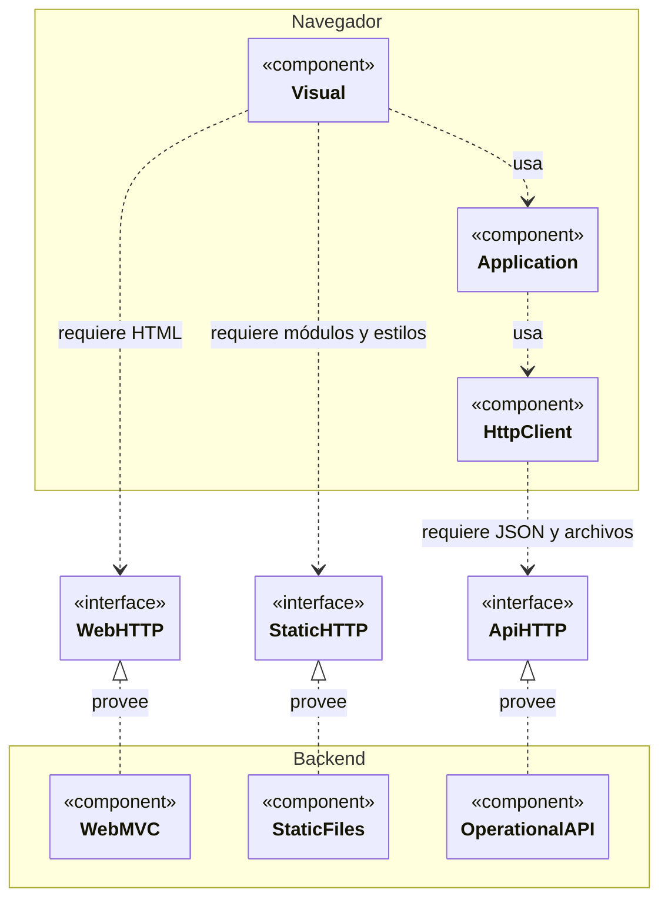
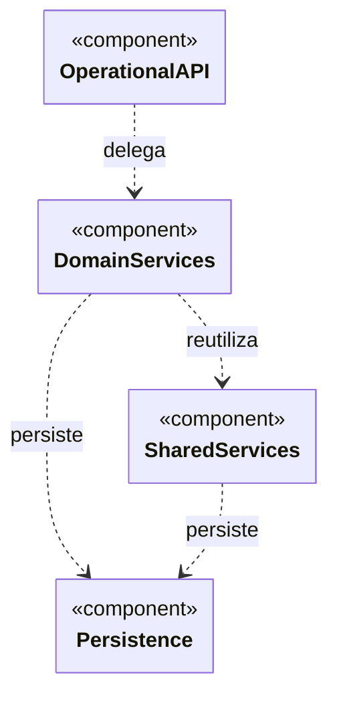
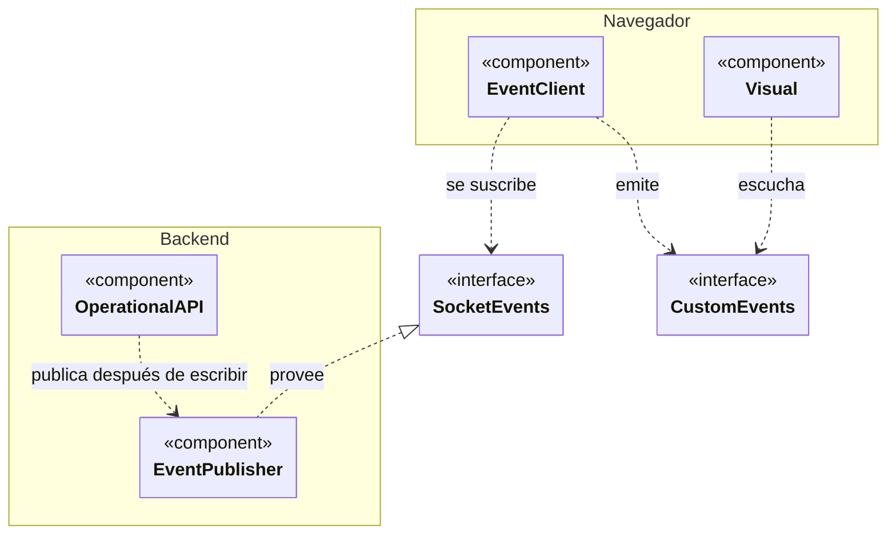

# 1. Componentes y reutilización de frontend y backend

La vista muestra componentes y dependencias. El orden de las peticiones pertenece a
la [vista de procesos](../processes/index.md).

## Componentes y dependencias

**Componentes y contratos con clasificadores UML en Mermaid:** `DIA-ARQ-CMP-001`.

### Contratos HTTP entre frontend y backend

### Colaboración interna del backend

`OperationalAPI` corresponde al proveedor de la interfaz HTTP de la figura anterior.

### Canal de eventos

Esta figura separa Socket.IO de las peticiones HTTP para conservar legibilidad.
`OperationalAPI` y `Visual` son los mismos componentes de la figura anterior.

`<<component>>` identifica componentes y `<<interface>>` contratos. `<|..` indica
realización y `..>` dependencia. Mermaid aproxima esta vista con clasificadores;
no dibuja puertos ni conectores de componente UML nativos. `CustomEvents` representa
los eventos del navegador: el emisor no depende de los listados que los escuchan.

| Componente | Responsabilidad |
| --- | --- |
| `Visual`, `Application`, `HttpClient` | Interfaz, coordinación frontend y peticiones Axios; el cliente HTTP gestiona la renovación y el reintento ante 401. |
| `WebMVC`, `StaticFiles`, `OperationalAPI` | Entregan HTML renderizado, archivos estáticos y el contrato API para JSON y descargas. |
| `DomainServices`, `SharedServices` | Aplican reglas del dominio y colaboraciones reutilizables; las escrituras compuestas conservan una transacción. |
| `Persistence` | Repositories y Prisma; la estructura de tablas pertenece al modelo persistente. |
| `EventPublisher`, `EventClient` | Publican y reciben avisos Socket.IO; el cliente emite eventos del navegador para actualizar los listados. |

HTTP y Socket.IO son contratos separados de la misma aplicación. Los avisos se emiten
tras completar la operación correspondiente; no sustituyen la respuesta HTTP ni la
consulta de datos del listado.

## Reutilización y mantenimiento

Las factories y consumidores se detallan en los
[diagramas de reutilización](../development/reuse-and-refactoring/index.md)
y en el [patrón de composición visual](../development/design-and-construction-patterns/12-composition-and-ownership-of-components-visual.md).
Las [colaboraciones por dominio](../development/code-structure/03-backend-domains-and-dependencies.md)
amplían las dependencias y [OpenAPI](../../openapi/openapi.json) define los contratos HTTP.

Al extender un componente, reutilizar el flujo compartido y mantener las reglas
específicas en su dominio. Actualizar esta vista sólo si cambia la estructura; imports
y rutas se comprueban en el [mapa generado](../development/code-map.md).
