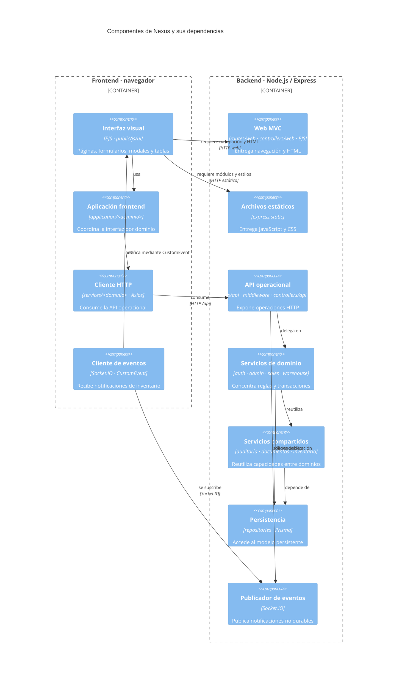

# 1. Componentes y reutilización de frontend y backend

Esta vista muestra la descomposición estática de Nexus: qué componentes existen, dónde
se ejecutan y de cuáles dependen. No representa el orden de una petición ni los pasos de
un caso de uso; esos recorridos pertenecen a la [vista de procesos](../processes/index.md).

## Componentes y dependencias

**Diagrama de componentes C4:** `DIA-ARQ-CMP-001`.

Mermaid no reproduce de forma nativa el glifo de componente, los puertos y los conectores
*ball-and-socket* de UML. Esta vista usa su representación equivalente mediante
clasificadores: `<<component>>` identifica componentes, `<<interface>>` identifica
contratos, la realización `<|..` une una interfaz con quien la provee y la dependencia
`..>` parte de quien la requiere. Las convenciones y el límite de esta aproximación se
detallan en las
[colaboraciones enfocadas por capacidad](03-component-collaborations-by-capability.md#notación-uml-adoptada-en-mermaid).

Cada contrato que cruza las fronteras se representa por separado: HTTP web, HTTP
estático, HTTP `/api` y Socket.IO. De este modo, agregar otra interfaz no obliga a
fusionarla con las existentes ni a tratarla como un componente. Un componente puede
realizar o requerir tantas interfaces como contratos estables exponga o consuma.

El diagrama general se complementa con [OpenAPI](../../openapi/openapi.json), las
[secuencias por caso de uso](../processes/index.md) y el
[patrón de componentes visuales](../development/design-and-construction-patterns/12-composition-and-ownership-of-components-visual.md).
Las [colaboraciones enfocadas por capacidad](03-component-collaborations-by-capability.md)
seleccionan de esta vista únicamente los componentes e interfaces necesarios cuando un
recorrido coordina varios dominios o mecanismos de inventario; no sustituyen las
secuencias ni duplican un diagrama por cada caso de uso.

### Canales comprobados en la implementación

La implementación usa estos canales:

| Canal | Recorrido real | Uso |
| --- | --- | --- |
| Página web | Navegador → ruta web → middleware/controller web → `res.render` o redirección. | Entrega el HTML EJS inicial. |
| Archivos estáticos | HTML → `GET /js/*` o `/css/*` → `express.static`. | Entrega los módulos ES y estilos que forman el frontend en el navegador. |
| API operacional | Página/UI → aplicación frontend → archivo `*Service.js` → `apiRequest` → Axios → ruta `/api` → middleware → controller API → servicio backend → Prisma o efecto. | Consultas, escrituras y descargas; la respuesta vuelve por la misma petición como JSON o `Blob`. |
| Renovación de sesión | Interceptor de `axiosInstanceApi.js` → `POST /api/auth/refresh` → reintento de la petición original; si falla, redirección a `/`. | Recupera una petición que recibió `401`; Axios envía las cookies porque usa `withCredentials`. |
| Tiempo real | Controller API después de una escritura → `emitInventoryUpdated` → Socket.IO → `indexPage.js` → `CustomEvent` → DataTable interesado. | Notifica cambios de materiales, consumibles, mermas y movimientos; no reemplaza la respuesta HTTP ni transporta la escritura inicial. |

## Reutilización comprobada en el frontend

Las factories, configuradores y consumidores se detallan en los
[diagramas de reutilización](../development/code-diagrams/06-view-of-reuse-crud-and-interface.md)
y en el patrón [`DIA-PAT-CON-001`](../development/design-and-construction-patterns/04-catalog-visual-of-patterns-applied.md#factories-y-composición-sobre-herencia).

## Criterio para extender un componente

1. Registrar la ruta bajo el dominio existente y mantener juntos sus nombres a través
   de ruta, controlador, servicio, aplicación y página.
2. Reutilizar una factory o componente compartido cuando el recorrido sea el mismo y
   expresar la diferencia mediante configuración; conservar en el dominio los
   selectores, payloads y reglas que no sean generales.
3. Mantener una sola transacción backend para escrituras compuestas y propagar `tx` a
   cada colaborador.
4. Representar una dependencia nueva en este diagrama sólo si cambia la estructura; el
   detalle de imports y rutas pertenece al [mapa generado](../development/code-map.md).
