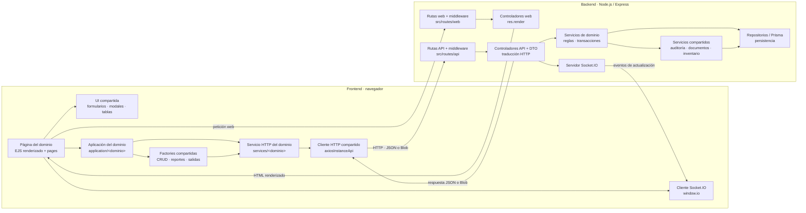
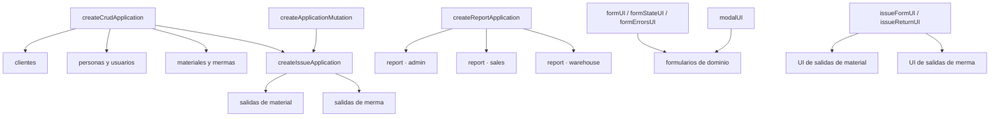

# 1. Componentes y reutilización de frontend y backend

Esta vista sustituye una descripción archivo por archivo por las responsabilidades y
puntos de reutilización que condicionan la solución. La unidad de organización es el
dominio funcional (`admin`, `sales` o `warehouse`); las capas no crean otro flujo de
negocio, sino que colaboran para realizarlo.

## Componentes y conexión entre frontend y backend

**Diagrama:** `DIA-ARQ-CMP-001`. Se usa un diagrama de componentes porque la pregunta
es estructural: qué piezas existen, qué responsabilidad tienen y mediante qué interfaz
se conecta el navegador con Express. Las flechas sólidas internas indican dependencia;
las flechas etiquetadas que cruzan el límite muestran los tres canales vigentes: páginas
web HTML, API HTTP y eventos Socket.IO.

La conexión no constituye una capa adicional: las páginas se obtienen mediante rutas y
controladores web; el JavaScript del navegador consume las rutas API mediante los
servicios HTTP y `axiosInstanceApi`; Socket.IO comunica actualizaciones iniciadas por el
servidor. Toda entrada vuelve a autenticarse, autorizarse y validarse en Express.

Este diagrama no sustituye otros artefactos. El [contrato API](../../api-contract/index.md)
y OpenAPI definen métodos, rutas y payloads; el
[recorrido extremo a extremo](../processes/01-end-to-end-interaction.md) y las secuencias
por `CU-*` muestran el orden temporal. Por tanto, se actualiza el diagrama de componentes
cuando cambia una pieza o un canal entre frontend y backend, y una secuencia cuando cambia
el orden de colaboración de un flujo.

## Componentes que realizan un caso de uso

Un diagrama de componentes también puede acotarse a un `CU-*`. En ese caso no representa
el flujo temporal del caso, sino el conjunto de componentes que lo realiza y las
interfaces entre ellos. Debe titularse con un solo identificador de caso de uso y omitir
capas o infraestructura que no participan en ese objetivo.

La vista de componentes y la secuencia por caso responden preguntas distintas y pueden
coexistir:

| Vista | Pregunta | Cuándo mantenerla |
| --- | --- | --- |
| Componentes por `CU-*` | ¿Qué piezas implementan este caso y de qué interfaces dependen? | Cuando la composición particular del caso aporta información que no muestra la vista global. |
| Secuencia `DIA-FE-CU-*` o `DIA-BE-CU-*` | ¿En qué orden colaboran esas piezas y qué alternativas aparecen? | Para el recorrido ejecutable frontend o backend del caso. |

No se exige duplicar los 73 casos con ambos tipos de diagrama. Las colecciones de
secuencias ya aseguran una vista técnica individual por caso; se agrega una vista de
componentes individual sólo cuando ayuda a explicar una frontera, una reutilización o
una colaboración estructural propia. Si varios casos usan exactamente la misma
composición, se enlaza esta vista general en vez de copiarla.

## Reutilización comprobada en el frontend

**Diagrama:** `DIA-ARQ-CMP-002`. Esta vista responde específicamente dónde se reutiliza
comportamiento y dónde permanece la configuración del dominio.

Las factories reciben requests, claves de respuesta y mutaciones del contexto; no
exponen una instancia genérica a la UI. Cada módulo mantiene exports con nombres del
dominio, mientras los formularios y páginas reutilizan los helpers visuales sin mover
selectores o reglas específicas a `ui`. Las exportaciones Excel siguen el mismo
criterio: el caso permanece en la pantalla propietaria y sólo la descarga se comparte
mediante `createReportApplication`.

## Criterio para extender un flujo

1. Registrar la ruta bajo el dominio existente y mantener juntos sus nombres a través
   de ruta, controlador, servicio, aplicación y página.
2. Reutilizar una factory o componente compartido cuando el recorrido sea el mismo y
   expresar la diferencia mediante configuración; conservar en el dominio los
   selectores, payloads y reglas que no sean generales.
3. Mantener una sola transacción backend para escrituras compuestas y propagar `tx` a
   cada colaborador.
4. Representar una colaboración nueva en este diagrama sólo si cambia la estructura;
   el detalle de imports y rutas pertenece al [mapa generado](../development/code-map.md)
   y las secuencias concretas a las colecciones de
   [frontend](../processes/frontend-code-sequences/index.md) y
   [backend](../processes/backend-code-sequences/index.md).
