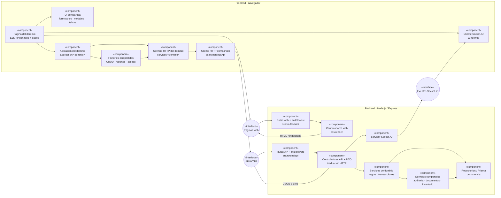
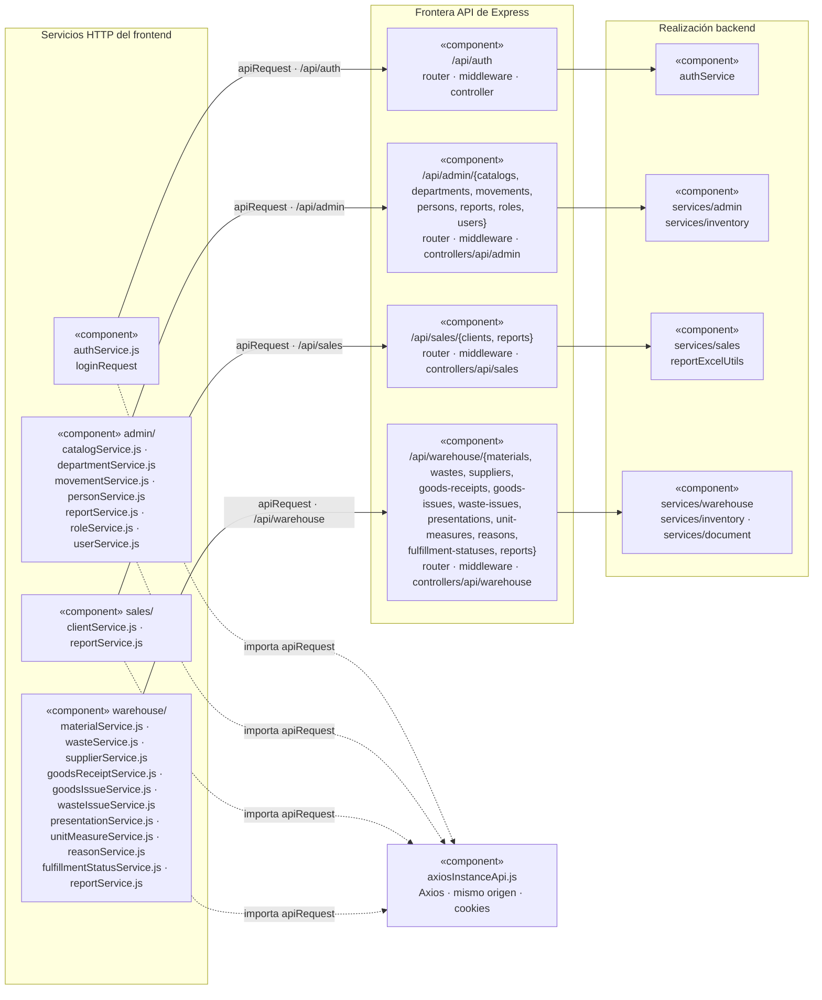

# 1. Componentes y reutilización de frontend y backend

Esta vista sustituye una descripción archivo por archivo por las responsabilidades y
puntos de reutilización que condicionan la solución. La unidad de organización es el
dominio funcional (`admin`, `sales` o `warehouse`); las capas no crean otro flujo de
negocio, sino que colaboran para realizarlo.

## Componentes y conexión entre frontend y backend

**Diagrama UML de componentes:** `DIA-ARQ-CMP-001`. Se usa la semántica UML porque la
pregunta es estructural: qué componentes existen, qué responsabilidad tienen y mediante
qué interfaz se conecta el navegador con Express. Mermaid no dispone de un tipo nativo
para componentes UML, por lo que el `flowchart` conserva explícitamente los
clasificadores `«component»` y `«interface»`: los rectángulos son componentes, los nodos
circulares son interfaces provistas y las flechas indican dependencias, no orden temporal.

La conexión no constituye una capa adicional: las páginas se obtienen mediante rutas y
controladores web; el JavaScript del navegador consume las rutas API mediante los
servicios HTTP y `axiosInstanceApi`; Socket.IO comunica actualizaciones iniciadas por el
servidor. Toda entrada vuelve a autenticarse, autorizarse y validarse en Express.

### Servicios que cruzan la frontera HTTP

**Diagrama UML de componentes:** `DIA-ARQ-CMP-002`. La unidad de este diagrama es el **módulo o archivo** que
mantiene una dependencia estable, no cada método exportado. El componente
`services/<dominio>` del navegador no es un servicio backend ni se conecta directamente
con él. Cada módulo frontend construye una petición con `apiRequest`; el cliente
compartido la envía a una familia de rutas registrada en Express y, después del
middleware, el controller delega en los servicios backend que realizan la operación.
El siguiente detalle hace explícita esa correspondencia sin confundirla con una llamada
directa entre archivos homónimos:

Los nombres agrupados corresponden a módulos bajo `src/public/js/services`; las familias
de endpoint corresponden al registro de `src/routes/api/index.js`. El diagrama termina
en la realización backend por dominio porque las dependencias internas más profundas
—servicios de inventario, documentos, auditoría y repositorios— no cruzan la frontera
frontend–backend. Los métodos y payloads concretos permanecen en el
[contrato API](../../api-contract.md), y el archivo exacto que participa en cada operación
se consulta en las [secuencias frontend](../processes/frontend-code-sequences/index.md) y
[backend](../processes/backend-code-sequences/index.md).

### Canales comprobados en la implementación

La revisión del código muestra que frontend y backend se conectan de cuatro formas, con
responsabilidades distintas:

| Canal | Recorrido real | Uso |
| --- | --- | --- |
| Página web | Navegador → ruta web → middleware/controller web → `res.render` o redirección. | Entrega el HTML EJS inicial; los scripts ES se sirven como archivos estáticos y se cargan desde la página. |
| API operacional | Página/UI → aplicación frontend → archivo `*Service.js` → `apiRequest` → Axios → ruta `/api` → middleware → controller API → servicio backend → Prisma o efecto. | Consultas, escrituras y descargas; la respuesta vuelve por la misma petición como JSON o `Blob`. |
| Renovación de sesión | Interceptor de `axiosInstanceApi.js` → `POST /api/auth/refresh` → reintento de la petición original; si falla, redirección a `/`. | Recupera una petición que recibió `401`; Axios envía las cookies porque usa `withCredentials`. |
| Tiempo real | Controller API después de una escritura → `emitInventoryUpdated` → Socket.IO → `indexPage.js` → `CustomEvent` → DataTable interesado. | Notifica cambios de materiales, mermas y movimientos; no reemplaza la respuesta HTTP ni transporta la escritura inicial. |

No se encontraron llamadas `fetch` ni usos directos de Axios desde las páginas o módulos
de aplicación: las operaciones vigentes pasan por los archivos de servicio y
`apiRequest`. La excepción deliberada es la renovación dentro del propio interceptor,
que usa Axios directamente para evitar que la petición de renovación entre de nuevo en
el mismo ciclo de interceptores. En `authService.js`, sólo `loginRequest` tiene consumidor
y endpoint registrados actualmente; `registerRequest` y `resetPasswordRequest` no se
representan como conexiones vigentes porque no tienen consumidor ni ruta API registrada.

La granularidad se elige por la pregunta documental, no por el deseo de colocar todo el
código en una sola figura:

| Artefacto | Unidad explícita | Razón |
| --- | --- | --- |
| Diagrama de componentes | Archivo o familia de módulos y su interfaz HTTP. | Muestra límites y dependencias estables sin convertirse en inventario de funciones. |
| OpenAPI | Método HTTP + ruta, parámetros, cuerpo y respuesta. | Es la fuente verificable de cada operación expuesta. |
| Secuencia por `CU-*` | Función exportada y llamada relevante del recorrido. | Demuestra qué método participa, en qué orden y con qué resultado. |
| Mapa generado | Imports, exports, rutas y símbolos detectados. | Mantiene el inventario mecánico sin duplicarlo manualmente. |

Por tanto, aquí se hace explícito el archivo —o la familia cuando todos sus archivos
cruzan la misma frontera—. Un método sólo se agrega a una secuencia cuando cambia la
lectura del caso de uso; enumerar todos los métodos en el diagrama de componentes
duplicaría OpenAPI y las secuencias, y mezclaría estructura con comportamiento.

Este diagrama no sustituye otros artefactos. El [contrato API](../../api-contract.md)
y OpenAPI definen métodos, rutas y payloads; el
[recorrido extremo a extremo](../processes/01-end-to-end-interaction.md) y las secuencias
por `CU-*` muestran el orden temporal. Por tanto, se actualiza el diagrama de componentes
cuando cambia una pieza o un canal entre frontend y backend, y una secuencia cuando cambia
el orden de colaboración de un flujo.

## Componentes que realizan un caso de uso

Nexus conserva dos niveles complementarios y ambos usan semántica UML, pero no son el
mismo tipo de diagrama:

1. `DIA-ARQ-CMP-001` y `DIA-ARQ-CMP-002` son los diagramas **generales de componentes**;
   muestran clasificadores `«component»`, interfaces provistas `«interface»` y
   dependencias estructurales estables.
2. Cada `CU-*` cuenta con diagramas **de secuencia UML** frontend y backend; muestra
   participantes, mensajes, retornos y alternativas del recorrido concreto. Que sus
   participantes sean componentes no convierte la secuencia en otro diagrama de
   componentes.

Un diagrama UML de componentes también puede acotarse a un `CU-*`. En ese caso no
representa el flujo temporal del caso, sino el subconjunto de componentes que lo realiza
y sus interfaces provistas o requeridas. Su identificador es `DIA-CMP-CU-<grupo>-<número>`,
debe titularse con un solo caso de uso y omitir capas o infraestructura que no participan
en ese objetivo.

La vista de componentes y la secuencia por caso responden preguntas distintas y pueden
coexistir:

| Vista | Pregunta | Cuándo mantenerla |
| --- | --- | --- |
| Componentes `DIA-CMP-CU-*` | ¿Qué piezas implementan este caso y qué interfaces proveen o requieren? | Cuando la composición particular del caso aporta información que no muestra la vista global. Usa `«component»`, `«interface»` y dependencias. |
| Secuencia `DIA-FE-CU-*` o `DIA-BE-CU-*` | ¿En qué orden colaboran esas piezas y qué alternativas aparecen? | Para el recorrido ejecutable frontend o backend del caso. Usa participantes y mensajes UML. |

Las colecciones de secuencias ya aseguran una vista técnica individual para los 73 casos.
No se renombran esas figuras como componentes ni se copia el diagrama general 73 veces:
se agrega `DIA-CMP-CU-*` sólo cuando ayuda a explicar una frontera, una reutilización o
una colaboración estructural propia que la secuencia no hace visible. Si varios casos
usan exactamente la misma composición, enlazan la vista UML general en vez de mantener
copias que podrían divergir.

### Resultado de aplicabilidad por caso de uso

Se revisaron los participantes de las 73 secuencias frontend y backend y las dependencias
de los servicios propietarios. Un diagrama `DIA-CMP-CU-*` aplica cuando el caso cumple al
menos uno de estos criterios estructurales:

1. coordina componentes de más de un dominio o servicios compartidos dentro de una misma
   consistencia transaccional;
2. combina más de una interfaz relevante —HTTP, cookies/tokens, eventos o persistencia—;
3. selecciona colaboradores diferentes según el contexto y esa composición no queda
   explicada por el diagrama general o por un patrón compartido;
4. posee un componente propietario especializado cuya relación con inventario,
   documentos o estados de cumplimiento debe seguir siendo visible aunque cambie el
   orden del flujo.

Con esos criterios, la vista específica **sí aporta información estructural** en los
siguientes casos:

| Caso | Componentes que justifican la vista específica | Motivo |
| --- | --- | --- |
| `CU-AUT-01` | autenticación, usuarios, JWT y cookies | Une identidad, emisión de tokens y la interfaz de sesión; no es un CRUD por capas. |
| `CU-ALM-02` | materiales, relaciones proveedor–material, motivos y ajustes | La creación selecciona colaboradores según el contexto y puede incorporar existencia inicial en la misma transacción. |
| `CU-ALM-10` | material de origen, merma, inventario de merma y Socket.IO | Crea la merma desde una composición de componentes y publica el cambio fuera de la transacción. |
| `CU-ENT-02` | compras, proveedor, persona, folio documental, material, inventario y Socket.IO | Es la composición más amplia de entrada y cruza documentos, catálogo e inventario. |
| `CU-ENT-04` | corrección de detalle, historial de cambios, motivo, inventario y recálculo de costo | La corrección coordina componentes especializados bajo una transacción y un efecto posterior. |
| `CU-ENT-05` | cancelación de detalle, historial de cambios, motivo, inventario y recálculo de costo | Comparte infraestructura con la corrección, pero el componente propietario y sus dependencias representan la cancelación. |
| `CU-SAL-06` | devolución de material, movimiento de inventario, reglas de cumplimiento y Socket.IO | La devolución cruza el documento de salida, inventario y estado de cumplimiento. |
| `CU-SAL-12` | salida de merma, movimientos, inventario de merma, cumplimiento y Socket.IO | El surtimiento distribuye responsabilidades entre varios servicios especializados de merma. |
| `CU-SAL-13` | devolución de merma, movimientos, cumplimiento y Socket.IO | La devolución tiene un componente propietario distinto del surtimiento y restituye inventario. |

Para los demás casos no se agrega otro diagrama de componentes:

- consultas y CRUD directos quedan cubiertos por `DIA-ARQ-CMP-001`,
  `DIA-ARQ-CMP-002` y su secuencia;
- los catálogos `CU-CAT-09..26` reutilizan la misma factory y la misma frontera, por lo
  que corresponde enlazar el diagrama de reutilización;
- reportes y consultas de movimientos reutilizan las composiciones canónicas de reporte
  o query service;
- altas, ediciones y surtimientos paralelos que no introducen un componente distinto
  enlazan la vista específica equivalente en lugar de copiarla.

Esta revisión identifica dónde corresponde mantener `DIA-CMP-CU-*`; no afirma que la
secuencia existente sea ese diagrama. La vista de componentes se incorpora junto al caso
cuando se publique esa representación y debe conservar los estereotipos UML definidos
en esta sección.

## Reutilización comprobada en el frontend

La representación detallada de factories, configuradores, consumidores y contratos se
mantiene una sola vez en los
[diagramas de reutilización de código](../development/code-diagrams/06-view-of-reuse-crud-and-interface.md).
Esta vista lógica no conserva otro diagrama con los mismos nodos: `DIA-COD-REU-001`
localiza las piezas comunes y `DIA-COD-REU-002` muestra cómo cada dominio las configura.
El diagrama de componentes anterior conserva únicamente las fronteras de alto nivel
entre navegador y servidor.

Para el orden temporal de construcción y uso de una factory se consulta
[`DIA-PAT-CON-001`](../development/design-and-construction-patterns/04-catalog-visual-of-patterns-applied.md#factories-y-composición-sobre-herencia).
No es una copia de la vista estructural: la secuencia explica cuándo se crean las
*closures*, cuándo se inyectan requests y cuándo la página invoca el contrato resultante.

## Criterio para extender un flujo

1. Registrar la ruta bajo el dominio existente y mantener juntos sus nombres a través
   de ruta, controlador, servicio, aplicación y página.
2. Reutilizar una factory o componente compartido cuando el recorrido sea el mismo y
   expresar la diferencia mediante configuración; conservar en el dominio los
   selectores, payloads y reglas que no sean generales.
3. Mantener una sola transacción backend para escrituras compuestas y propagar `tx` a
   cada colaborador.
4. Representar una colaboración nueva en este diagrama sólo si cambia la estructura;
   el detalle de imports y rutas pertenece al [mapa generado](../development/code-map.md)
   y las secuencias concretas a las colecciones de
   [frontend](../processes/frontend-code-sequences/index.md) y
   [backend](../processes/backend-code-sequences/index.md).
