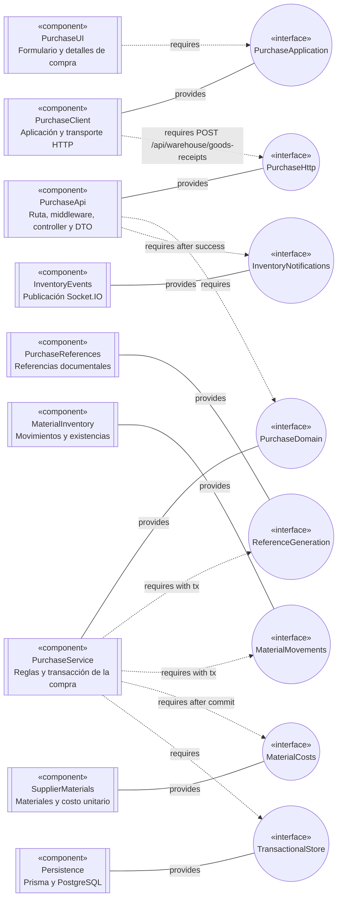
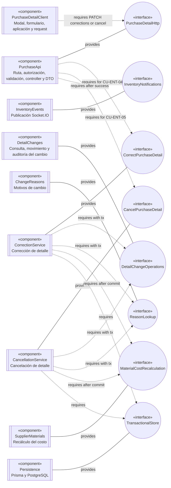
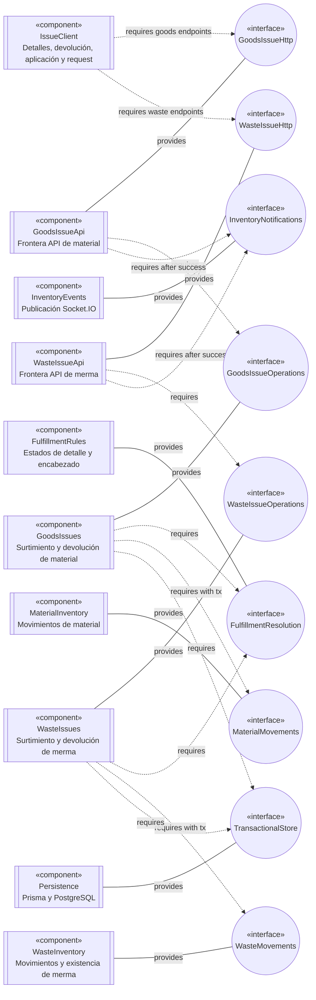

# 3. Colaboraciones de componentes por capacidad

Estas vistas enfocadas complementan `DIA-ARQ-CMP-001`: muestran qué componente provee
cada interfaz y cuál depende de ella en las capacidades cuya coordinación no se comprende
suficientemente desde el diagrama general. No representan el orden temporal, las
alternativas ni el contrato HTTP completo; esos detalles permanecen en las secuencias
`CU-*` y en OpenAPI.

No se crea un diagrama de componentes para cada caso de uso. Una vista enfocada se
justifica sólo cuando el recorrido cruza varios dominios, coordina persistencia e
inventario, o combina una respuesta HTTP con una notificación. Los CRUD, las consultas y
los reportes que conservan el pipeline común se apoyan en el diagrama general y en su
secuencia correspondiente.

## Notación UML adoptada en Mermaid

Un diagrama de componentes UML debe comunicar unidades sustituibles, sus interfaces
provistas y requeridas, y las dependencias estructurales que permiten ensamblarlas. Los
puertos sólo se agregan cuando identifican un punto de interacción distinto dentro del
mismo componente; no representan automáticamente cada método o endpoint.

Mermaid no dispone de una sintaxis nativa de diagrama de componentes UML. Para no
presentar estas vistas como diagramas de clases, se usa `flowchart` con una convención
visual explícita:

- una figura rectangular de doble borde lateral con `«component»` aproxima el contorno
  reconocible de un componente;
- una figura circular compacta con `«interface»` aproxima el punto de interfaz sin
  convertirlo en otra caja de implementación;
- una línea continua parte del componente que **provee** la interfaz;
- una flecha discontinua parte del componente que **requiere** la interfaz; y
- la etiqueta del conector identifica la operación o condición relevante.

No se agrega un estilo de color personalizado: las figuras, estereotipos, direcciones y
etiquetas ya distinguen cada responsabilidad con el tema predeterminado de Mermaid.
Las operaciones detalladas no se escriben dentro de los círculos para evitar que Mermaid
los expanda hasta convertirlos en óvalos grandes; permanecen en las etiquetas necesarias,
OpenAPI y las secuencias enlazadas.

Esta notación conserva la semántica UML aunque Mermaid no replique exactamente la forma
visual de los ejemplos con lollipop, socket y puertos. Las llamadas internas privadas,
helpers y objetos DTO no se elevan a componentes: aparecen en las secuencias cuando son
necesarios para seguir la ejecución.

## Decisión sobre PlantUML

Mermaid no es la única herramienta que puede aplicarse. Es la única que ya funciona en
Nexus **como código embebido en Markdown**, con vista automática en GitHub y conversión
automática durante `docs:export`. diagrams.net puede incorporarse hoy como una imagen
versionada; PlantUML puede incorporarse cuando se implemente su generación local o en CI.

No basta con registrar código PlantUML para que GitHub genere el diagrama. GitHub
[renderiza Mermaid de forma nativa](https://docs.github.com/es/get-started/writing-on-github/working-with-advanced-formatting/creating-diagrams#creating-mermaid-diagrams),
pero no procesa un bloque `plantuml`: lo muestra como código. Para verlo como diagrama
habría que generar antes un PNG o SVG, versionarlo o publicarlo desde CI y enlazarlo desde
el Markdown.

Tampoco se exportaría automáticamente en Nexus. El flujo existente reconoce bloques
`mermaid`, los guarda como `.mmd`, ejecuta Mermaid CLI y entrega el PNG temporal a
Pandoc. Para PlantUML habría que implementar y mantener otro procesador antes de poder
reutilizar la etapa común de imagen hacia DOCX o PDF.

Por estas razones **no se cambia Mermaid por PlantUML**. Mermaid satisface las dos
necesidades operativas actuales —vista inmediata en GitHub y exportación reproducible—,
aunque aproxime la notación de componentes mediante figuras y estereotipos. PlantUML sólo
sería preferible si un entregable exigiera los glifos UML estrictos y se aceptara ampliar
`docs:export`, `docs:check` y CI, además de perder la vista nativa del código fuente en
GitHub.

### Alternativa según la necesidad

- Si la prioridad es escribir código en Markdown y ver el resultado automáticamente en
  GitHub, se debe usar **Mermaid**; no hay otra herramienta de UML de componentes con
  integración nativa equivalente en el flujo actual.
- Si la prioridad es obtener el aspecto UML estricto sin modificar el exportador, se
  puede usar [diagrams.net](https://www.diagrams.net/) y versionar tanto la fuente
  editable `.drawio` como un PNG exportado. El Markdown enlazaría el PNG mediante el
  mecanismo de imágenes versionadas que `docs:export` ya admite. La desventaja es que la
  imagen debe regenerarse en el editor cada vez que cambie su fuente.
- Si la prioridad es conservar el diagrama como código y obtener UML estricto, se puede
  usar **PlantUML**, pero acompañado de una tarea local o de CI que genere el PNG. Esta
  opción requiere ampliar y probar la canalización; no es un reemplazo inmediato.

Para Nexus se recomienda continuar con Mermaid. Si aparece un requisito formal de
notación UML estricta, la alternativa de menor impacto es probar primero diagrams.net con
un único diagrama; PlantUML sólo conviene cuando también sea requisito generar las
imágenes automáticamente desde texto.

## Registro de una compra de material

**Diagrama de componentes:** `DIA-ARQ-CMP-ENT-001`.

**Casos cubiertos:** `CU-ENT-02`. Las altas opcionales de proveedor y material conservan
sus propios contratos en `CU-CAT-02` y `CU-ALM-10`; entregan identificadores al registro
de la compra, pero no forman parte de su transacción.

El servicio de compra es propietario de la transacción y pasa el mismo `tx` a las
interfaces de referencias e inventario. La actualización del costo unitario y la
notificación ocurren después del commit. Las validaciones de proveedor, factura, receptor
y detalles son responsabilidades internas del servicio, no interfaces arquitectónicas
independientes. El orden y los datos se detallan en las secuencias
[frontend](../processes/frontend-code-sequences/purchases/cu-ent-02.md) y
[backend](../processes/backend-code-sequences/purchases/cu-ent-02.md).

## Corrección y cancelación de detalles de compra

**Diagrama de componentes:** `DIA-ARQ-CMP-ENT-002`.

**Casos cubiertos:** `CU-ENT-04` y `CU-ENT-05`. Ambos comparten la frontera y los servicios
de apoyo, pero exponen operaciones distintas y conservan componentes propietarios
separados.

`PurchaseDetailHttp` agrupa dos operaciones del mismo contrato HTTP, pero las interfaces
de dominio no se fusionan: corrección y cancelación tienen reglas y resultados distintos.
Las secuencias backend de
[`CU-ENT-04`](../processes/backend-code-sequences/purchases/cu-ent-04.md) y
[`CU-ENT-05`](../processes/backend-code-sequences/purchases/cu-ent-05.md) conservan los
endpoints completos, el orden de llamadas, el rollback y las respuestas.

## Surtimiento y devolución de salidas

**Diagrama de componentes:** `DIA-ARQ-CMP-SAL-001`.

**Casos cubiertos:** `CU-SAL-05`, `CU-SAL-06`, `CU-SAL-12` y `CU-SAL-13`. La vista hace
visible el contrato compartido de cumplimiento y las implementaciones de inventario
propias de material y merma sin presentar ambos recursos como un solo componente.

Las cuatro operaciones reutilizan autorización, validación, transacción y resolución de
cumplimiento, pero cada recurso conserva su frontera, servicio e interfaz de inventario.
Las secuencias backend de [salidas](../processes/backend-code-sequences/issues/index.md)
mantienen los endpoints, permisos, DTO, cantidades, estados, movimientos y respuestas.

## Mantenimiento y trazabilidad

| Capacidad | Vista enfocada | Casos | Motivo de inclusión |
| --- | --- | --- | --- |
| Registrar compra | `DIA-ARQ-CMP-ENT-001` | `CU-ENT-02` | Coordina referencia, inventario, transacción y evento posterior. |
| Cambiar detalle de compra | `DIA-ARQ-CMP-ENT-002` | `CU-ENT-04`, `CU-ENT-05` | Dos interfaces de dominio reutilizan cambios, motivos e inventario con reglas distintas. |
| Surtir y devolver salidas | `DIA-ARQ-CMP-SAL-001` | `CU-SAL-05`, `CU-SAL-06`, `CU-SAL-12`, `CU-SAL-13` | Dos recursos paralelos comparten reglas, pero tienen componentes de inventario propios. |

Se agrega o modifica una vista enfocada sólo cuando cambia una interfaz, su proveedor, su
consumidor o la frontera transaccional de estas capacidades. Un cambio de orden,
validación, payload o respuesta se documenta en la secuencia `CU-*` y en OpenAPI; un caso
nuevo que reutiliza íntegramente estas colaboraciones sólo las enlaza.
