# 3. Colaboraciones de componentes por capacidad

Estas vistas enfocadas complementan `DIA-ARQ-CMP-001`: muestran qué componente provee
cada interfaz y cuál depende de ella en las capacidades cuya coordinación no se comprende
suficientemente desde el diagrama general. No representan el orden temporal, las
alternativas ni el contrato HTTP completo; esos detalles permanecen en las secuencias
`CU-*` y en OpenAPI.

No se crea un diagrama de componentes para cada caso de uso. Una vista enfocada se
justifica sólo cuando el recorrido cruza varios dominios, coordina persistencia e
inventario, o combina una respuesta HTTP con una notificación. Los CRUD, las consultas y
los reportes que conservan el pipeline común se apoyan en el diagrama general y en su
secuencia correspondiente.

## Notación UML adoptada en Mermaid

Un diagrama de componentes UML debe comunicar unidades sustituibles, sus interfaces
provistas y requeridas, y las dependencias estructurales que permiten ensamblarlas. Los
puertos sólo se agregan cuando identifican un punto de interacción distinto dentro del
mismo componente; no representan automáticamente cada método o endpoint.

Mermaid no dispone de una sintaxis nativa de diagrama de componentes UML que dibuje a la
vez el glifo de componente, puertos cuadrados y conectores *ball-and-socket*. Usar círculos
de `flowchart` para todas las interfaces no distingue una interfaz provista de una
requerida y puede confundirse con un conector de ensamblaje. Por ello estas vistas usan
la representación UML equivalente mediante clasificadores:

- `<<component>>` identifica cada componente.
- `<<interface>>` identifica un contrato estable, no una llamada aislada.
- `Interfaz <|.. Componente` expresa que el componente **realiza y provee** la interfaz.
- `Consumidor ..> Interfaz` expresa que el componente **requiere** esa interfaz.
- La etiqueta de una dependencia indica el endpoint o la operación relevante cuando
  hace falta desambiguar el contrato.

Esta notación conserva la semántica UML aunque Mermaid no replique exactamente la forma
visual de los ejemplos con lollipop, socket y puertos. Las llamadas internas privadas,
helpers y objetos DTO no se elevan a componentes: aparecen en las secuencias cuando son
necesarios para seguir la ejecución.

## Registro de una compra de material

**Diagrama de componentes:** `DIA-ARQ-CMP-ENT-001`.

**Casos cubiertos:** `CU-ENT-02`. Las altas opcionales de proveedor y material conservan
sus propios contratos en `CU-CAT-02` y `CU-ALM-10`; entregan identificadores al registro
de la compra, pero no forman parte de su transacción.

```mermaid
classDiagram
    direction LR

    class PurchaseUI {
        <<component>>
        Formulario y detalles de compra
    }
    class PurchaseClient {
        <<component>>
        Aplicación y transporte HTTP
    }
    class PurchaseApi {
        <<component>>
        Ruta, middleware, controller y DTO
    }
    class PurchaseService {
        <<component>>
        Reglas y transacción de la compra
    }
    class PurchaseReferences {
        <<component>>
        Referencias documentales
    }
    class MaterialInventory {
        <<component>>
        Movimientos y existencias
    }
    class SupplierMaterials {
        <<component>>
        Materiales y costo unitario
    }
    class Persistence {
        <<component>>
        Prisma y PostgreSQL
    }
    class InventoryEvents {
        <<component>>
        Publicación Socket.IO
    }

    class PurchaseApplication {
        <<interface>>
        +registerGoodsReceipt(formData)
    }
    class PurchaseHttp {
        <<interface>>
        +POST goods-receipts
    }
    class PurchaseDomain {
        <<interface>>
        +createGoodsReceipt(goodsReceiptDto)
    }
    class ReferenceGeneration {
        <<interface>>
        +generateYearlyReferenceNumber(tx)
    }
    class MaterialMovements {
        <<interface>>
        +applyInventoryMovement(tx, ENTRY)
    }
    class MaterialCosts {
        <<interface>>
        +updateMaterialUnitCostIfHigher()
    }
    class TransactionalStore {
        <<interface>>
        +transaction()
    }
    class InventoryNotifications {
        <<interface>>
        +emitInventoryUpdated(material)
    }

    PurchaseApplication <|.. PurchaseClient : provides
    PurchaseUI ..> PurchaseApplication : requires
    PurchaseHttp <|.. PurchaseApi : provides
    PurchaseClient ..> PurchaseHttp : requires POST /api/warehouse/goods-receipts
    PurchaseDomain <|.. PurchaseService : provides
    PurchaseApi ..> PurchaseDomain : requires
    ReferenceGeneration <|.. PurchaseReferences : provides
    PurchaseService ..> ReferenceGeneration : requires with tx
    MaterialMovements <|.. MaterialInventory : provides
    PurchaseService ..> MaterialMovements : requires with tx
    MaterialCosts <|.. SupplierMaterials : provides
    PurchaseService ..> MaterialCosts : requires after commit
    TransactionalStore <|.. Persistence : provides
    PurchaseService ..> TransactionalStore : requires
    InventoryNotifications <|.. InventoryEvents : provides
    PurchaseApi ..> InventoryNotifications : requires after success
```

El servicio de compra es propietario de la transacción y pasa el mismo `tx` a las
interfaces de referencias e inventario. La actualización del costo unitario y la
notificación ocurren después del commit. Las validaciones de proveedor, factura, receptor
y detalles son responsabilidades internas del servicio, no interfaces arquitectónicas
independientes. El orden y los datos se detallan en las secuencias
[frontend](../processes/frontend-code-sequences/purchases/cu-ent-02.md) y
[backend](../processes/backend-code-sequences/purchases/cu-ent-02.md).

## Corrección y cancelación de detalles de compra

**Diagrama de componentes:** `DIA-ARQ-CMP-ENT-002`.

**Casos cubiertos:** `CU-ENT-04` y `CU-ENT-05`. Ambos comparten la frontera y los servicios
de apoyo, pero exponen operaciones distintas y conservan componentes propietarios
separados.

```mermaid
classDiagram
    direction LR

    class PurchaseDetailClient {
        <<component>>
        Modal, formulario, aplicación y request
    }
    class PurchaseApi {
        <<component>>
        Ruta, autorización, validación, controller y DTO
    }
    class CorrectionService {
        <<component>>
        Corrección de detalle
    }
    class CancellationService {
        <<component>>
        Cancelación de detalle
    }
    class DetailChanges {
        <<component>>
        Consulta, movimiento y auditoría del cambio
    }
    class ChangeReasons {
        <<component>>
        Motivos de cambio
    }
    class SupplierMaterials {
        <<component>>
        Recálculo del costo
    }
    class Persistence {
        <<component>>
        Prisma y PostgreSQL
    }
    class InventoryEvents {
        <<component>>
        Publicación Socket.IO
    }

    class PurchaseDetailHttp {
        <<interface>>
        +correctDetail()
        +cancelDetail()
    }
    class CorrectPurchaseDetail {
        <<interface>>
        +correctGoodsReceiptDetailLine()
    }
    class CancelPurchaseDetail {
        <<interface>>
        +cancelGoodsReceiptDetailLine()
    }
    class DetailChangeOperations {
        <<interface>>
        +findDetail(tx)
        +updateStockAndMovement(tx)
        +recordChange(tx)
    }
    class ReasonLookup {
        <<interface>>
        +findChangeReason(tx)
    }
    class MaterialCostRecalculation {
        <<interface>>
        +recalculateMaterialUnitCosts()
    }
    class TransactionalStore {
        <<interface>>
        +transaction()
    }
    class InventoryNotifications {
        <<interface>>
        +emitInventoryUpdated(material)
    }

    PurchaseDetailHttp <|.. PurchaseApi : provides
    PurchaseDetailClient ..> PurchaseDetailHttp : requires PATCH corrections or cancel
    CorrectPurchaseDetail <|.. CorrectionService : provides
    PurchaseApi ..> CorrectPurchaseDetail : requires for CU-ENT-04
    CancelPurchaseDetail <|.. CancellationService : provides
    PurchaseApi ..> CancelPurchaseDetail : requires for CU-ENT-05
    DetailChangeOperations <|.. DetailChanges : provides
    CorrectionService ..> DetailChangeOperations : requires with tx
    CancellationService ..> DetailChangeOperations : requires with tx
    ReasonLookup <|.. ChangeReasons : provides
    CorrectionService ..> ReasonLookup : requires with tx
    CancellationService ..> ReasonLookup : requires with tx
    MaterialCostRecalculation <|.. SupplierMaterials : provides
    CorrectionService ..> MaterialCostRecalculation : requires after commit
    CancellationService ..> MaterialCostRecalculation : requires after commit
    TransactionalStore <|.. Persistence : provides
    CorrectionService ..> TransactionalStore : requires
    CancellationService ..> TransactionalStore : requires
    InventoryNotifications <|.. InventoryEvents : provides
    PurchaseApi ..> InventoryNotifications : requires after success
```

`PurchaseDetailHttp` agrupa dos operaciones del mismo contrato HTTP, pero las interfaces
de dominio no se fusionan: corrección y cancelación tienen reglas y resultados distintos.
Las secuencias backend de
[`CU-ENT-04`](../processes/backend-code-sequences/purchases/cu-ent-04.md) y
[`CU-ENT-05`](../processes/backend-code-sequences/purchases/cu-ent-05.md) conservan los
endpoints completos, el orden de llamadas, el rollback y las respuestas.

## Surtimiento y devolución de salidas

**Diagrama de componentes:** `DIA-ARQ-CMP-SAL-001`.

**Casos cubiertos:** `CU-SAL-05`, `CU-SAL-06`, `CU-SAL-12` y `CU-SAL-13`. La vista hace
visible el contrato compartido de cumplimiento y las implementaciones de inventario
propias de material y merma sin presentar ambos recursos como un solo componente.

```mermaid
classDiagram
    direction LR

    class IssueClient {
        <<component>>
        Detalles, devolución, aplicación y request
    }
    class GoodsIssueApi {
        <<component>>
        Frontera API de material
    }
    class WasteIssueApi {
        <<component>>
        Frontera API de merma
    }
    class GoodsIssues {
        <<component>>
        Surtimiento y devolución de material
    }
    class WasteIssues {
        <<component>>
        Surtimiento y devolución de merma
    }
    class FulfillmentRules {
        <<component>>
        Estados de detalle y encabezado
    }
    class MaterialInventory {
        <<component>>
        Movimientos de material
    }
    class WasteInventory {
        <<component>>
        Movimientos y existencia de merma
    }
    class Persistence {
        <<component>>
        Prisma y PostgreSQL
    }
    class InventoryEvents {
        <<component>>
        Publicación Socket.IO
    }

    class GoodsIssueHttp {
        <<interface>>
        +supplyGoodsIssue()
        +returnGoodsIssueDetail()
    }
    class WasteIssueHttp {
        <<interface>>
        +supplyWasteIssue()
        +returnWasteIssueDetail()
    }
    class GoodsIssueOperations {
        <<interface>>
        +editGoodsIssue()
        +returnGoodsIssueDetail()
    }
    class WasteIssueOperations {
        <<interface>>
        +updateWasteIssueDetails()
        +returnWasteIssueDetail()
    }
    class FulfillmentResolution {
        <<interface>>
        +resolveDetailStatus()
        +resolveIssueStatus()
    }
    class MaterialMovements {
        <<interface>>
        +applyInventoryMovement(tx, ISSUE_OR_ENTRY)
    }
    class WasteMovements {
        <<interface>>
        +applyWasteMovement(tx)
        +applyWasteStockChange(tx)
    }
    class TransactionalStore {
        <<interface>>
        +transaction()
    }
    class InventoryNotifications {
        <<interface>>
        +emitInventoryUpdated(context)
    }

    GoodsIssueHttp <|.. GoodsIssueApi : provides
    IssueClient ..> GoodsIssueHttp : requires goods endpoints
    WasteIssueHttp <|.. WasteIssueApi : provides
    IssueClient ..> WasteIssueHttp : requires waste endpoints
    GoodsIssueOperations <|.. GoodsIssues : provides
    GoodsIssueApi ..> GoodsIssueOperations : requires
    WasteIssueOperations <|.. WasteIssues : provides
    WasteIssueApi ..> WasteIssueOperations : requires
    FulfillmentResolution <|.. FulfillmentRules : provides
    GoodsIssues ..> FulfillmentResolution : requires
    WasteIssues ..> FulfillmentResolution : requires
    MaterialMovements <|.. MaterialInventory : provides
    GoodsIssues ..> MaterialMovements : requires with tx
    WasteMovements <|.. WasteInventory : provides
    WasteIssues ..> WasteMovements : requires with tx
    TransactionalStore <|.. Persistence : provides
    GoodsIssues ..> TransactionalStore : requires
    WasteIssues ..> TransactionalStore : requires
    InventoryNotifications <|.. InventoryEvents : provides
    GoodsIssueApi ..> InventoryNotifications : requires after success
    WasteIssueApi ..> InventoryNotifications : requires after success
```

Las cuatro operaciones reutilizan autorización, validación, transacción y resolución de
cumplimiento, pero cada recurso conserva su frontera, servicio e interfaz de inventario.
Las secuencias backend de [salidas](../processes/backend-code-sequences/issues/index.md)
mantienen los endpoints, permisos, DTO, cantidades, estados, movimientos y respuestas.

## Mantenimiento y trazabilidad

| Capacidad | Vista enfocada | Casos | Motivo de inclusión |
| --- | --- | --- | --- |
| Registrar compra | `DIA-ARQ-CMP-ENT-001` | `CU-ENT-02` | Coordina referencia, inventario, transacción y evento posterior. |
| Cambiar detalle de compra | `DIA-ARQ-CMP-ENT-002` | `CU-ENT-04`, `CU-ENT-05` | Dos interfaces de dominio reutilizan cambios, motivos e inventario con reglas distintas. |
| Surtir y devolver salidas | `DIA-ARQ-CMP-SAL-001` | `CU-SAL-05`, `CU-SAL-06`, `CU-SAL-12`, `CU-SAL-13` | Dos recursos paralelos comparten reglas, pero tienen componentes de inventario propios. |

Se agrega o modifica una vista enfocada sólo cuando cambia una interfaz, su proveedor, su
consumidor o la frontera transaccional de estas capacidades. Un cambio de orden,
validación, payload o respuesta se documenta en la secuencia `CU-*` y en OpenAPI; un caso
nuevo que reutiliza íntegramente estas colaboraciones sólo las enlaza.
