<!-- Archivo generado por scripts/generateArchitectureDocs.js. No editar manualmente. -->
# Diagramas de la base de datos

Estos diagramas ER de pata de cuervo se generan desde `prisma/schema.prisma`.
Cada figura muestra las claves de hasta tres modelos y sus relaciones salientes.
Cada FK aparece una vez, en la figura de su tabla dependiente; la tabla final permite
consultar también las relaciones entrantes. Los modelos referenciados conservan su
PK completa y las columnas utilizadas en esas conexiones. El [diccionario](data-dictionary.md) contiene
los demás atributos, tipos y valores predeterminados.

Las líneas unen tablas, no filas de atributos. La etiqueta identifica
`FK = TablaReferenciada.clave`; la tabla final muestra ambos nombres completos.
`PK` es clave primaria, `FK` clave foránea y `UK` unicidad individual. Las claves
compuestas y demás restricciones se comprueban en Prisma y sus migraciones.

En el extremo referenciado, `||` indica uno obligatorio y `o|` cero o uno.
En el dependiente, `o{` indica cero o muchos y `o|` cero o uno cuando la FK es
única. Las propiedades de relación del ORM no son columnas adicionales.

Modelos sin relaciones FK entrantes ni salientes en Prisma: `ReferenceNumberCounter`.

## Identidad, acceso y auditoría

### Department · Role · User

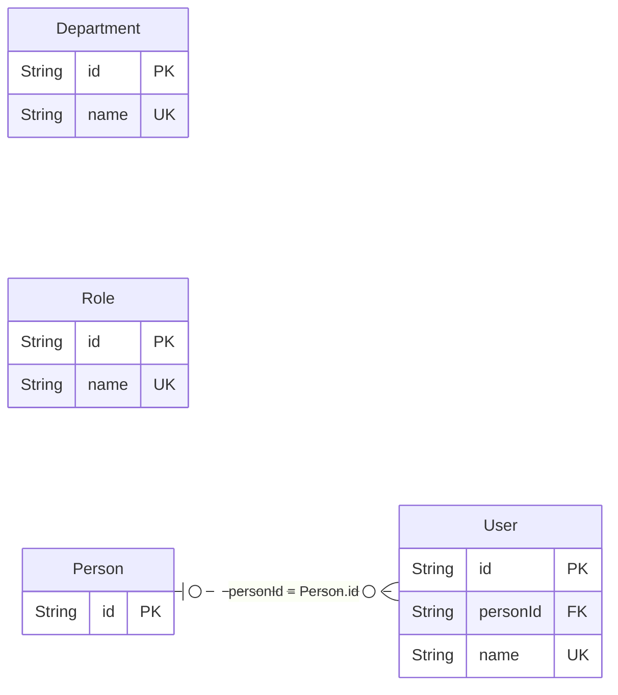
```mermaid
erDiagram
    direction LR
    Department {
        String id PK
        String name UK
    }
    Role {
        String id PK
        String name UK
    }
    User {
        String id PK
        String personId FK
        String name UK
    }
    Person {
        String id PK
    }
    Person o|..o{ User : "personId = Person.id"
```

### Person · UserRoleDepartment · PersonRoleDepartment

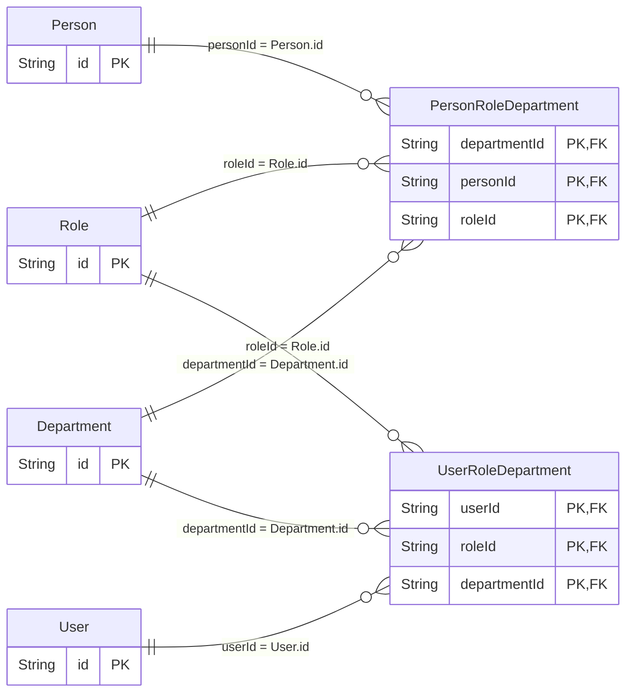
```mermaid
erDiagram
    direction LR
    Person {
        String id PK
    }
    UserRoleDepartment {
        String userId PK,FK
        String roleId PK,FK
        String departmentId PK,FK
    }
    PersonRoleDepartment {
        String departmentId PK,FK
        String personId PK,FK
        String roleId PK,FK
    }
    User {
        String id PK
    }
    Role {
        String id PK
    }
    Department {
        String id PK
    }
    User ||--o{ UserRoleDepartment : "userId = User.id"
    Role ||--o{ UserRoleDepartment : "roleId = Role.id"
    Department ||--o{ UserRoleDepartment : "departmentId = Department.id"
    Department ||--o{ PersonRoleDepartment : "departmentId = Department.id"
    Person ||--o{ PersonRoleDepartment : "personId = Person.id"
    Role ||--o{ PersonRoleDepartment : "roleId = Role.id"
```

### CriticalWriteAudit

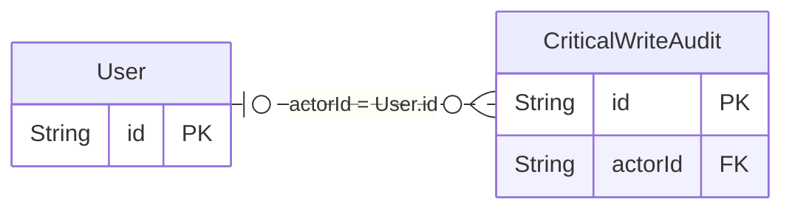
```mermaid
erDiagram
    direction LR
    CriticalWriteAudit {
        String id PK
        String actorId FK
    }
    User {
        String id PK
    }
    User o|..o{ CriticalWriteAudit : "actorId = User.id"
```

## Catálogos y relaciones comerciales

### Status · FulfillmentStatus · Project

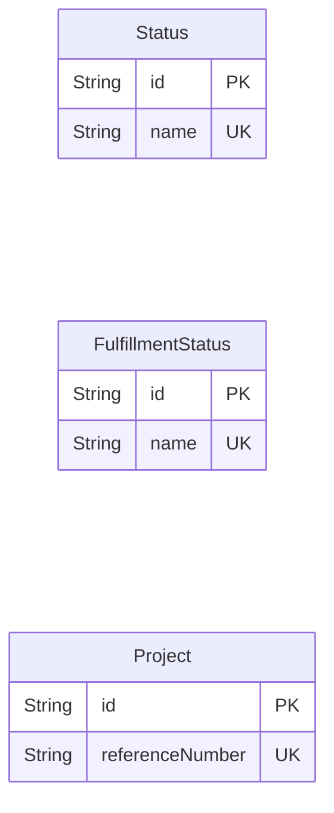
```mermaid
erDiagram
    direction LR
    Status {
        String id PK
        String name UK
    }
    FulfillmentStatus {
        String id PK
        String name UK
    }
    Project {
        String id PK
        String referenceNumber UK
    }


```

### Client · Supplier · Material

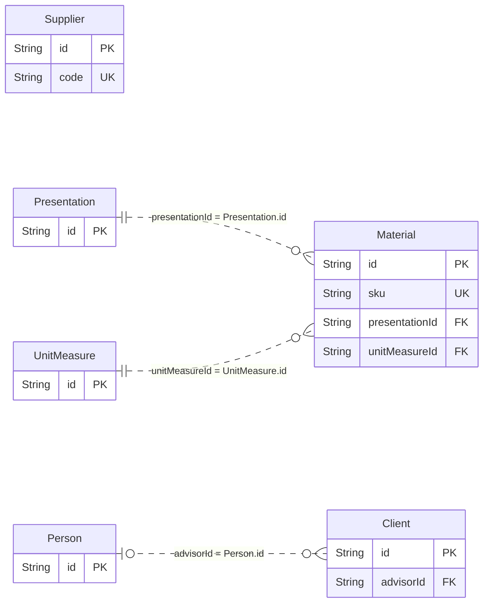
```mermaid
erDiagram
    direction LR
    Client {
        String id PK
        String advisorId FK
    }
    Supplier {
        String id PK
        String code UK
    }
    Material {
        String id PK
        String sku UK
        String presentationId FK
        String unitMeasureId FK
    }
    Presentation {
        String id PK
    }
    UnitMeasure {
        String id PK
    }
    Person {
        String id PK
    }
    Presentation ||..o{ Material : "presentationId = Presentation.id"
    UnitMeasure ||..o{ Material : "unitMeasureId = UnitMeasure.id"
    Person o|..o{ Client : "advisorId = Person.id"
```

### UnitMeasure · Presentation · SupplierMaterial

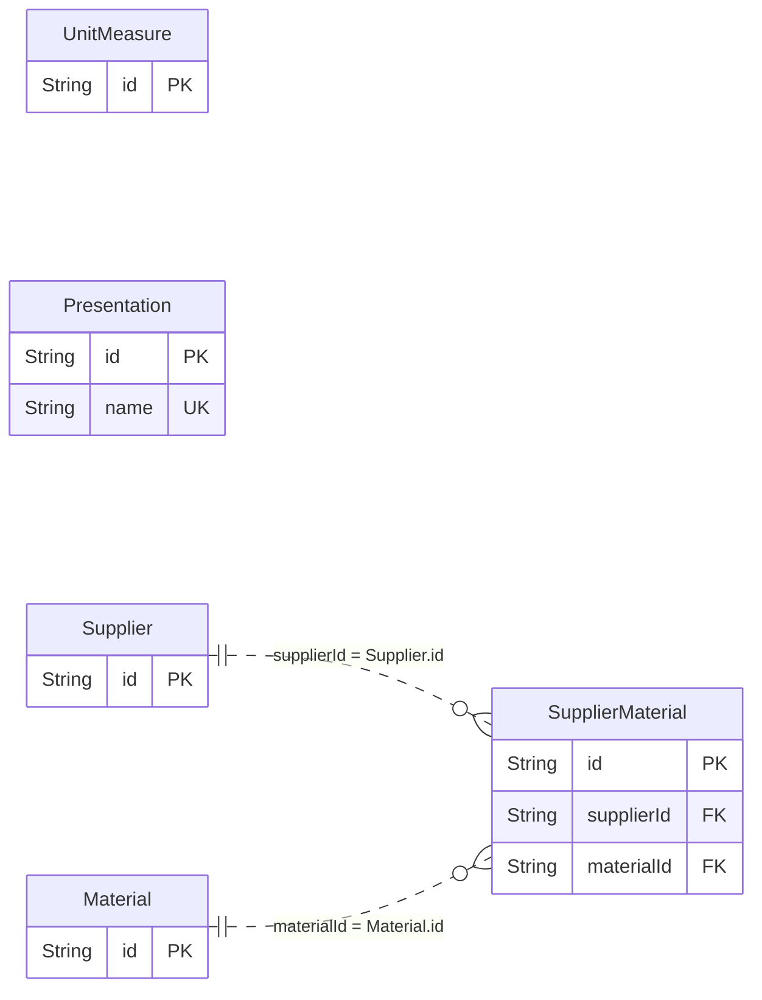
```mermaid
erDiagram
    direction LR
    UnitMeasure {
        String id PK
    }
    Presentation {
        String id PK
        String name UK
    }
    SupplierMaterial {
        String id PK
        String supplierId FK
        String materialId FK
    }
    Supplier {
        String id PK
    }
    Material {
        String id PK
    }
    Supplier ||..o{ SupplierMaterial : "supplierId = Supplier.id"
    Material ||..o{ SupplierMaterial : "materialId = Material.id"
```

### ReferenceNumberCounter

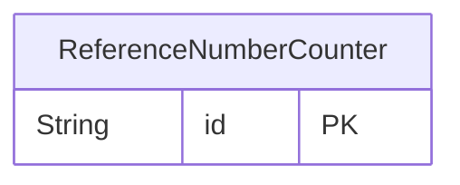
```mermaid
erDiagram
    direction LR
    ReferenceNumberCounter {
        String id PK
    }


```

## Compras e inventario de materiales

### GoodsReceipt · GoodsReceiptDetail

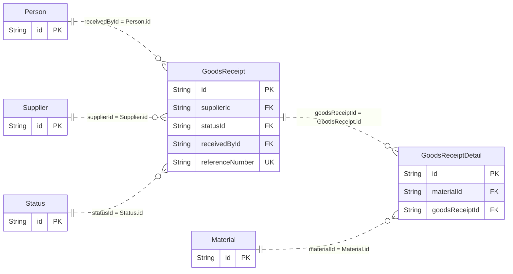
```mermaid
erDiagram
    direction LR
    GoodsReceipt {
        String id PK
        String supplierId FK
        String statusId FK
        String receivedById FK
        String referenceNumber UK
    }
    GoodsReceiptDetail {
        String id PK
        String materialId FK
        String goodsReceiptId FK
    }
    Person {
        String id PK
    }
    Supplier {
        String id PK
    }
    Status {
        String id PK
    }
    Material {
        String id PK
    }
    Person ||..o{ GoodsReceipt : "receivedById = Person.id"
    Supplier ||..o{ GoodsReceipt : "supplierId = Supplier.id"
    Status ||..o{ GoodsReceipt : "statusId = Status.id"
    GoodsReceipt ||..o{ GoodsReceiptDetail : "goodsReceiptId = GoodsReceipt.id"
    Material ||..o{ GoodsReceiptDetail : "materialId = Material.id"
```

### GoodsReceiptDetailChange

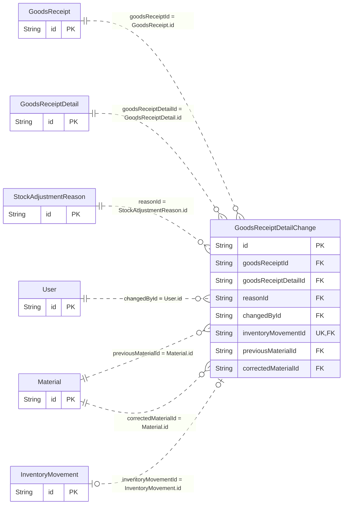
```mermaid
erDiagram
    direction LR
    GoodsReceiptDetailChange {
        String id PK
        String goodsReceiptId FK
        String goodsReceiptDetailId FK
        String reasonId FK
        String changedById FK
        String inventoryMovementId UK,FK
        String previousMaterialId FK
        String correctedMaterialId FK
    }
    GoodsReceipt {
        String id PK
    }
    GoodsReceiptDetail {
        String id PK
    }
    StockAdjustmentReason {
        String id PK
    }
    User {
        String id PK
    }
    Material {
        String id PK
    }
    InventoryMovement {
        String id PK
    }
    GoodsReceipt ||..o{ GoodsReceiptDetailChange : "goodsReceiptId = GoodsReceipt.id"
    GoodsReceiptDetail ||..o{ GoodsReceiptDetailChange : "goodsReceiptDetailId = GoodsReceiptDetail.id"
    StockAdjustmentReason ||..o{ GoodsReceiptDetailChange : "reasonId = StockAdjustmentReason.id"
    User ||..o{ GoodsReceiptDetailChange : "changedById = User.id"
    Material ||..o{ GoodsReceiptDetailChange : "previousMaterialId = Material.id"
    Material ||..o{ GoodsReceiptDetailChange : "correctedMaterialId = Material.id"
    InventoryMovement o|..o| GoodsReceiptDetailChange : "inventoryMovementId = InventoryMovement.id"
```

### GoodsIssue

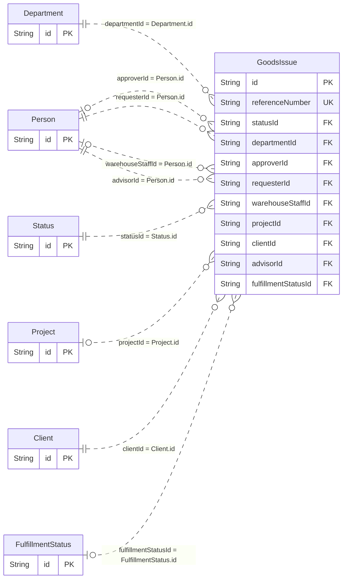
```mermaid
erDiagram
    direction LR
    GoodsIssue {
        String id PK
        String referenceNumber UK
        String statusId FK
        String departmentId FK
        String approverId FK
        String requesterId FK
        String warehouseStaffId FK
        String projectId FK
        String clientId FK
        String advisorId FK
        String fulfillmentStatusId FK
    }
    Department {
        String id PK
    }
    Person {
        String id PK
    }
    Status {
        String id PK
    }
    Project {
        String id PK
    }
    Client {
        String id PK
    }
    FulfillmentStatus {
        String id PK
    }
    Department ||..o{ GoodsIssue : "departmentId = Department.id"
    Person o|..o{ GoodsIssue : "approverId = Person.id"
    Person ||..o{ GoodsIssue : "requesterId = Person.id"
    Person o|..o{ GoodsIssue : "warehouseStaffId = Person.id"
    Status ||..o{ GoodsIssue : "statusId = Status.id"
    Project o|..o{ GoodsIssue : "projectId = Project.id"
    Client ||..o{ GoodsIssue : "clientId = Client.id"
    Person ||..o{ GoodsIssue : "advisorId = Person.id"
    FulfillmentStatus o|..o{ GoodsIssue : "fulfillmentStatusId = FulfillmentStatus.id"
```

### GoodsIssueDetail

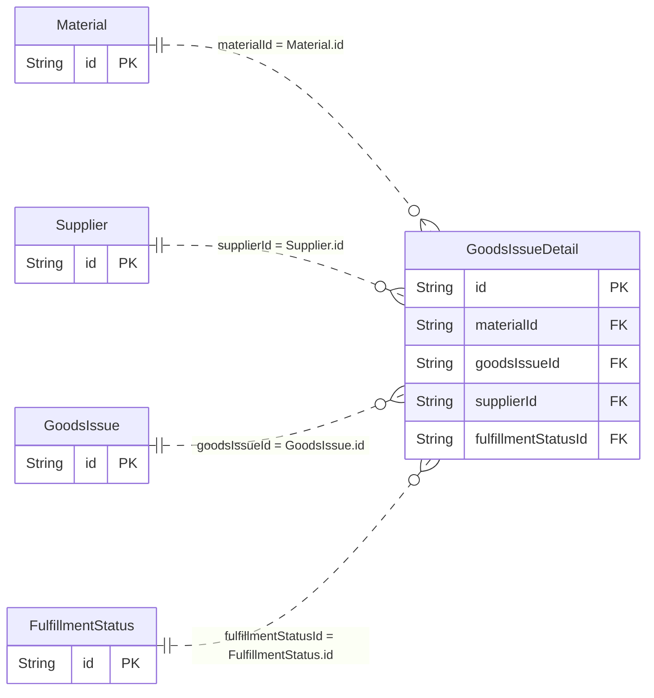
```mermaid
erDiagram
    direction LR
    GoodsIssueDetail {
        String id PK
        String materialId FK
        String goodsIssueId FK
        String supplierId FK
        String fulfillmentStatusId FK
    }
    Material {
        String id PK
    }
    Supplier {
        String id PK
    }
    GoodsIssue {
        String id PK
    }
    FulfillmentStatus {
        String id PK
    }
    Material ||..o{ GoodsIssueDetail : "materialId = Material.id"
    Supplier ||..o{ GoodsIssueDetail : "supplierId = Supplier.id"
    GoodsIssue ||..o{ GoodsIssueDetail : "goodsIssueId = GoodsIssue.id"
    FulfillmentStatus ||..o{ GoodsIssueDetail : "fulfillmentStatusId = FulfillmentStatus.id"
```

### GoodsIssueReturn

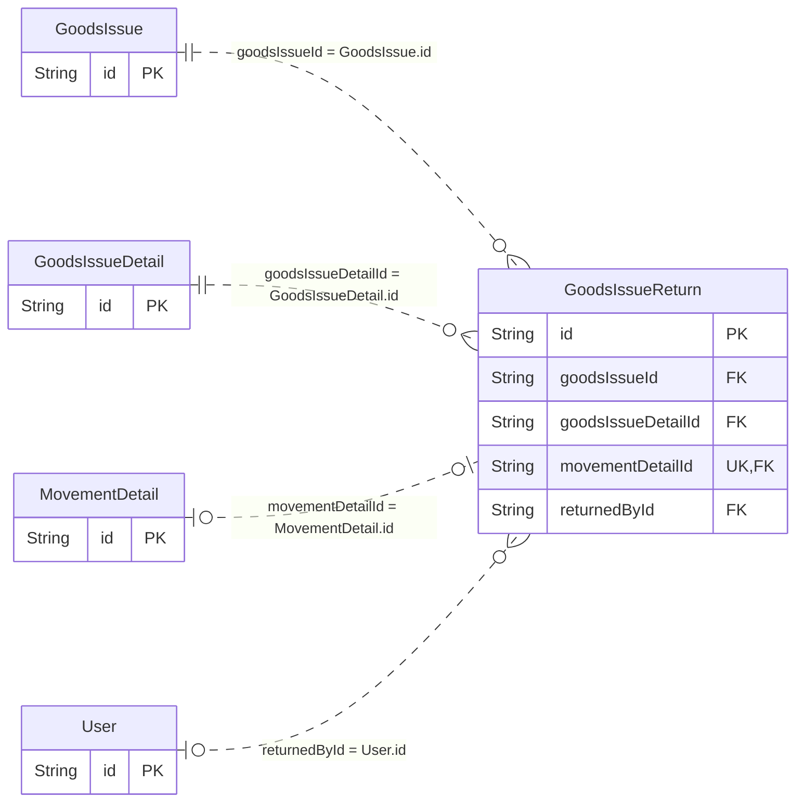
```mermaid
erDiagram
    direction LR
    GoodsIssueReturn {
        String id PK
        String goodsIssueId FK
        String goodsIssueDetailId FK
        String movementDetailId UK,FK
        String returnedById FK
    }
    GoodsIssue {
        String id PK
    }
    GoodsIssueDetail {
        String id PK
    }
    MovementDetail {
        String id PK
    }
    User {
        String id PK
    }
    GoodsIssue ||..o{ GoodsIssueReturn : "goodsIssueId = GoodsIssue.id"
    GoodsIssueDetail ||..o{ GoodsIssueReturn : "goodsIssueDetailId = GoodsIssueDetail.id"
    MovementDetail o|..o| GoodsIssueReturn : "movementDetailId = MovementDetail.id"
    User o|..o{ GoodsIssueReturn : "returnedById = User.id"
```

### InventoryMovement

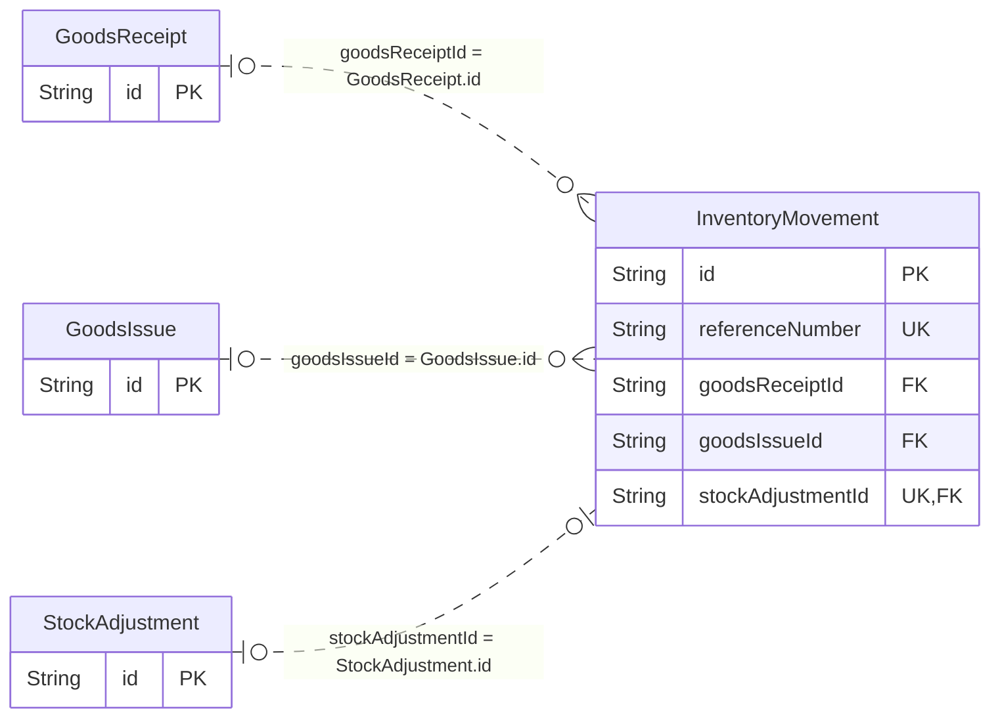
```mermaid
erDiagram
    direction LR
    InventoryMovement {
        String id PK
        String referenceNumber UK
        String goodsReceiptId FK
        String goodsIssueId FK
        String stockAdjustmentId UK,FK
    }
    GoodsReceipt {
        String id PK
    }
    GoodsIssue {
        String id PK
    }
    StockAdjustment {
        String id PK
    }
    GoodsReceipt o|..o{ InventoryMovement : "goodsReceiptId = GoodsReceipt.id"
    GoodsIssue o|..o{ InventoryMovement : "goodsIssueId = GoodsIssue.id"
    StockAdjustment o|..o| InventoryMovement : "stockAdjustmentId = StockAdjustment.id"
```

### MovementDetail

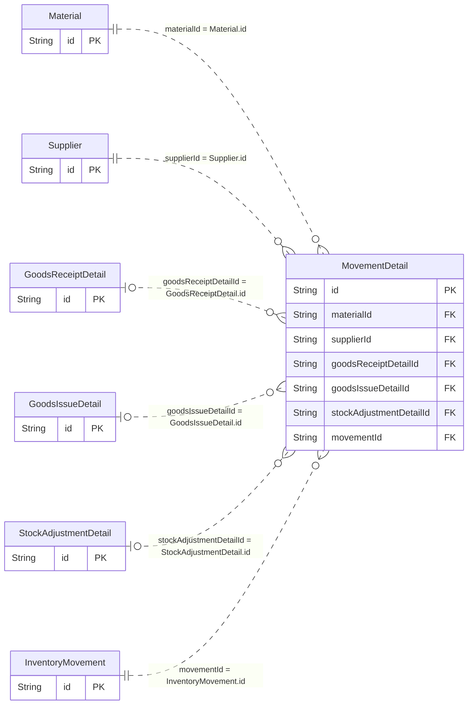
```mermaid
erDiagram
    direction LR
    MovementDetail {
        String id PK
        String materialId FK
        String supplierId FK
        String goodsReceiptDetailId FK
        String goodsIssueDetailId FK
        String stockAdjustmentDetailId FK
        String movementId FK
    }
    Material {
        String id PK
    }
    Supplier {
        String id PK
    }
    GoodsReceiptDetail {
        String id PK
    }
    GoodsIssueDetail {
        String id PK
    }
    StockAdjustmentDetail {
        String id PK
    }
    InventoryMovement {
        String id PK
    }
    Material ||..o{ MovementDetail : "materialId = Material.id"
    Supplier ||..o{ MovementDetail : "supplierId = Supplier.id"
    GoodsReceiptDetail o|..o{ MovementDetail : "goodsReceiptDetailId = GoodsReceiptDetail.id"
    GoodsIssueDetail o|..o{ MovementDetail : "goodsIssueDetailId = GoodsIssueDetail.id"
    StockAdjustmentDetail o|..o{ MovementDetail : "stockAdjustmentDetailId = StockAdjustmentDetail.id"
    InventoryMovement ||..o{ MovementDetail : "movementId = InventoryMovement.id"
```

### StockAdjustment · StockAdjustmentDetail · StockAdjustmentReason

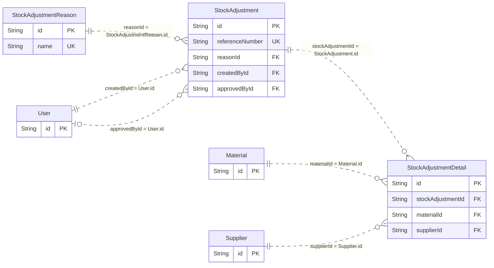
```mermaid
erDiagram
    direction LR
    StockAdjustment {
        String id PK
        String referenceNumber UK
        String reasonId FK
        String createdById FK
        String approvedById FK
    }
    StockAdjustmentDetail {
        String id PK
        String stockAdjustmentId FK
        String materialId FK
        String supplierId FK
    }
    StockAdjustmentReason {
        String id PK
        String name UK
    }
    User {
        String id PK
    }
    Material {
        String id PK
    }
    Supplier {
        String id PK
    }
    StockAdjustmentReason ||..o{ StockAdjustment : "reasonId = StockAdjustmentReason.id"
    User ||..o{ StockAdjustment : "createdById = User.id"
    User o|..o{ StockAdjustment : "approvedById = User.id"
    StockAdjustment ||..o{ StockAdjustmentDetail : "stockAdjustmentId = StockAdjustment.id"
    Material ||..o{ StockAdjustmentDetail : "materialId = Material.id"
    Supplier ||..o{ StockAdjustmentDetail : "supplierId = Supplier.id"
```

## Mermas e inventario de merma

### Waste

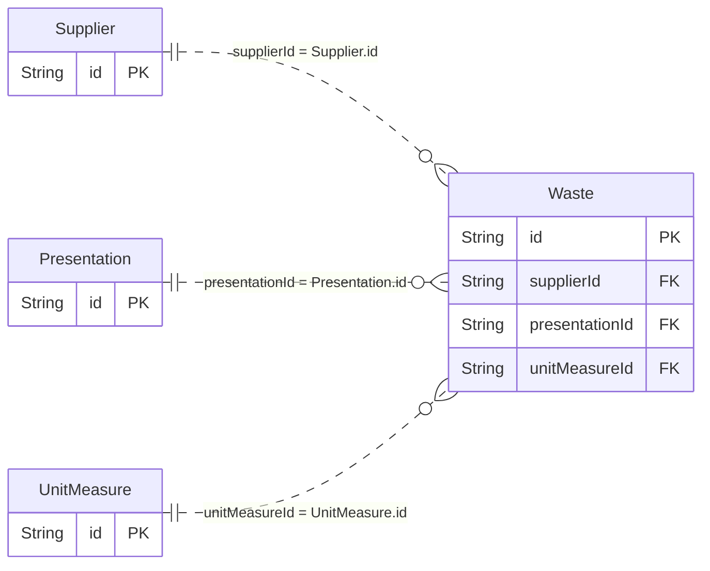
```mermaid
erDiagram
    direction LR
    Waste {
        String id PK
        String supplierId FK
        String presentationId FK
        String unitMeasureId FK
    }
    Supplier {
        String id PK
    }
    Presentation {
        String id PK
    }
    UnitMeasure {
        String id PK
    }
    Supplier ||..o{ Waste : "supplierId = Supplier.id"
    Presentation ||..o{ Waste : "presentationId = Presentation.id"
    UnitMeasure ||..o{ Waste : "unitMeasureId = UnitMeasure.id"
```

### WasteIssue

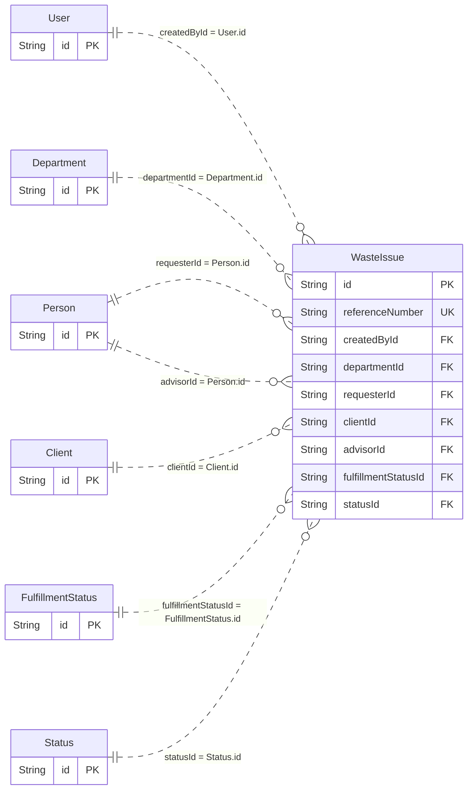
```mermaid
erDiagram
    direction LR
    WasteIssue {
        String id PK
        String referenceNumber UK
        String createdById FK
        String departmentId FK
        String requesterId FK
        String clientId FK
        String advisorId FK
        String fulfillmentStatusId FK
        String statusId FK
    }
    User {
        String id PK
    }
    Department {
        String id PK
    }
    Person {
        String id PK
    }
    Client {
        String id PK
    }
    FulfillmentStatus {
        String id PK
    }
    Status {
        String id PK
    }
    User ||..o{ WasteIssue : "createdById = User.id"
    Department ||..o{ WasteIssue : "departmentId = Department.id"
    Person ||..o{ WasteIssue : "requesterId = Person.id"
    Client ||..o{ WasteIssue : "clientId = Client.id"
    Person ||..o{ WasteIssue : "advisorId = Person.id"
    FulfillmentStatus ||..o{ WasteIssue : "fulfillmentStatusId = FulfillmentStatus.id"
    Status ||..o{ WasteIssue : "statusId = Status.id"
```

### WasteIssueDetail

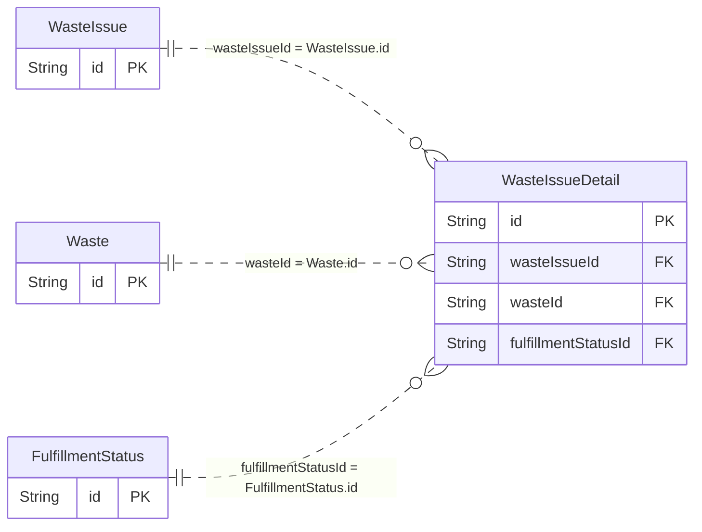
```mermaid
erDiagram
    direction LR
    WasteIssueDetail {
        String id PK
        String wasteIssueId FK
        String wasteId FK
        String fulfillmentStatusId FK
    }
    WasteIssue {
        String id PK
    }
    Waste {
        String id PK
    }
    FulfillmentStatus {
        String id PK
    }
    WasteIssue ||..o{ WasteIssueDetail : "wasteIssueId = WasteIssue.id"
    Waste ||..o{ WasteIssueDetail : "wasteId = Waste.id"
    FulfillmentStatus ||..o{ WasteIssueDetail : "fulfillmentStatusId = FulfillmentStatus.id"
```

### WasteIssueReturn · WasteMovement

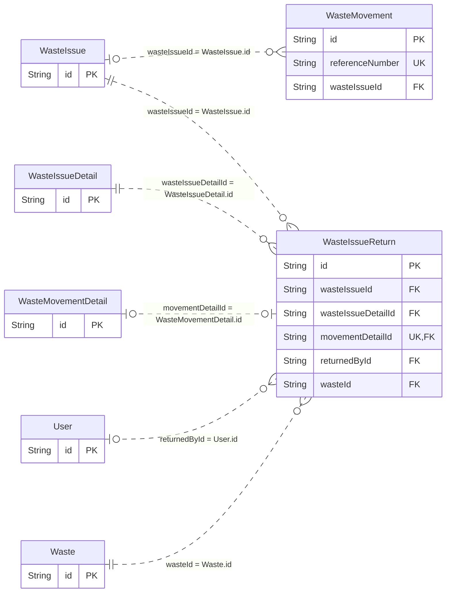
```mermaid
erDiagram
    direction LR
    WasteIssueReturn {
        String id PK
        String wasteIssueId FK
        String wasteIssueDetailId FK
        String movementDetailId UK,FK
        String returnedById FK
        String wasteId FK
    }
    WasteMovement {
        String id PK
        String referenceNumber UK
        String wasteIssueId FK
    }
    WasteIssue {
        String id PK
    }
    WasteIssueDetail {
        String id PK
    }
    WasteMovementDetail {
        String id PK
    }
    User {
        String id PK
    }
    Waste {
        String id PK
    }
    WasteIssue o|..o{ WasteMovement : "wasteIssueId = WasteIssue.id"
    WasteIssue ||..o{ WasteIssueReturn : "wasteIssueId = WasteIssue.id"
    WasteIssueDetail ||..o{ WasteIssueReturn : "wasteIssueDetailId = WasteIssueDetail.id"
    WasteMovementDetail o|..o| WasteIssueReturn : "movementDetailId = WasteMovementDetail.id"
    User o|..o{ WasteIssueReturn : "returnedById = User.id"
    Waste ||..o{ WasteIssueReturn : "wasteId = Waste.id"
```

### WasteMovementDetail

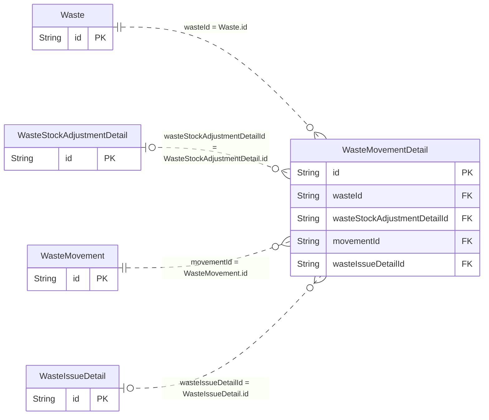
```mermaid
erDiagram
    direction LR
    WasteMovementDetail {
        String id PK
        String wasteId FK
        String wasteStockAdjustmentDetailId FK
        String movementId FK
        String wasteIssueDetailId FK
    }
    Waste {
        String id PK
    }
    WasteStockAdjustmentDetail {
        String id PK
    }
    WasteMovement {
        String id PK
    }
    WasteIssueDetail {
        String id PK
    }
    Waste ||..o{ WasteMovementDetail : "wasteId = Waste.id"
    WasteStockAdjustmentDetail o|..o{ WasteMovementDetail : "wasteStockAdjustmentDetailId = WasteStockAdjustmentDetail.id"
    WasteMovement ||..o{ WasteMovementDetail : "movementId = WasteMovement.id"
    WasteIssueDetail o|..o{ WasteMovementDetail : "wasteIssueDetailId = WasteIssueDetail.id"
```

### WasteStockEntry

```mermaid
erDiagram
    direction LR
    WasteStockEntry {
        String id PK
        String referenceNumber UK
        String wasteId FK
        String createdById FK
        String wasteMovementId UK,FK
    }
    Waste {
        String id PK
    }
    User {
        String id PK
    }
    WasteMovement {
        String id PK
    }
    Waste ||..o{ WasteStockEntry : "wasteId = Waste.id"
    User ||..o{ WasteStockEntry : "createdById = User.id"
    WasteMovement ||..o| WasteStockEntry : "wasteMovementId = WasteMovement.id"
```

### WasteStockAdjustment · WasteStockAdjustmentDetail

```mermaid
erDiagram
    direction LR
    WasteStockAdjustment {
        String id PK
        String referenceNumber UK
        String reasonId FK
        String createdById FK
        String approvedById FK
        String wasteMovementId UK,FK
    }
    WasteStockAdjustmentDetail {
        String id PK
        String wasteStockAdjustmentId FK
        String wasteId FK
    }
    StockAdjustmentReason {
        String id PK
    }
    User {
        String id PK
    }
    WasteMovement {
        String id PK
    }
    Waste {
        String id PK
    }
    StockAdjustmentReason ||..o{ WasteStockAdjustment : "reasonId = StockAdjustmentReason.id"
    User ||..o{ WasteStockAdjustment : "createdById = User.id"
    User o|..o{ WasteStockAdjustment : "approvedById = User.id"
    WasteMovement o|..o| WasteStockAdjustment : "wasteMovementId = WasteMovement.id"
    WasteStockAdjustment ||..o{ WasteStockAdjustmentDetail : "wasteStockAdjustmentId = WasteStockAdjustment.id"
    Waste ||..o{ WasteStockAdjustmentDetail : "wasteId = Waste.id"
```

## Correspondencias de claves entre modelos

Las claves compuestas se corresponden por posición. «Referenciados por dependiente»
indica cuántos destinos admite cada registro con FK; «Dependientes por referenciado»
indica la cardinalidad inversa. La línea continua del diagrama identifica una FK que
forma parte de la PK del dependiente; la discontinua, una relación no identificadora.

| Campos FK del dependiente | Clave referenciada | Referenciados por dependiente | Dependientes por referenciado |
| --- | --- | --- | --- |
| `User.personId` | `Person.id` | 0..1 | 0..N |
| `CriticalWriteAudit.actorId` | `User.id` | 0..1 | 0..N |
| `UserRoleDepartment.userId` | `User.id` | 1 | 0..N |
| `UserRoleDepartment.roleId` | `Role.id` | 1 | 0..N |
| `UserRoleDepartment.departmentId` | `Department.id` | 1 | 0..N |
| `PersonRoleDepartment.departmentId` | `Department.id` | 1 | 0..N |
| `PersonRoleDepartment.personId` | `Person.id` | 1 | 0..N |
| `PersonRoleDepartment.roleId` | `Role.id` | 1 | 0..N |
| `Material.presentationId` | `Presentation.id` | 1 | 0..N |
| `Material.unitMeasureId` | `UnitMeasure.id` | 1 | 0..N |
| `SupplierMaterial.supplierId` | `Supplier.id` | 1 | 0..N |
| `SupplierMaterial.materialId` | `Material.id` | 1 | 0..N |
| `Waste.supplierId` | `Supplier.id` | 1 | 0..N |
| `Waste.presentationId` | `Presentation.id` | 1 | 0..N |
| `Waste.unitMeasureId` | `UnitMeasure.id` | 1 | 0..N |
| `WasteStockAdjustment.reasonId` | `StockAdjustmentReason.id` | 1 | 0..N |
| `WasteStockAdjustment.createdById` | `User.id` | 1 | 0..N |
| `WasteStockAdjustment.approvedById` | `User.id` | 0..1 | 0..N |
| `WasteStockAdjustment.wasteMovementId` | `WasteMovement.id` | 0..1 | 0..1 |
| `WasteStockAdjustmentDetail.wasteStockAdjustmentId` | `WasteStockAdjustment.id` | 1 | 0..N |
| `WasteStockAdjustmentDetail.wasteId` | `Waste.id` | 1 | 0..N |
| `WasteMovement.wasteIssueId` | `WasteIssue.id` | 0..1 | 0..N |
| `WasteStockEntry.wasteId` | `Waste.id` | 1 | 0..N |
| `WasteStockEntry.createdById` | `User.id` | 1 | 0..N |
| `WasteStockEntry.wasteMovementId` | `WasteMovement.id` | 1 | 0..1 |
| `WasteMovementDetail.wasteId` | `Waste.id` | 1 | 0..N |
| `WasteMovementDetail.wasteStockAdjustmentDetailId` | `WasteStockAdjustmentDetail.id` | 0..1 | 0..N |
| `WasteMovementDetail.movementId` | `WasteMovement.id` | 1 | 0..N |
| `WasteMovementDetail.wasteIssueDetailId` | `WasteIssueDetail.id` | 0..1 | 0..N |
| `WasteIssue.createdById` | `User.id` | 1 | 0..N |
| `WasteIssue.departmentId` | `Department.id` | 1 | 0..N |
| `WasteIssue.requesterId` | `Person.id` | 1 | 0..N |
| `WasteIssue.clientId` | `Client.id` | 1 | 0..N |
| `WasteIssue.advisorId` | `Person.id` | 1 | 0..N |
| `WasteIssue.fulfillmentStatusId` | `FulfillmentStatus.id` | 1 | 0..N |
| `WasteIssue.statusId` | `Status.id` | 1 | 0..N |
| `WasteIssueDetail.wasteIssueId` | `WasteIssue.id` | 1 | 0..N |
| `WasteIssueDetail.wasteId` | `Waste.id` | 1 | 0..N |
| `WasteIssueDetail.fulfillmentStatusId` | `FulfillmentStatus.id` | 1 | 0..N |
| `WasteIssueReturn.wasteIssueId` | `WasteIssue.id` | 1 | 0..N |
| `WasteIssueReturn.wasteIssueDetailId` | `WasteIssueDetail.id` | 1 | 0..N |
| `WasteIssueReturn.movementDetailId` | `WasteMovementDetail.id` | 0..1 | 0..1 |
| `WasteIssueReturn.returnedById` | `User.id` | 0..1 | 0..N |
| `WasteIssueReturn.wasteId` | `Waste.id` | 1 | 0..N |
| `Client.advisorId` | `Person.id` | 0..1 | 0..N |
| `GoodsReceipt.receivedById` | `Person.id` | 1 | 0..N |
| `GoodsReceipt.supplierId` | `Supplier.id` | 1 | 0..N |
| `GoodsReceipt.statusId` | `Status.id` | 1 | 0..N |
| `GoodsReceiptDetail.goodsReceiptId` | `GoodsReceipt.id` | 1 | 0..N |
| `GoodsReceiptDetail.materialId` | `Material.id` | 1 | 0..N |
| `GoodsIssue.departmentId` | `Department.id` | 1 | 0..N |
| `GoodsIssue.approverId` | `Person.id` | 0..1 | 0..N |
| `GoodsIssue.requesterId` | `Person.id` | 1 | 0..N |
| `GoodsIssue.warehouseStaffId` | `Person.id` | 0..1 | 0..N |
| `GoodsIssue.statusId` | `Status.id` | 1 | 0..N |
| `GoodsIssue.projectId` | `Project.id` | 0..1 | 0..N |
| `GoodsIssue.clientId` | `Client.id` | 1 | 0..N |
| `GoodsIssue.advisorId` | `Person.id` | 1 | 0..N |
| `GoodsIssue.fulfillmentStatusId` | `FulfillmentStatus.id` | 0..1 | 0..N |
| `GoodsIssueDetail.materialId` | `Material.id` | 1 | 0..N |
| `GoodsIssueDetail.supplierId` | `Supplier.id` | 1 | 0..N |
| `GoodsIssueDetail.goodsIssueId` | `GoodsIssue.id` | 1 | 0..N |
| `GoodsIssueDetail.fulfillmentStatusId` | `FulfillmentStatus.id` | 1 | 0..N |
| `GoodsIssueReturn.goodsIssueId` | `GoodsIssue.id` | 1 | 0..N |
| `GoodsIssueReturn.goodsIssueDetailId` | `GoodsIssueDetail.id` | 1 | 0..N |
| `GoodsIssueReturn.movementDetailId` | `MovementDetail.id` | 0..1 | 0..1 |
| `GoodsIssueReturn.returnedById` | `User.id` | 0..1 | 0..N |
| `InventoryMovement.goodsReceiptId` | `GoodsReceipt.id` | 0..1 | 0..N |
| `InventoryMovement.goodsIssueId` | `GoodsIssue.id` | 0..1 | 0..N |
| `InventoryMovement.stockAdjustmentId` | `StockAdjustment.id` | 0..1 | 0..1 |
| `MovementDetail.materialId` | `Material.id` | 1 | 0..N |
| `MovementDetail.supplierId` | `Supplier.id` | 1 | 0..N |
| `MovementDetail.goodsReceiptDetailId` | `GoodsReceiptDetail.id` | 0..1 | 0..N |
| `MovementDetail.goodsIssueDetailId` | `GoodsIssueDetail.id` | 0..1 | 0..N |
| `MovementDetail.stockAdjustmentDetailId` | `StockAdjustmentDetail.id` | 0..1 | 0..N |
| `MovementDetail.movementId` | `InventoryMovement.id` | 1 | 0..N |
| `StockAdjustment.reasonId` | `StockAdjustmentReason.id` | 1 | 0..N |
| `StockAdjustment.createdById` | `User.id` | 1 | 0..N |
| `StockAdjustment.approvedById` | `User.id` | 0..1 | 0..N |
| `StockAdjustmentDetail.stockAdjustmentId` | `StockAdjustment.id` | 1 | 0..N |
| `StockAdjustmentDetail.materialId` | `Material.id` | 1 | 0..N |
| `StockAdjustmentDetail.supplierId` | `Supplier.id` | 1 | 0..N |
| `GoodsReceiptDetailChange.goodsReceiptId` | `GoodsReceipt.id` | 1 | 0..N |
| `GoodsReceiptDetailChange.goodsReceiptDetailId` | `GoodsReceiptDetail.id` | 1 | 0..N |
| `GoodsReceiptDetailChange.reasonId` | `StockAdjustmentReason.id` | 1 | 0..N |
| `GoodsReceiptDetailChange.changedById` | `User.id` | 1 | 0..N |
| `GoodsReceiptDetailChange.previousMaterialId` | `Material.id` | 1 | 0..N |
| `GoodsReceiptDetailChange.correctedMaterialId` | `Material.id` | 1 | 0..N |
| `GoodsReceiptDetailChange.inventoryMovementId` | `InventoryMovement.id` | 0..1 | 0..1 |

Consulta el esquema Prisma para las reglas `onDelete`/`onUpdate`. Las etiquetas muestran los campos FK y su destino; las colecciones inversas no
generan una segunda asociación. La posición de una línea no cambia la
correspondencia de claves.
