<!-- Archivo generado por scripts/generateArchitectureDocs.js. No editar manualmente. -->
# Diagramas de la base de datos

Estos diagramas representan el modelo relacional persistente con notación ER de pata
de cuervo. Se generan desde los modelos y relaciones de
`prisma/schema.prisma`. Se separan por área para que puedan leerse y revisarse en
GitHub. Los atributos se distribuyen en figuras de hasta tres modelos. Cada figura
incluye sus relaciones entrantes y salientes; los modelos externos muestran sólo las
claves que intervienen en esas conexiones y conservan sus atributos completos en su
figura propietaria. Cada conexión expresa FK = clave referenciada entre los modelos de sus extremos; la
tabla final detalla los nombres completos. Los nombres de
relación del ORM no son columnas adicionales. Todas las correspondencias de claves se
reúnen en una tabla final para evitar otra colección de diagramas sin atributos.

La marca `PK` identifica claves primarias, `FK` claves foráneas y `UK` campos
únicos. Los campos compuestos y demás restricciones siguen teniendo como fuente de
verdad el esquema Prisma y sus migraciones. Para consultar obligatoriedad, valores
predeterminados y tipos de cada campo, usa el
[diccionario técnico](data-dictionary.md).

Las cardinalidades distinguen relaciones uno a muchos de relaciones uno a uno cuando
la FK es única. El extremo del destino indica si la referencia es obligatoria
(`||`) u opcional (`o|`); el extremo del modelo que contiene la FK indica cero o
muchos (`o{`) o cero o uno (`o|`).

Modelos sin relaciones FK entrantes ni salientes en Prisma: `ReferenceNumberCounter`.

## Identidad, acceso y auditoría

### Department · Role · User

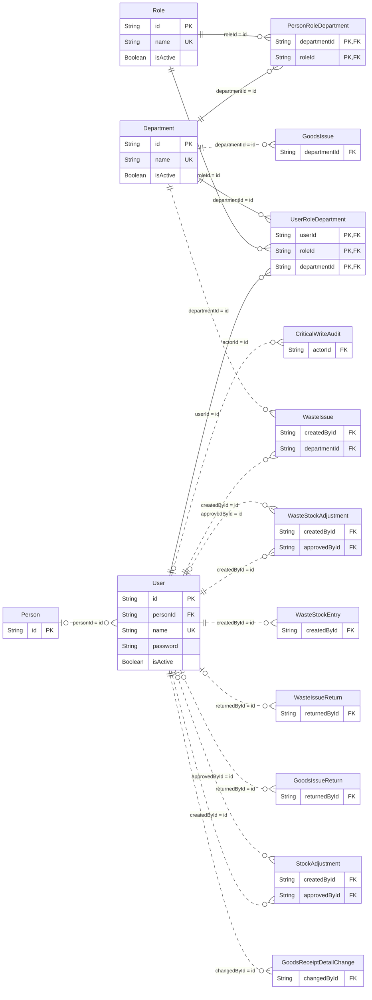

### Person · UserRoleDepartment · PersonRoleDepartment

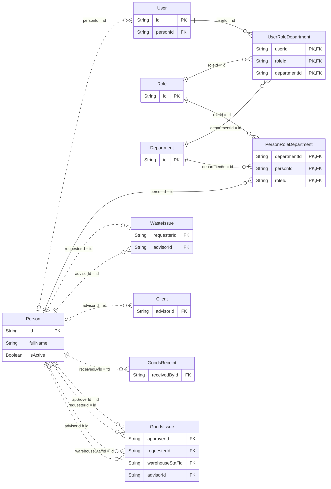

### CriticalWriteAudit

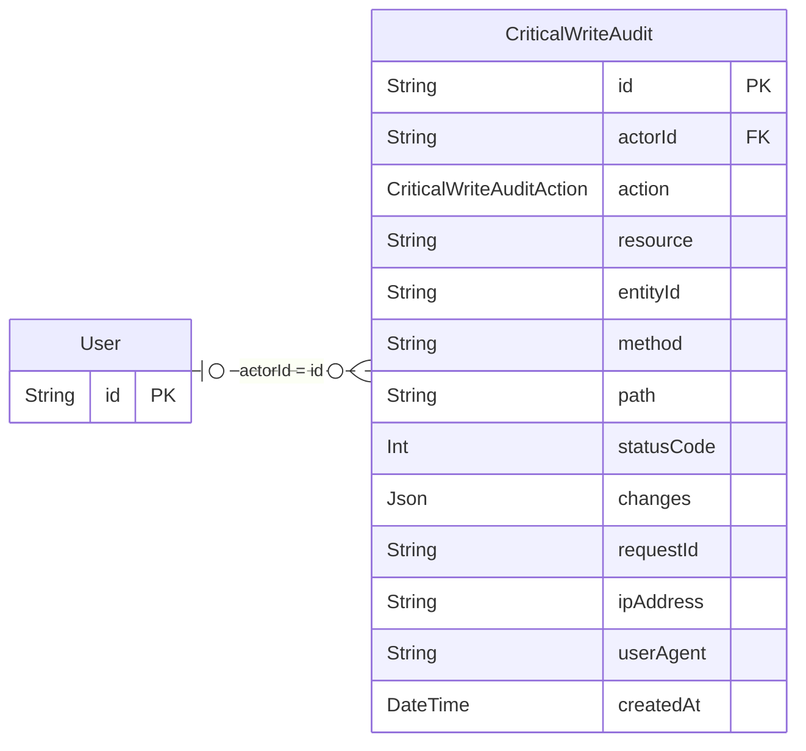

## Catálogos y relaciones comerciales

### Status · FulfillmentStatus · Project

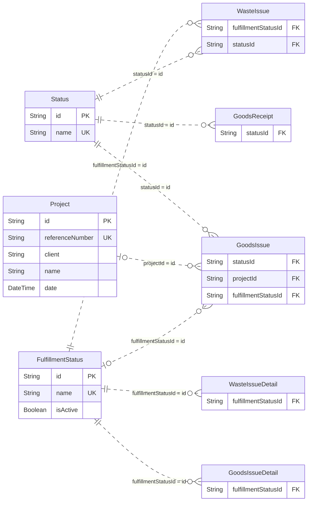

### Client · Supplier · Material

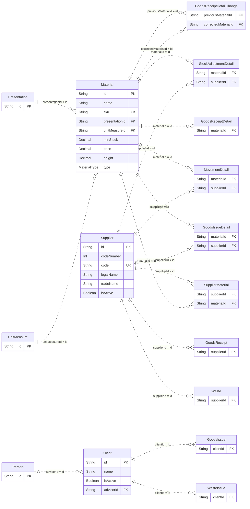

### UnitMeasure · Presentation · SupplierMaterial

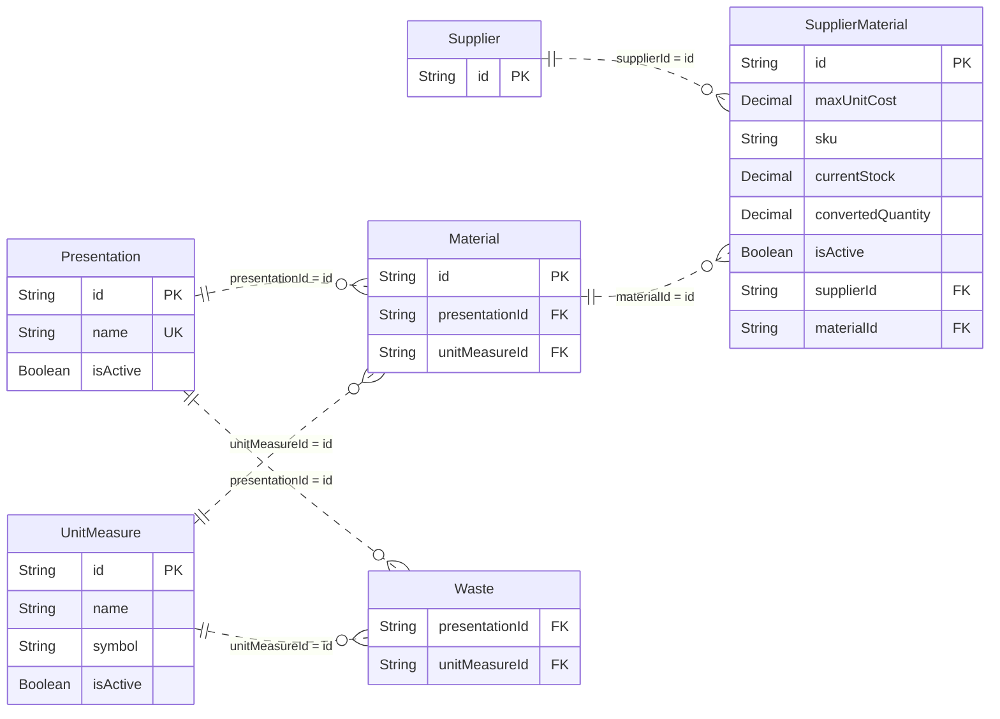

### ReferenceNumberCounter

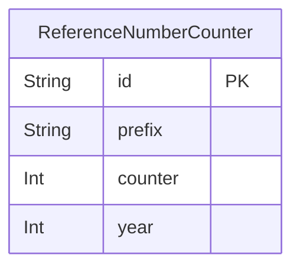

## Compras e inventario de materiales

### GoodsReceipt · GoodsReceiptDetail · GoodsReceiptDetailChange

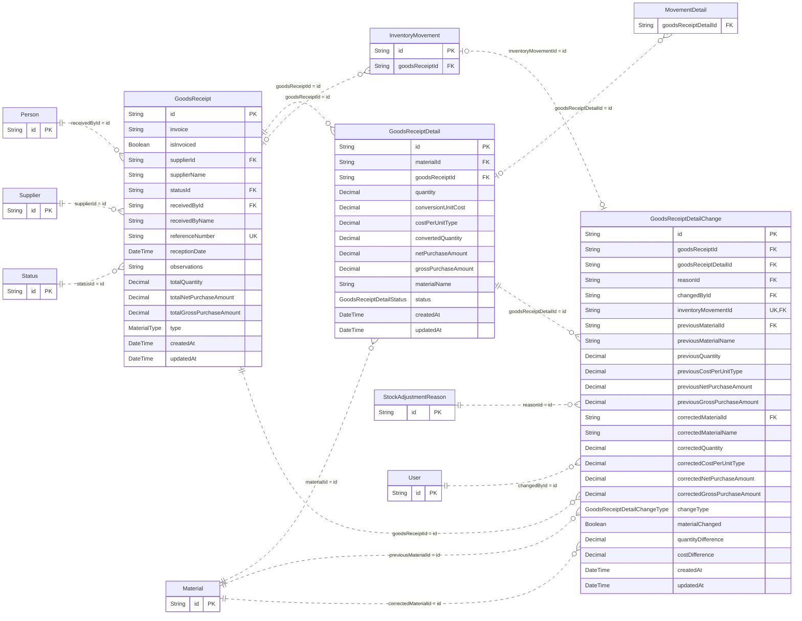

### GoodsIssue · GoodsIssueDetail · GoodsIssueReturn

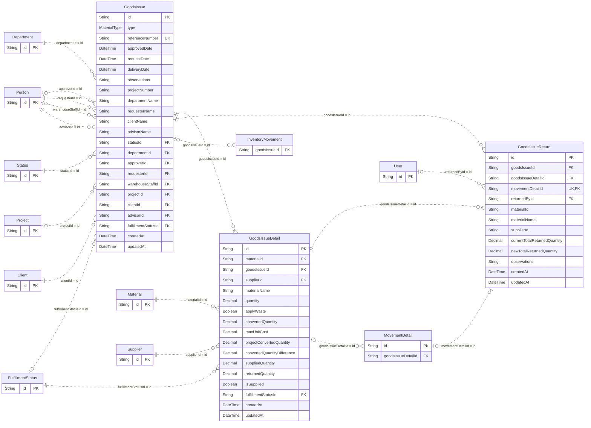

### InventoryMovement · MovementDetail · StockAdjustment

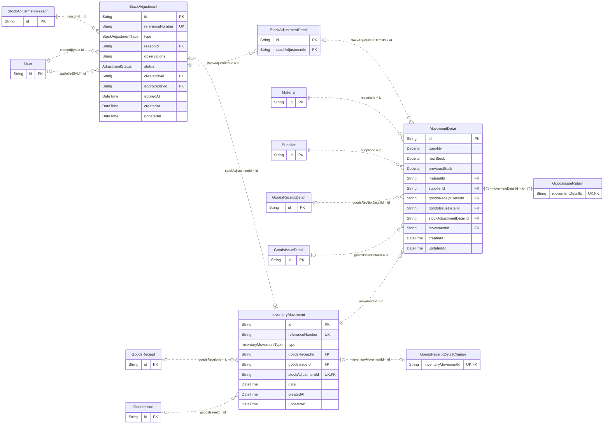

### StockAdjustmentDetail · StockAdjustmentReason

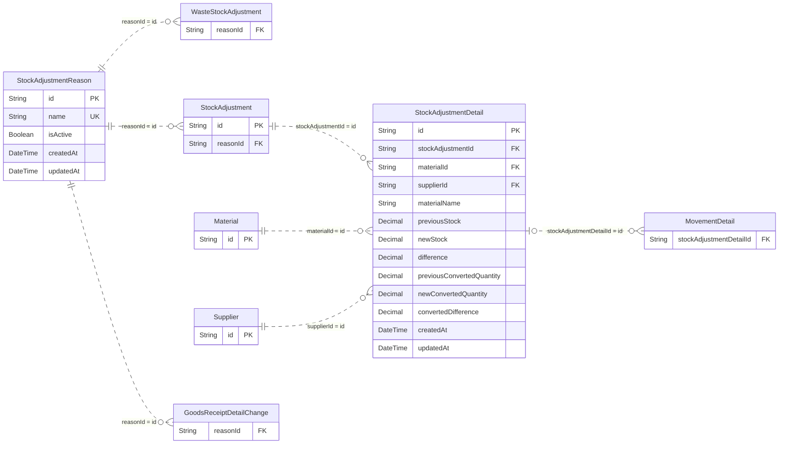

## Mermas e inventario de merma

### Waste · WasteIssue · WasteIssueDetail

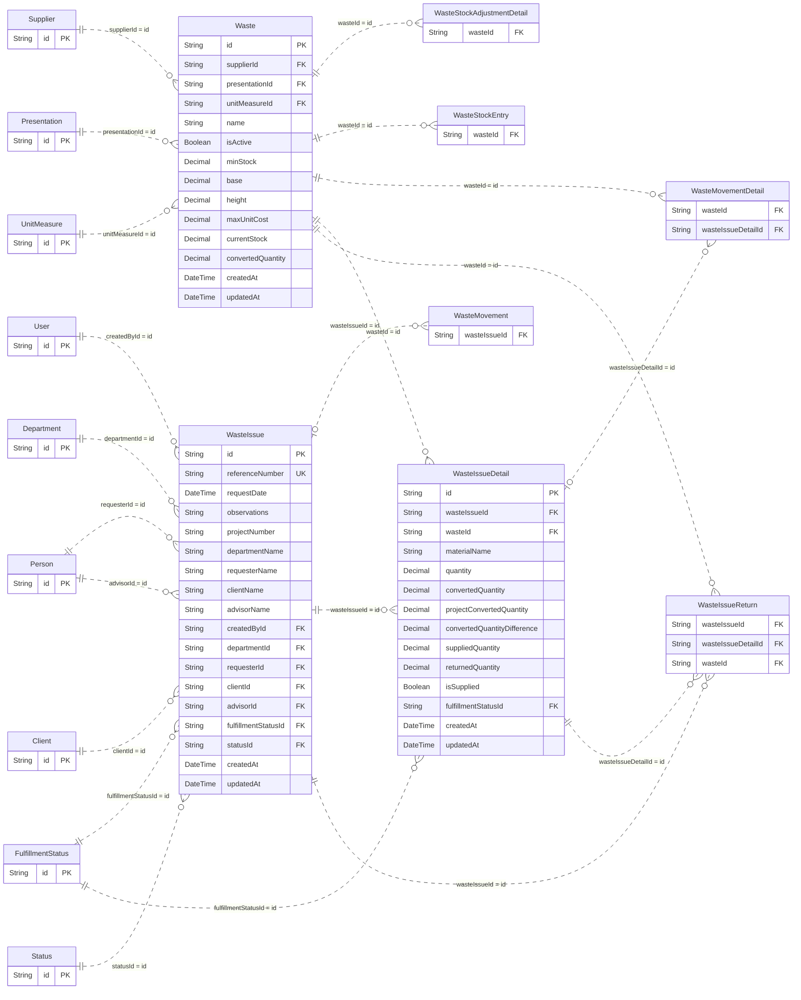

### WasteIssueReturn · WasteMovement · WasteMovementDetail

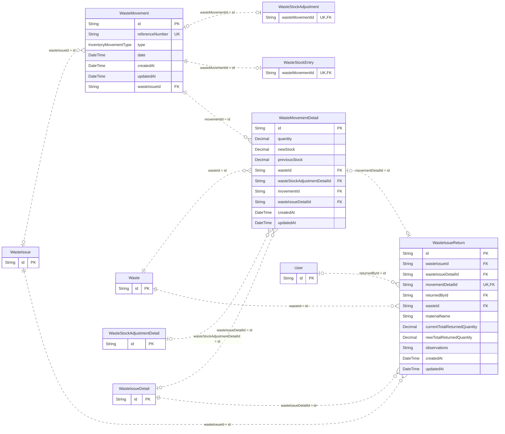

### WasteStockEntry · WasteStockAdjustment · WasteStockAdjustmentDetail

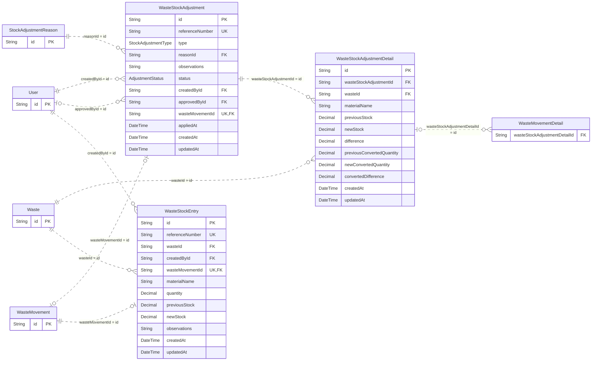

## Correspondencias de claves entre modelos

Las claves compuestas se corresponden por posición. «Referenciados por dependiente»
indica cuántos destinos admite cada registro con FK; «Dependientes por referenciado»
indica la cardinalidad inversa. La línea continua del diagrama identifica una FK que
forma parte de la PK del dependiente; la discontinua, una relación no identificadora.

| Campos FK del dependiente | Clave referenciada | Referenciados por dependiente | Dependientes por referenciado |
| --- | --- | --- | --- |
| `User.personId` | `Person.id` | 0..1 | 0..N |
| `CriticalWriteAudit.actorId` | `User.id` | 0..1 | 0..N |
| `UserRoleDepartment.userId` | `User.id` | 1 | 0..N |
| `UserRoleDepartment.roleId` | `Role.id` | 1 | 0..N |
| `UserRoleDepartment.departmentId` | `Department.id` | 1 | 0..N |
| `PersonRoleDepartment.departmentId` | `Department.id` | 1 | 0..N |
| `PersonRoleDepartment.personId` | `Person.id` | 1 | 0..N |
| `PersonRoleDepartment.roleId` | `Role.id` | 1 | 0..N |
| `Material.presentationId` | `Presentation.id` | 1 | 0..N |
| `Material.unitMeasureId` | `UnitMeasure.id` | 1 | 0..N |
| `SupplierMaterial.supplierId` | `Supplier.id` | 1 | 0..N |
| `SupplierMaterial.materialId` | `Material.id` | 1 | 0..N |
| `Waste.supplierId` | `Supplier.id` | 1 | 0..N |
| `Waste.presentationId` | `Presentation.id` | 1 | 0..N |
| `Waste.unitMeasureId` | `UnitMeasure.id` | 1 | 0..N |
| `WasteStockAdjustment.reasonId` | `StockAdjustmentReason.id` | 1 | 0..N |
| `WasteStockAdjustment.createdById` | `User.id` | 1 | 0..N |
| `WasteStockAdjustment.approvedById` | `User.id` | 0..1 | 0..N |
| `WasteStockAdjustment.wasteMovementId` | `WasteMovement.id` | 0..1 | 0..1 |
| `WasteStockAdjustmentDetail.wasteStockAdjustmentId` | `WasteStockAdjustment.id` | 1 | 0..N |
| `WasteStockAdjustmentDetail.wasteId` | `Waste.id` | 1 | 0..N |
| `WasteMovement.wasteIssueId` | `WasteIssue.id` | 0..1 | 0..N |
| `WasteStockEntry.wasteId` | `Waste.id` | 1 | 0..N |
| `WasteStockEntry.createdById` | `User.id` | 1 | 0..N |
| `WasteStockEntry.wasteMovementId` | `WasteMovement.id` | 1 | 0..1 |
| `WasteMovementDetail.wasteId` | `Waste.id` | 1 | 0..N |
| `WasteMovementDetail.wasteStockAdjustmentDetailId` | `WasteStockAdjustmentDetail.id` | 0..1 | 0..N |
| `WasteMovementDetail.movementId` | `WasteMovement.id` | 1 | 0..N |
| `WasteMovementDetail.wasteIssueDetailId` | `WasteIssueDetail.id` | 0..1 | 0..N |
| `WasteIssue.createdById` | `User.id` | 1 | 0..N |
| `WasteIssue.departmentId` | `Department.id` | 1 | 0..N |
| `WasteIssue.requesterId` | `Person.id` | 1 | 0..N |
| `WasteIssue.clientId` | `Client.id` | 1 | 0..N |
| `WasteIssue.advisorId` | `Person.id` | 1 | 0..N |
| `WasteIssue.fulfillmentStatusId` | `FulfillmentStatus.id` | 1 | 0..N |
| `WasteIssue.statusId` | `Status.id` | 1 | 0..N |
| `WasteIssueDetail.wasteIssueId` | `WasteIssue.id` | 1 | 0..N |
| `WasteIssueDetail.wasteId` | `Waste.id` | 1 | 0..N |
| `WasteIssueDetail.fulfillmentStatusId` | `FulfillmentStatus.id` | 1 | 0..N |
| `WasteIssueReturn.wasteIssueId` | `WasteIssue.id` | 1 | 0..N |
| `WasteIssueReturn.wasteIssueDetailId` | `WasteIssueDetail.id` | 1 | 0..N |
| `WasteIssueReturn.movementDetailId` | `WasteMovementDetail.id` | 0..1 | 0..1 |
| `WasteIssueReturn.returnedById` | `User.id` | 0..1 | 0..N |
| `WasteIssueReturn.wasteId` | `Waste.id` | 1 | 0..N |
| `Client.advisorId` | `Person.id` | 0..1 | 0..N |
| `GoodsReceipt.receivedById` | `Person.id` | 1 | 0..N |
| `GoodsReceipt.supplierId` | `Supplier.id` | 1 | 0..N |
| `GoodsReceipt.statusId` | `Status.id` | 1 | 0..N |
| `GoodsReceiptDetail.goodsReceiptId` | `GoodsReceipt.id` | 1 | 0..N |
| `GoodsReceiptDetail.materialId` | `Material.id` | 1 | 0..N |
| `GoodsIssue.departmentId` | `Department.id` | 1 | 0..N |
| `GoodsIssue.approverId` | `Person.id` | 0..1 | 0..N |
| `GoodsIssue.requesterId` | `Person.id` | 1 | 0..N |
| `GoodsIssue.warehouseStaffId` | `Person.id` | 0..1 | 0..N |
| `GoodsIssue.statusId` | `Status.id` | 1 | 0..N |
| `GoodsIssue.projectId` | `Project.id` | 0..1 | 0..N |
| `GoodsIssue.clientId` | `Client.id` | 1 | 0..N |
| `GoodsIssue.advisorId` | `Person.id` | 1 | 0..N |
| `GoodsIssue.fulfillmentStatusId` | `FulfillmentStatus.id` | 0..1 | 0..N |
| `GoodsIssueDetail.materialId` | `Material.id` | 1 | 0..N |
| `GoodsIssueDetail.supplierId` | `Supplier.id` | 1 | 0..N |
| `GoodsIssueDetail.goodsIssueId` | `GoodsIssue.id` | 1 | 0..N |
| `GoodsIssueDetail.fulfillmentStatusId` | `FulfillmentStatus.id` | 1 | 0..N |
| `GoodsIssueReturn.goodsIssueId` | `GoodsIssue.id` | 1 | 0..N |
| `GoodsIssueReturn.goodsIssueDetailId` | `GoodsIssueDetail.id` | 1 | 0..N |
| `GoodsIssueReturn.movementDetailId` | `MovementDetail.id` | 0..1 | 0..1 |
| `GoodsIssueReturn.returnedById` | `User.id` | 0..1 | 0..N |
| `InventoryMovement.goodsReceiptId` | `GoodsReceipt.id` | 0..1 | 0..N |
| `InventoryMovement.goodsIssueId` | `GoodsIssue.id` | 0..1 | 0..N |
| `InventoryMovement.stockAdjustmentId` | `StockAdjustment.id` | 0..1 | 0..1 |
| `MovementDetail.materialId` | `Material.id` | 1 | 0..N |
| `MovementDetail.supplierId` | `Supplier.id` | 1 | 0..N |
| `MovementDetail.goodsReceiptDetailId` | `GoodsReceiptDetail.id` | 0..1 | 0..N |
| `MovementDetail.goodsIssueDetailId` | `GoodsIssueDetail.id` | 0..1 | 0..N |
| `MovementDetail.stockAdjustmentDetailId` | `StockAdjustmentDetail.id` | 0..1 | 0..N |
| `MovementDetail.movementId` | `InventoryMovement.id` | 1 | 0..N |
| `StockAdjustment.reasonId` | `StockAdjustmentReason.id` | 1 | 0..N |
| `StockAdjustment.createdById` | `User.id` | 1 | 0..N |
| `StockAdjustment.approvedById` | `User.id` | 0..1 | 0..N |
| `StockAdjustmentDetail.stockAdjustmentId` | `StockAdjustment.id` | 1 | 0..N |
| `StockAdjustmentDetail.materialId` | `Material.id` | 1 | 0..N |
| `StockAdjustmentDetail.supplierId` | `Supplier.id` | 1 | 0..N |
| `GoodsReceiptDetailChange.goodsReceiptId` | `GoodsReceipt.id` | 1 | 0..N |
| `GoodsReceiptDetailChange.goodsReceiptDetailId` | `GoodsReceiptDetail.id` | 1 | 0..N |
| `GoodsReceiptDetailChange.reasonId` | `StockAdjustmentReason.id` | 1 | 0..N |
| `GoodsReceiptDetailChange.changedById` | `User.id` | 1 | 0..N |
| `GoodsReceiptDetailChange.previousMaterialId` | `Material.id` | 1 | 0..N |
| `GoodsReceiptDetailChange.correctedMaterialId` | `Material.id` | 1 | 0..N |
| `GoodsReceiptDetailChange.inventoryMovementId` | `InventoryMovement.id` | 0..1 | 0..1 |

Consulta el esquema Prisma para las reglas `onDelete`/`onUpdate`. Cada asociación
usa el nombre del campo que declara la FK en Prisma; las colecciones inversas no
generan una segunda asociación. La dirección de lectura no implica propiedad del
proceso de negocio.
