<!-- Archivo generado por scripts/generateArchitectureDocs.js. No editar manualmente. -->
# Diagramas de la base de datos

Estos diagramas ER se generan desde los modelos y relaciones de
`prisma/schema.prisma`. Se separan por área para que puedan leerse y revisarse en
GitHub. Los atributos se distribuyen en figuras de hasta tres modelos; todas las
relaciones, incluidas las que cruzan figuras o áreas, se muestran en la sección final.

La marca `PK` identifica claves primarias, `FK` claves foráneas y `UK` campos
únicos. Los campos compuestos y demás restricciones siguen teniendo como fuente de
verdad el esquema Prisma y sus migraciones. Para consultar obligatoriedad, valores
predeterminados y tipos de cada campo, usa el
[diccionario técnico](data-dictionary.md).

## Identidad, acceso y auditoría

### Department · Role · User

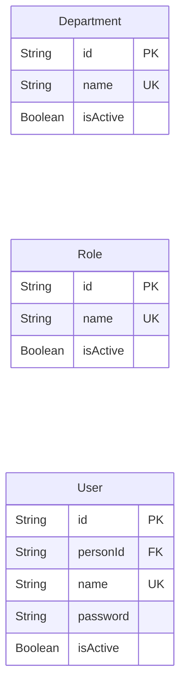

### Person · UserRoleDepartment · PersonRoleDepartment

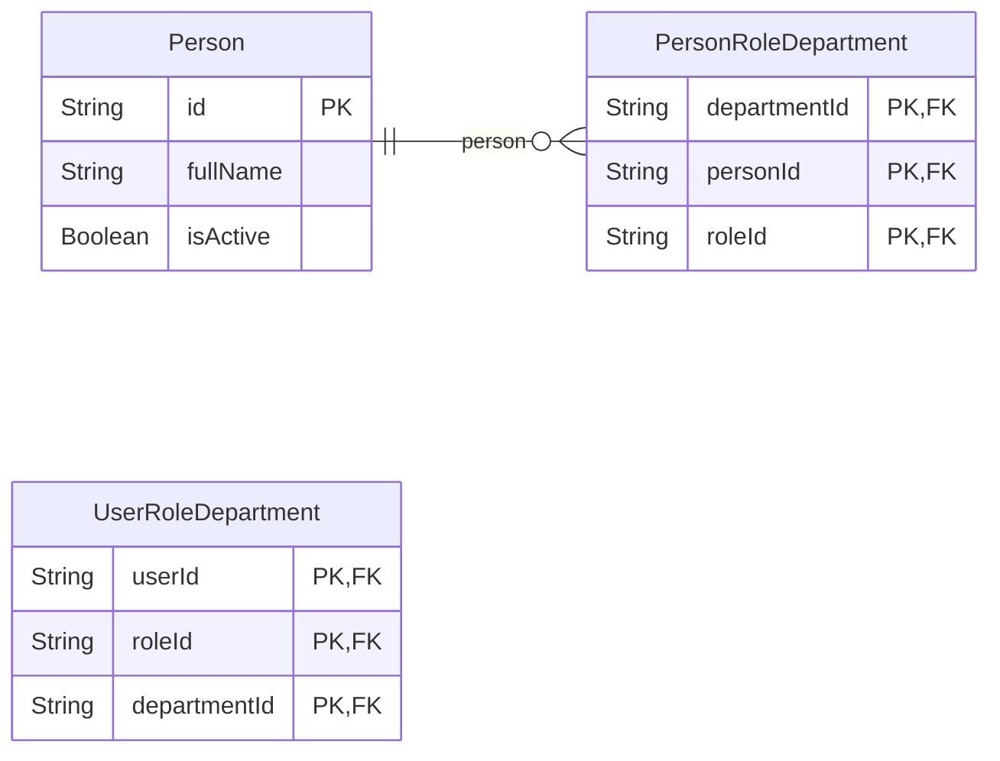

### CriticalWriteAudit

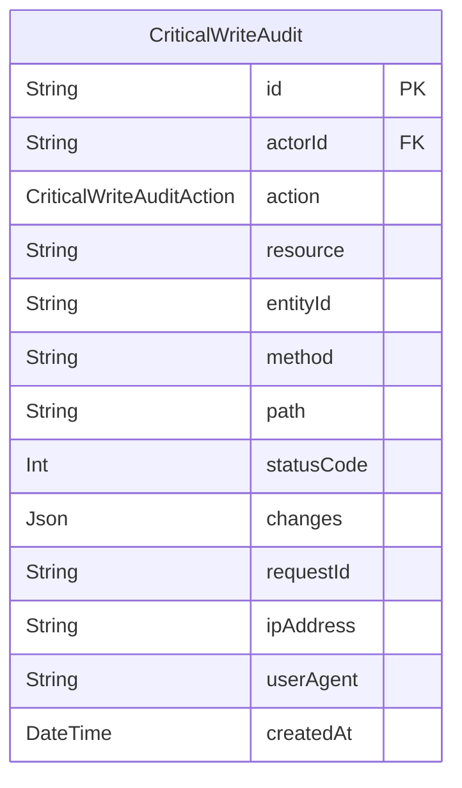

## Catálogos y relaciones comerciales

### Status · FulfillmentStatus · Project

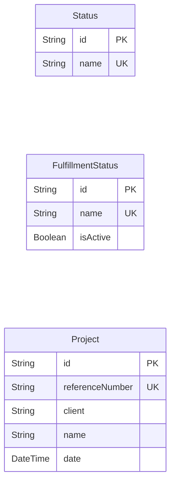

### Client · Supplier · Material

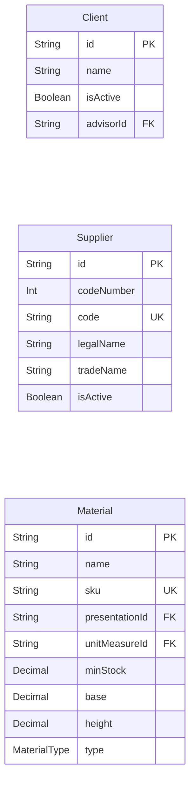

### UnitMeasure · Presentation · SupplierMaterial

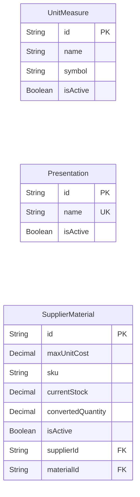

### ReferenceNumberCounter

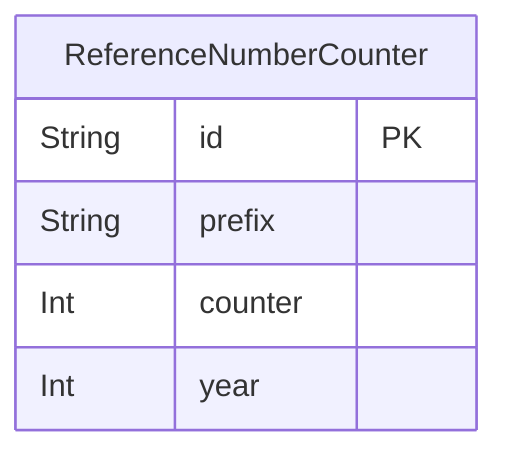

## Compras e inventario de materiales

### GoodsReceipt · GoodsReceiptDetail · GoodsReceiptDetailChange

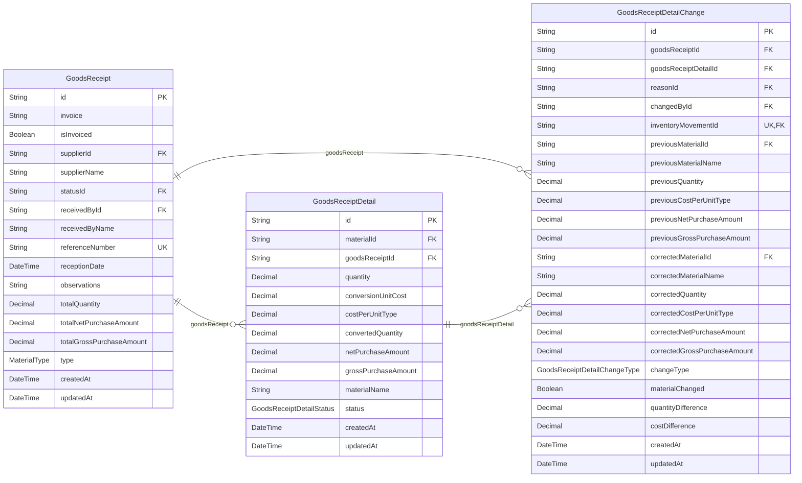

### GoodsIssue · GoodsIssueDetail · GoodsIssueReturn

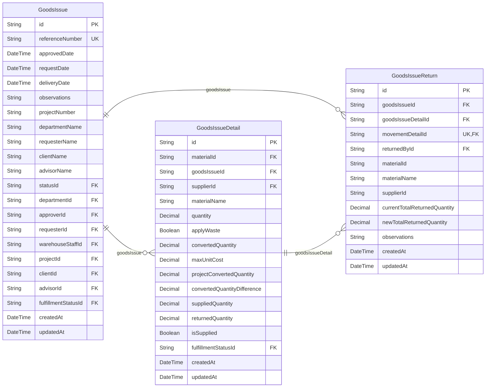

### InventoryMovement · MovementDetail · StockAdjustment

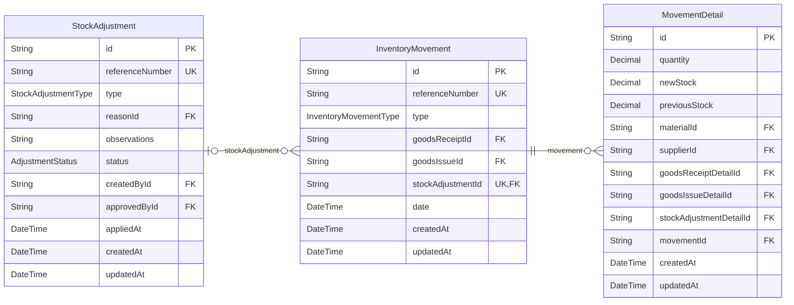

### StockAdjustmentDetail · StockAdjustmentReason

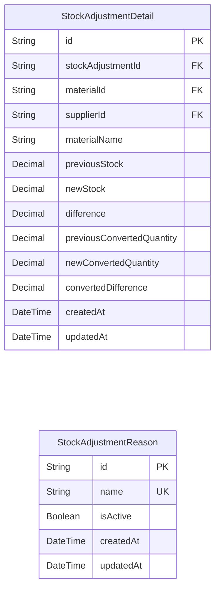

## Mermas e inventario de merma

### Waste · WasteIssue · WasteIssueDetail

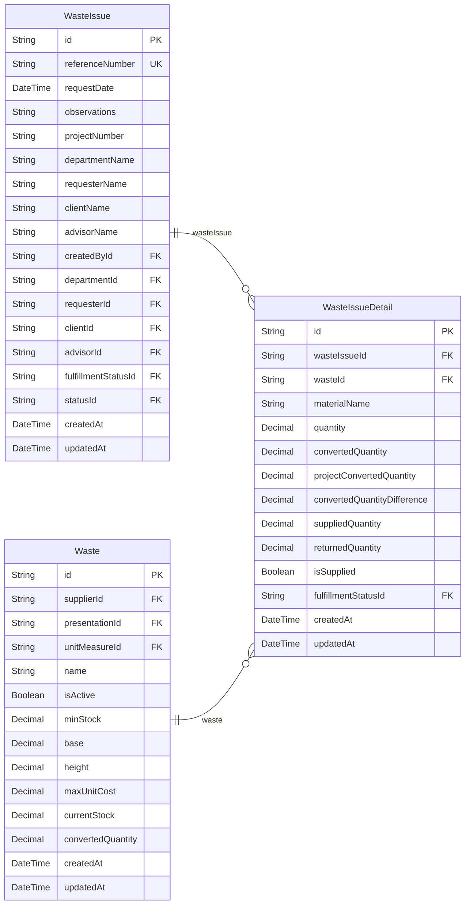

### WasteIssueReturn · WasteMovement · WasteMovementDetail

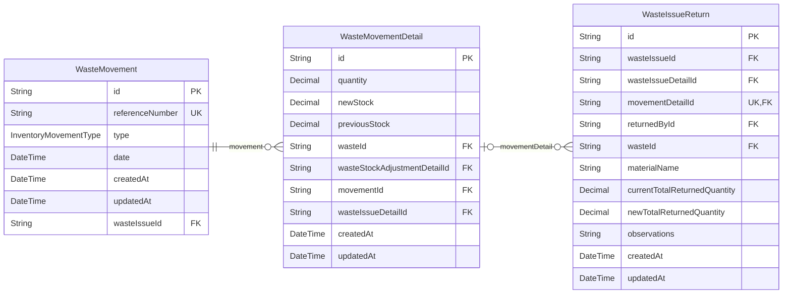

### WasteStockEntry · WasteStockAdjustment · WasteStockAdjustmentDetail

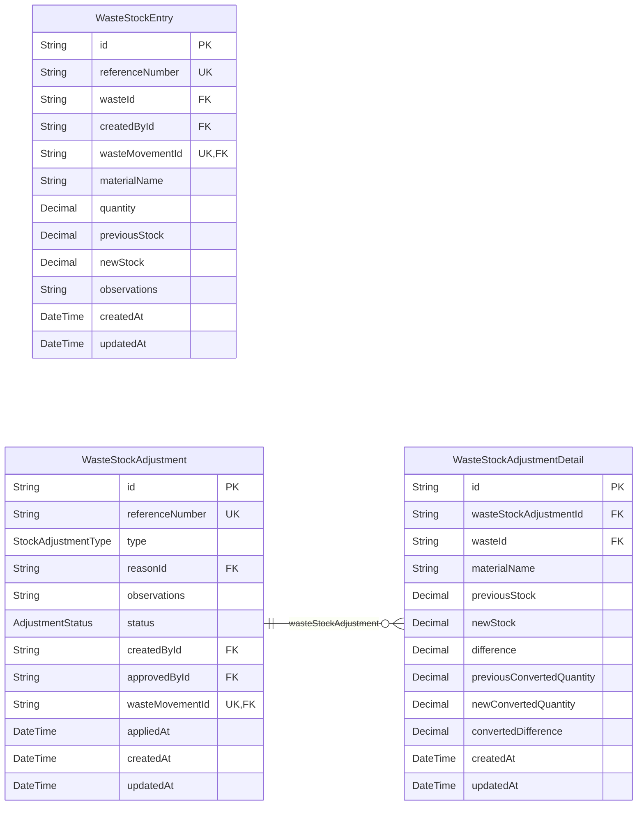

## Relaciones por grupo de modelos

Cada figura muestra las relaciones cuyo modelo de origen pertenece al grupo indicado,
incluidas las referencias a otras áreas. Los modelos referenciados pueden repetirse
entre figuras para conservar todas las asociaciones sin concentrarlas en una sola
imagen. Los atributos completos permanecen en las vistas anteriores y en el diccionario.

### Identidad, acceso y auditoría: Department · Role · User

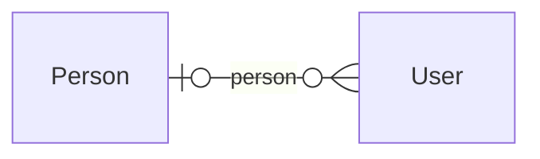

### Identidad, acceso y auditoría: Person · UserRoleDepartment · PersonRoleDepartment

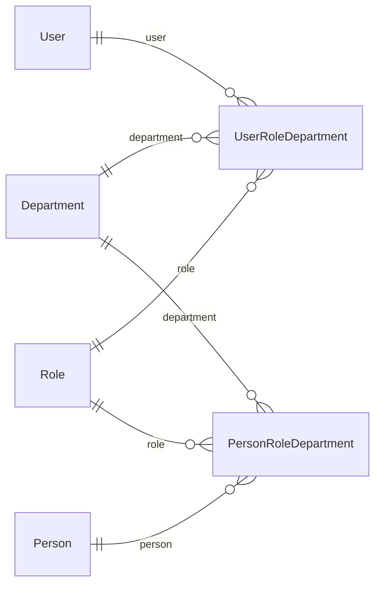

### Identidad, acceso y auditoría: CriticalWriteAudit

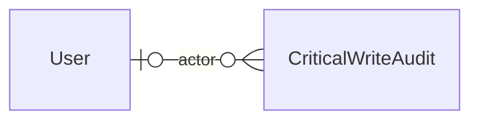

### Catálogos y relaciones comerciales: Client · Supplier · Material

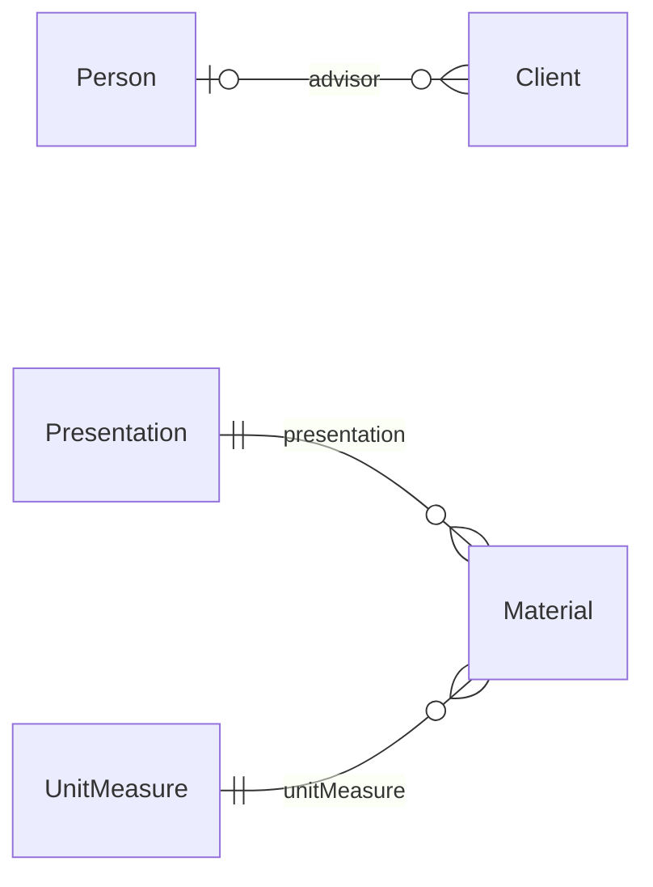

### Catálogos y relaciones comerciales: UnitMeasure · Presentation · SupplierMaterial

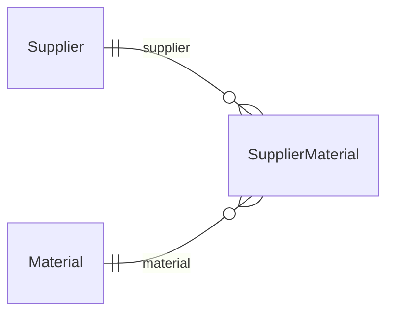

### Compras e inventario de materiales: GoodsReceipt · GoodsReceiptDetail · GoodsReceiptDetailChange

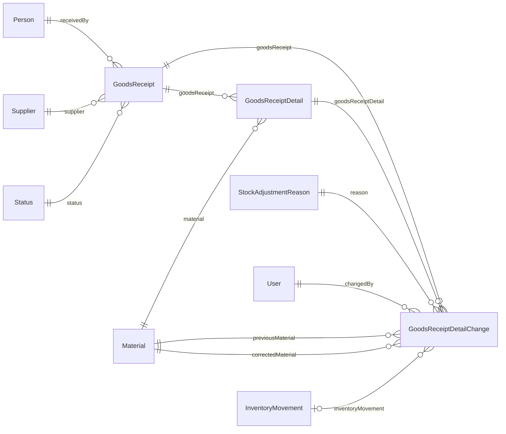

### Compras e inventario de materiales: GoodsIssue · GoodsIssueDetail · GoodsIssueReturn

```mermaid
erDiagram
    direction LR
    Department ||--o{ GoodsIssue : "department"
    Person o|--o{ GoodsIssue : "approver"
    Person ||--o{ GoodsIssue : "requester"
    Person o|--o{ GoodsIssue : "warehouseStaff"
    Status ||--o{ GoodsIssue : "status"
    Project o|--o{ GoodsIssue : "project"
    Client ||--o{ GoodsIssue : "client"
    Person ||--o{ GoodsIssue : "advisor"
    FulfillmentStatus o|--o{ GoodsIssue : "fulfillmentStatus"
    Material ||--o{ GoodsIssueDetail : "material"
    Supplier ||--o{ GoodsIssueDetail : "supplier"
    GoodsIssue ||--o{ GoodsIssueDetail : "goodsIssue"
    FulfillmentStatus ||--o{ GoodsIssueDetail : "fulfillmentStatus"
    GoodsIssue ||--o{ GoodsIssueReturn : "goodsIssue"
    GoodsIssueDetail ||--o{ GoodsIssueReturn : "goodsIssueDetail"
    MovementDetail o|--o{ GoodsIssueReturn : "movementDetail"
    User o|--o{ GoodsIssueReturn : "returnedBy"
```

### Compras e inventario de materiales: InventoryMovement · MovementDetail · StockAdjustment

```mermaid
erDiagram
    direction LR
    GoodsReceipt o|--o{ InventoryMovement : "goodsReceipt"
    GoodsIssue o|--o{ InventoryMovement : "goodsIssue"
    StockAdjustment o|--o{ InventoryMovement : "stockAdjustment"
    Material ||--o{ MovementDetail : "material"
    Supplier ||--o{ MovementDetail : "supplier"
    GoodsReceiptDetail o|--o{ MovementDetail : "goodsReceiptDetail"
    GoodsIssueDetail o|--o{ MovementDetail : "goodsIssueDetail"
    StockAdjustmentDetail o|--o{ MovementDetail : "stockAdjustmentDetail"
    InventoryMovement ||--o{ MovementDetail : "movement"
    StockAdjustmentReason ||--o{ StockAdjustment : "reason"
    User ||--o{ StockAdjustment : "createdBy"
    User o|--o{ StockAdjustment : "approvedBy"
```

### Compras e inventario de materiales: StockAdjustmentDetail · StockAdjustmentReason

```mermaid
erDiagram
    direction LR
    StockAdjustment ||--o{ StockAdjustmentDetail : "stockAdjustment"
    Material ||--o{ StockAdjustmentDetail : "material"
    Supplier ||--o{ StockAdjustmentDetail : "supplier"
```

### Mermas e inventario de merma: Waste · WasteIssue · WasteIssueDetail

```mermaid
erDiagram
    direction LR
    Supplier ||--o{ Waste : "supplier"
    Presentation ||--o{ Waste : "presentation"
    UnitMeasure ||--o{ Waste : "unitMeasure"
    User ||--o{ WasteIssue : "createdBy"
    Department ||--o{ WasteIssue : "department"
    Person ||--o{ WasteIssue : "requester"
    Client ||--o{ WasteIssue : "client"
    Person ||--o{ WasteIssue : "advisor"
    FulfillmentStatus ||--o{ WasteIssue : "fulfillmentStatus"
    Status ||--o{ WasteIssue : "status"
    WasteIssue ||--o{ WasteIssueDetail : "wasteIssue"
    Waste ||--o{ WasteIssueDetail : "waste"
    FulfillmentStatus ||--o{ WasteIssueDetail : "fulfillmentStatus"
```

### Mermas e inventario de merma: WasteIssueReturn · WasteMovement · WasteMovementDetail

```mermaid
erDiagram
    direction LR
    WasteIssue ||--o{ WasteIssueReturn : "wasteIssue"
    WasteIssueDetail ||--o{ WasteIssueReturn : "wasteIssueDetail"
    WasteMovementDetail o|--o{ WasteIssueReturn : "movementDetail"
    User o|--o{ WasteIssueReturn : "returnedBy"
    Waste ||--o{ WasteIssueReturn : "waste"
    WasteIssue o|--o{ WasteMovement : "wasteIssue"
    Waste ||--o{ WasteMovementDetail : "waste"
    WasteStockAdjustmentDetail o|--o{ WasteMovementDetail : "wasteStockAdjustmentDetail"
    WasteMovement ||--o{ WasteMovementDetail : "movement"
    WasteIssueDetail o|--o{ WasteMovementDetail : "wasteIssueDetail"
```

### Mermas e inventario de merma: WasteStockEntry · WasteStockAdjustment · WasteStockAdjustmentDetail

```mermaid
erDiagram
    direction LR
    Waste ||--o{ WasteStockEntry : "waste"
    User ||--o{ WasteStockEntry : "createdBy"
    WasteMovement ||--o{ WasteStockEntry : "movement"
    StockAdjustmentReason ||--o{ WasteStockAdjustment : "reason"
    User ||--o{ WasteStockAdjustment : "createdBy"
    User o|--o{ WasteStockAdjustment : "approvedBy"
    WasteMovement o|--o{ WasteStockAdjustment : "movement"
    WasteStockAdjustment ||--o{ WasteStockAdjustmentDetail : "wasteStockAdjustment"
    Waste ||--o{ WasteStockAdjustmentDetail : "waste"
```

Consulta el esquema Prisma para las reglas `onDelete`/`onUpdate`. Una relación puede
aparecer con el nombre del campo inverso porque la vista se deriva de la relación Prisma;
la dirección de lectura no implica propiedad del proceso de negocio.
